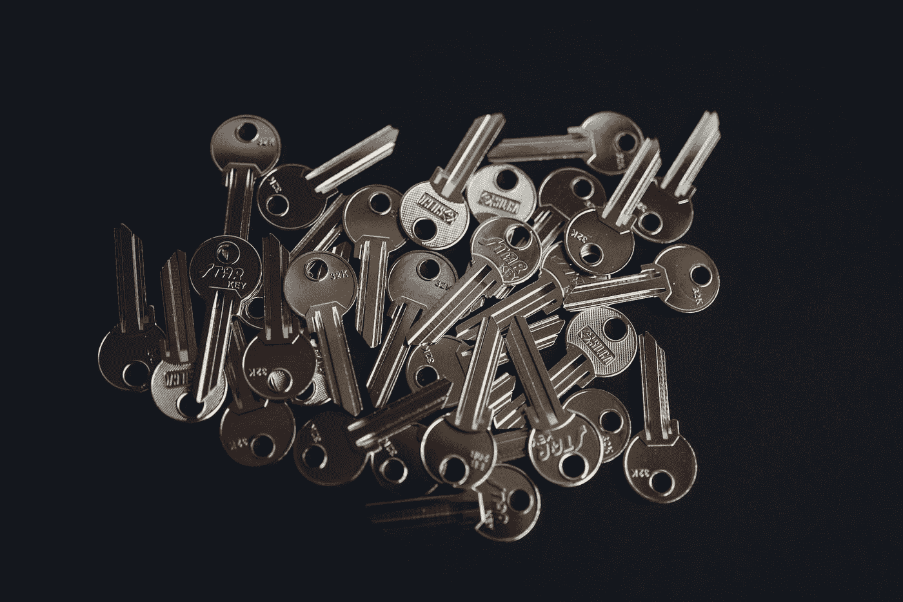
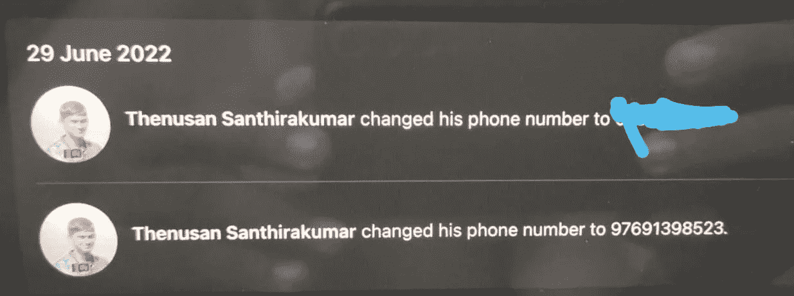
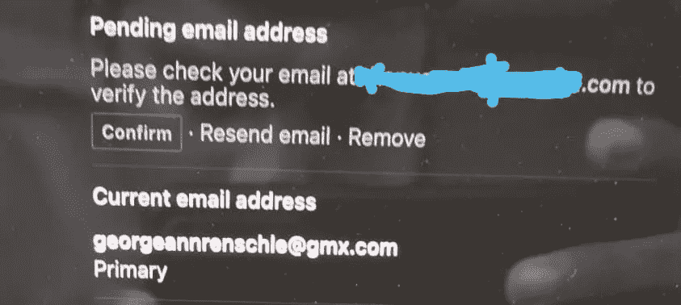
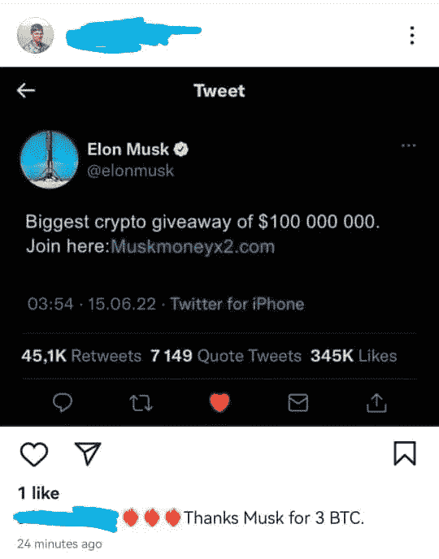
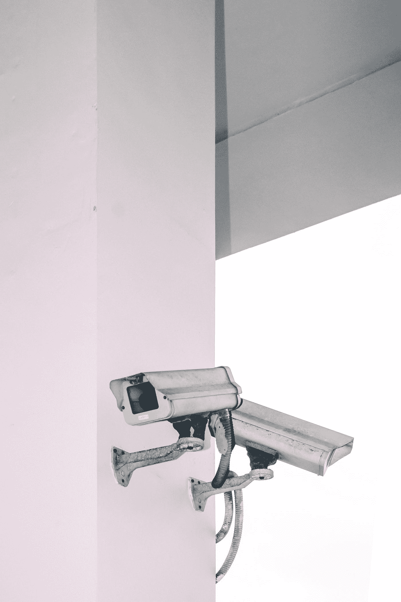

# 我的脸书账户怎么了🤔❓

> 原文：<https://medium.com/geekculture/what-happened-to-my-facebook-account-b399443c9a74?source=collection_archive---------9----------------------->

## 技术进步的阴暗面

## 我的脸书& Instagram 账户被黑的实时体验

大家好🙋，今天这一集是根据我六天前发生的真实故事改编的。

Photo by [Max Bender](https://unsplash.com/@maxwbender?utm_source=medium&utm_medium=referral) on [Unsplash](https://unsplash.com?utm_source=medium&utm_medium=referral)

## 发生了什么事？

2022 年 6 月 29 日，我正在为本科生活中的期末考试而学习。在讲述了人力资源管理模块中的一些主题后，我感到很无聊，于是尝试打开我的脸书账户。当我尝试打开脸书移动应用程序时，它打开了我的登录页面。这让我有点惊讶，因为我已经在我的设备上有一个登录会话。但我没多想，因为它可能已经过期了。我尝试使用我的凭据登录帐户。它提示我错误的密码警告。但它对我来说很熟悉。因为我经常忘记/混淆多个帐户的多个密码。我想我给错了密码。然后我用我所有的密码试了试。我无法登录。这些步骤迫使我去与忘记密码选项，因为我已经给了一个恢复电子邮件和手机号码与我的帐户。所以我毫不犹豫地点击了忘记密码选项😕。但是后缀显示的邮件和电话号码确实让我震动了…..我从未见过那些电子邮件和电话号码👺。

Photo by [regularguy.eth](https://unsplash.com/@moneyphotos?utm_source=medium&utm_medium=referral) on [Unsplash](https://unsplash.com?utm_source=medium&utm_medium=referral)

我慢慢明白可能会发生什么。是的，我的账户被黑了。但这怎么可能改变恢复邮件或电话号码呢🌛？不管怎样，事情已经发生了。但是我没有收到验证码的短信或者邮件。有一段时间，我在想黑客们可以对我的账户做什么，因为里面什么都没有。但是也有一点小小的恐惧。

我试图改变密码，正如我提到的，我失去了对给定恢复方法的控制，但脸书没有给我改变密码的选项。但他们要求我的国民身份证，但他们提到，这可能需要长达 48 小时。所以不知道该立即做什么…

但幸运的是，在这一切之后，我已经看到我的手机收到了一封电子邮件，内容是关于新的未知设备在同一天登录。不过黑了之后看过一次。我点击了我不是，并保护我的帐户选项。然后我可以立即更改我的密码。进入我的帐户后，我立即更改了所有的电子邮件和手机号码。

Image by Author

在上面的图片中你可以看到。第一个号码是我的号码，第二个号码是某个未知号码的号码。黑客把我的号码改成了 97691398523 这个号码作为验证号。黑客也改了我的邮箱。检查下面的图像(原谅我的图像质量，因为它是在匆忙中拍摄的)。你可能会看到有一些未知的电子邮件 id 作为当前的电子邮件地址(**geogeannrescle@gmx.com**)。我仍然想知道，在脸书有这些高安全性的认证服务器的脸书这样的组织中，这是如何发生的。

Image By Author

## 接下来呢？

成功更改我的电子邮件、电话号码和密码后。我很好。感觉轻松。我知道这是一个黑客行动，但我认为我足够快，以尽量减少损失。但是当时没有想到脸书是一个身份服务器。大约两三个小时后，我的一个好朋友打电话给我，告诉我你获得了 3 项 BTC 奖😃？我像什么？？？？？？？。因为我没有参与任何与密码相关活动。那又怎样？？？？？。他让我查看我的 Instagram 帖子。我打开我的 Instagram，在我的个人资料中看到了下面的帖子。

Image by Author

我很快就能匹配可能发生的事情。有了 Instagram 和脸书的新更新，如果我们配置并连接两个应用程序，我们就可以在两个应用程序之间切换。我已经连接了两个应用程序。所以 hacker 也有我的 Instagram 权限。当我撤销我的脸书访问权限时，黑客在我的 Instagram 账户上发布了这个帖子。我把帖子删了，Instagram 密码也改了。但随后我很快想到，Whatsapp 也与脸书身份服务器有某种联系。因此，我进一步加强了对我的 WhatsApp 账户的两步验证。我想我得知道我的脸书不是故意被黑的，而是为了做一些秘密营销。上面的 Instagram 帖子验证了这一点。如果黑客攻击是有目的的，我可能会面临比这些帖子更多的问题。但这可能发生在你身上。所以，当涉及到与计算机相关的事情时，每个人都必须尽可能地清楚和小心，因为它有时有耳朵、眼睛甚至大脑。

## 进一步的预防措施

但是，我仍然无法相信这是怎么发生的。但无论如何，我有责任提高我账户的安全性。不仅是我，每个人都应该最大限度地保护账户的安全。让我们看看我如何最大限度地保护我的脸书帐户。

Photo by [Victor](https://unsplash.com/@victor_g?utm_source=medium&utm_medium=referral) on [Unsplash](https://unsplash.com?utm_source=medium&utm_medium=referral)

*   我已经启用了脸书的电子邮件和电话号码进行验证。但不管怎样，它被黑客破解了。
*   脸书身份服务器实现了多因素认证。为了更好的安全性，每个人都必须使用它。
*   我也在我的脸书账户中启用了两步认证。因此，每当我们尝试登录脸书时，它都会要求输入一次性密码。我为此设置了 Google 身份验证应用程序。
*   我还为我的帐户上的每次登录尝试启用了短信通知。这将有助于识别何时有人试图登录我的帐户。
*   但是，我仍然不知道这些东西会节省/保护我的帐户多少，但我已经最大限度地保护。
*   如今，我们必须尽一切可能保护我们的数据。

这些今天才上市。但在未来，可能会有更先进的保护。我们必须习惯它们来保存和保护我们自己的宝贵数据。

Photo by [Tyler Nix](https://unsplash.com/@nixcreative?utm_source=medium&utm_medium=referral) on [Unsplash](https://unsplash.com?utm_source=medium&utm_medium=referral)

我相信你已经阅读并理解了我关于脸书和 Instagram 被黑的故事，以及我是如何解决的。如果您有任何问题或任何澄清，不要犹豫，通过回复部分与我联系。感谢您花费宝贵的时间阅读本博客，我相信这将激励您继续阅读我的其他博客**。**

**如果你想享受这样的科技故事，想支持我永远坚持写作，可以考虑* [*报名成为中等会员*](https://sthenusan.medium.com/membership) *。每月 5 美元，你可以无限制地阅读媒体上的故事。如果你* [*用我的链接*](https://sthenusan.medium.com/membership) *注册，我会赚一小笔佣金。你也可以跟着我上* [*中*](https://sthenusan.medium.com/) *和* [*推特*](https://twitter.com/thenusan97) *。**