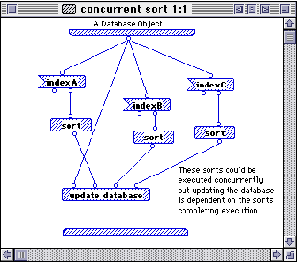
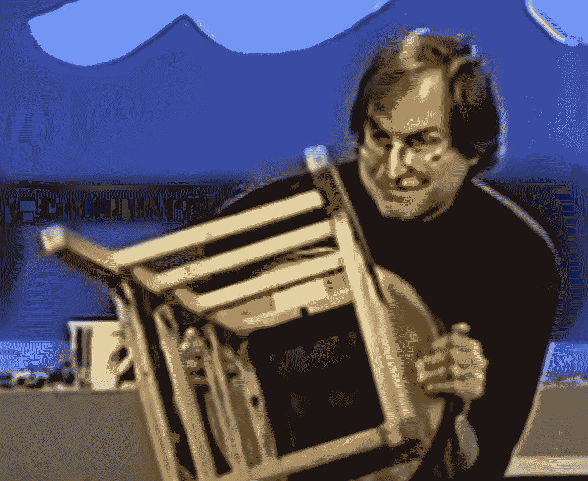

# “有趣”的编程语言发生了什么变化？

> 原文：<https://medium.com/geekculture/what-happened-to-the-fun-programming-languages-b6e3b374f003?source=collection_archive---------26----------------------->

我第一次接触计算机编程是在 20 世纪 80 年代末 90 年代初。最初大概是 10 印“你好”；20 转到 10 在准将 64。实际上，直到 1993 年底，我才拥有一台电脑。所以我学习编程主要是从图书馆借来的书。我学习了我喜欢的 Pascal 语言，也学习了微处理器。我会在纸上写 Pascal 和汇编语言程序，不知道它们是否能编译或运行。

在那个时代，计算机仍处于初级阶段。例如，我的第一台电脑是 Macintosh Classic II，它有一个 9 英寸的黑白显示屏。甚至我的第二台和第三台彩色电脑也只能以每秒几帧的速度玩第一人称射击游戏。

## 有趣的编程语言

那时候编程非常有趣。基本款相当于乐高积木。很容易将小块代码组合在一起以创建有趣的东西，但不是工程化大代码库的最佳选择。

除了 BASIC 之外，还有其他开创性的编程方法。例如， [**Prograph**](https://en.wikipedia.org/wiki/Prograph) 是一种表示数据流的可视化编程语言。这种方法类似于函数式编程。它也碰巧是面向对象的。

[Prograph](https://en.wikipedia.org/wiki/Prograph) visual programming language from the early 1990s.

Hypercard 更加出名，非常受欢迎。名为 [**HyperTalk**](https://en.wikipedia.org/wiki/HyperTalk) 的几乎类似自然语言的脚本语言，结合易于使用的拖放、基于卡片的界面，使其对一般人来说难以置信地平易近人。它有办法吸引你去建造东西。和乐高一样，这也很有趣，即使不是构建复杂代码库的最实用的方式。

[HyperTalk’s](https://en.wikipedia.org/wiki/HyperTalk) revolutionary natural language syntax

1993 年，苹果发布了 Newton MessagePad，这是 iPhone 的前身。Newton 有一个非常有趣的用户界面，它背后的编程语言是基于 Self 编程语言的 NewtonScript。像 HyperTalk 一样，NewtonScript 也很容易使用和有趣，在这里是面向对象的。NewtonScript 的独特之处在于它是为 Newton 编写代码的主要方式。请记住，这些设备仅在 20 MHz 左右运行。

牛顿最初打算使用苹果正在开发的一种新的编程语言，名为 [**迪伦**](https://en.wikipedia.org/wiki/Dylan_(programming_language)) 。Dylan 是一种面向对象的 Lisp，但是使用代数语法。然而，Dylan 并没有为 Newton 的发布做好准备，所以使用了 NewtonScript，然而其目的是让 Dylan 最终成为所有苹果产品的标准语言(就像今天的 Swift)。

苹果也在开发一个基于组件的库，叫做 **OpenDoc** 。在 OpenDoc 中没有应用程序。一切都是组成部分。用户将从一个空白文档开始，并向该文档添加组件。当用户点击不同的组件时，OpenDoc 会打开正确的相关编辑器。

苹果发布的一项技术是 AppleScript。AppleScript 在语法上类似于 HyperTalk，但设计用于任何应用程序。应用程序将公开词汇表的“字典”,用户可以用它来编写与应用程序交互的脚本。这在使用苹果事件时有效。一个名为 FaceSpan 的短暂开发环境允许用户可视化地设计应用程序，并使用 AppleScript 来响应事件。一种通用的超卡，而不仅仅是一堆卡片。

## 史蒂夫·乔布斯扼杀了乐趣

当史蒂夫·乔布斯在 1996 年末回到苹果时，他扼杀了整个牛顿项目、OpenDoc 和 Dylan。当时他说公司将专注于 Java。任何熟悉苹果技术的人都认为 Java 是一个伟大的缺乏想象力的倒退。YouTube 上有一个著名的视频,是一名开发者和史蒂夫·乔布斯在这个问题上的对峙。

[Steve Jobs being challenged](https://www.youtube.com/watch?v=oeqPrUmVz-o) about his decision to adopt Java and cancel Apple’s revolutionary projects.

该视频很有见地，因为史蒂夫·乔布斯的回应本质上是:让我们首先从客户体验开始，而不是让我们创造一项伟大的技术，然后看看如何营销它。值得一提的是，他的动机是为苹果赚一大笔钱(这是合理的)。

然而，我认为这给喜欢乐高的人带来了一个问题。

如果我们从客户体验开始，例如，光滑的 iPhone 用户界面，并成为重中之重，不惜一切代价，其他因素，如开发的容易程度，开发的乐趣，让用户界面也能为更有技术头脑的人所享受，都被抛到了窗外。

这就是为什么这是一个问题:是有技术头脑的人创造了未来！你想为这些人创造有趣和愉快的环境。

如果激励点是:客户(可能跟你一点都不像)；客户体验(你可能不喜欢)；和发展过程(这是不愉快的)；这怎么可能创造出愉快的开发体验呢？

这篇文章是写给热爱乐高的人，而不是想创建世界上最大的公司的人。不是每个人都喜欢乐高。但是为世界上最大的公司开发软件的人做了！我认为这是一个不应该被忽略的重要联系。

当然，史蒂夫·乔布斯说的对，他们将通过关注所有客户来赚更多的钱。但是他对开发者的热爱不屑一顾并不一定是对的。

## 开发人员与客户

HyperCard 非常用户友好。这真的是革命性的，也许从那以后就没有任何东西像它一样了。但是，尽管它很容易使用，但有多少非技术人员真的对能够以用户友好的方式拖动按钮或键入脚本感到兴奋呢？现实是没有人。事实上，对此感到兴奋的是乐高类型的人。

具有讽刺意味的是，能够处理复杂 C 程序的人也是对 HyperCard 感兴趣的人。我不认为创建 HyperCard 的开发者意识到他们并不是真的在为普通人创造东西，而是真的在为像他们一样的人创造东西。

但从某种意义上说，这是一个美好的时代，因为开发商没有意识到这一点。他们正在创造一个他们认为令人惊叹的未来。但是当史蒂夫·乔布斯回到苹果时，这一切都停止了。开发者喜欢什么不再重要。最重要的是客户体验，开发者必须适应这一点。

另一个苹果的例子是 Objective-C。我发现开发人员对 Objective-C 有一定的好感。它的方法有些特别。Objective-C 的优势在 Interface Builder(现在是 Xcode 的一部分)中达到顶峰。Objective-C 的一个特性是绑定，它允许代码和数据在用户界面中很容易地结合起来。这种方法在 web 框架中已经变得非常普遍。最初，苹果扩展了 Objective-C 相当复杂的绑定功能，但随着时间的推移，实际上开始倒退。事实上，iOS 的绑定功能远不如 macOS。

这是另一个例子，说明编程的乐趣并不是苹果公司的首要任务。最终，苹果用 Swift 取代了 Objective-C。尽管 Swift 很优秀，但 Swift 有时感觉像是神经质的优秀表演者，但有时客观-C 只是更有趣。

## 程序员只是想找乐子

我发现现在很多开发工具的动机很大程度上是工程驱动的，最终归结到美元。这不是一件坏事。让事情运行可靠，不崩溃，不使用过多的内存是一件好事。

但是乐高也很有趣，而且它不是最有效或最可靠的建造方式。有时候我们只想享受追求。喜欢欣赏艺术或音乐。享受使完美黯然失色。即使数码照片更准确，绘画仍然是一种更好的体验。

我并不是说我们应该抛弃工程上的完美，但是也许我们应该在编程清单中为一些乐高创造一点空间。

## PC 用户补遗

写完这篇文章后，我意识到它几乎 100%以苹果为中心，这在很大程度上与我的兴趣相符。然而，我认为它同样适用于个人电脑。批处理文件。所有像乐高积木一样低效地做真正有趣的事情。