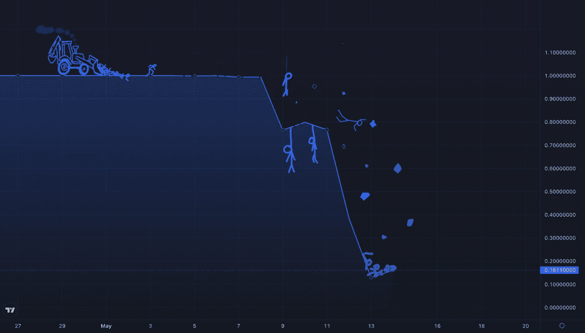

# $卢娜和$UST 发生了什么事，为什么？

> 原文：<https://medium.com/geekculture/what-happened-with-luna-and-ust-and-why-ce971d02202?source=collection_archive---------12----------------------->

一个 40 亿美元的加密项目怎么可能在一周内几乎为零？

UST chart on Coinbase

可能每个人都已经听说过卢娜和 UST 加密。不幸的是，Terra 的 LUNA 上周价格下跌了 99.7%。成千上万的人损失了数百万美元。但这是怎么发生的呢？一个排名前 10 的项目怎么会在一周之内几乎跌到零呢？