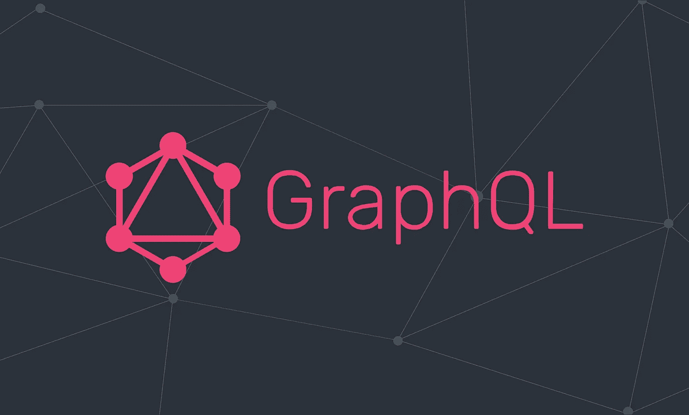

# GraphQL 联邦 API 下发生了什么

> 原文：<https://medium.com/geekculture/what-happens-underneath-graphql-federated-api-8f25c1b2697?source=collection_archive---------17----------------------->

我对使用 GraphQL 联邦 API 非常着迷。最近，我正在构建一个代码生成框架，它可以用 Java 生成实际的可编译和可部署的代码，并通过 GraphQL 联邦 API 自动相互连接。

为了让它真正闪耀，我需要对 GrahQL 的工作方式和底层的实际情况有一个非常深刻的理解。

