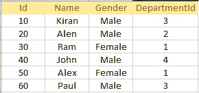
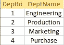
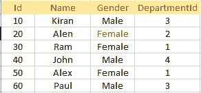
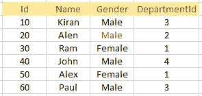
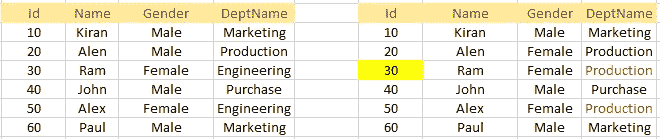

# 更新公共表表达式(cte)时会发生什么？

> 原文：<https://medium.com/geekculture/what-happens-when-you-update-common-table-expressions-ctes-f46b71f1f646?source=collection_archive---------13----------------------->

## **在 CTEs 中提升您的 SQL 技能**


**Photo by** [**Elena Taranenko**](https://unsplash.com/@elenatrn?utm_source=medium&utm_medium=referral) **on** [**Unsplash**](https://unsplash.com?utm_source=medium&utm_medium=referral)

**目录**

**在本文中，我们将在 cte 中看到 3 种不同的更新场景，例如:**

1.  **基于单基表的 CTE**
2.  **CTE 基于多个基表，更新影响 1 个基表**
3.  **CTE 基于多个基表，更新影响 2 个基表**

考虑下面的两个表雇员和部门



**Employee**



**Department**

**CTE 基于单基表**

> 让我们基于 tblEmployee 创建一个 CTE，并更新 id=20 的性别

```
**With EmpUpdateGender
as
( Select Id, Name, Gender from tblEmployee)
Update EmpUpdateGender Set Gender = 'Female' where Id = 20**
```

**更新成功**



Updated Employee Table: Alen’s gender is updated

**CTE 基于 2 个以上的基表，更新影响 1 个基表**

> 让我们基于 tblEmployee 和 tblDepartment 创建一个 CTE，并更新 id=20 的性别

```
**With EmpUpdateGender as 
(Select Id, Name, Gender, DeptName
from tblEmployee
join tblDepartment
on tblDepartment.DeptId = tblEmployee.DepartmentId)****Update EmpUpdateGender set Gender = 'Male' where Id = 20**
```

**更新成功**



Update Employee Table: Alen’s gender is updated

## 基于 2 个基表的 CTE 和基于 2 个基表的更新

```
**With EmpByDeptName as
(Select Id, Name, Gender, DeptName 
from tblEmployee 
join tblDepartment 
on tblDepartment.DeptId = tblEmployee.DepartmentId)****Update EmpByDeptName set Gender = 'Female', DeptName='Engineering' where id = 20**
```

> **没有更新！！！！！！！！！！！！！！！！！！**


ERROR !!!!!!

> 简而言之，如果 CTE 基于多个基表，并且更新影响多个基表，则不允许更新(抛出错误)

我们将看到一个特殊场景的最后一个案例，在更新 CTE 时我们必须非常小心

```
With EmpByDeptName as
(Select Id, Name, Gender, DeptName 
from tblEmployee 
join tblDepartment 
on tblDepartment.DeptId = tblEmployee.DepartmentId)Update EmpByDeptName set DeptName='Production' where id = 30
```

> **更新成功。小心点！！！！！！！！！！！**



Data Comparison when DeptName is updated for Id=30

执行更新后，当您尝试从 CTE 中选择数据时，您会看到 Alex 的 DeptName 也更改为 Production。

所以在这里，更新并没有像预期的那样工作，因为它也改变了 Alex 的 DeptName。这是因为，更新将 DeptName 从工程更改为生产。

# 结论

我们已经在 CTE 看到了 3 种不同的更新情况:
1) CTE 基于 1 个基表，更新如预期的那样成功

2)基于 2 个基表的 CTE 和基于 2 个基表的更新，查询因错误而终止

3)基于 2 个基表的 CTE 和对 1 个基表的更新，更新成功。但是，更新没有按预期运行