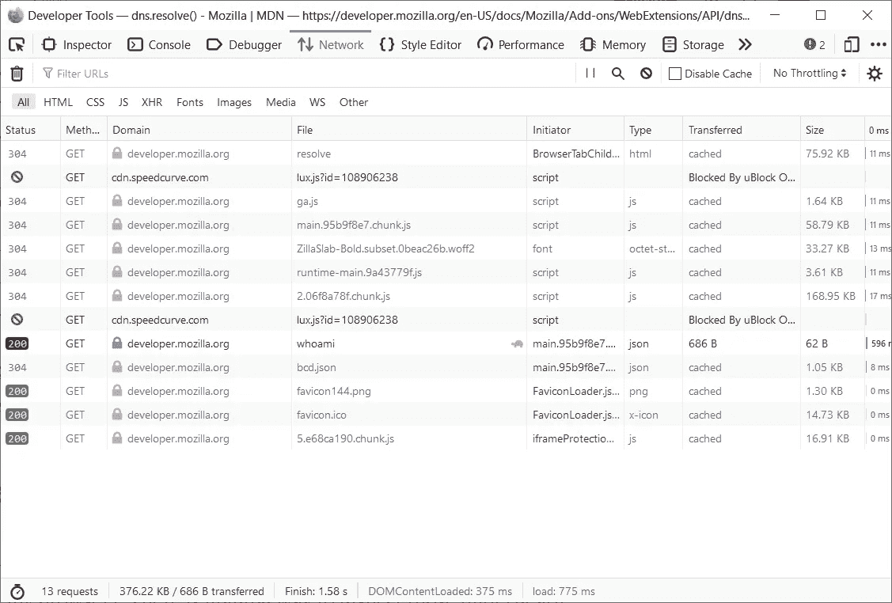
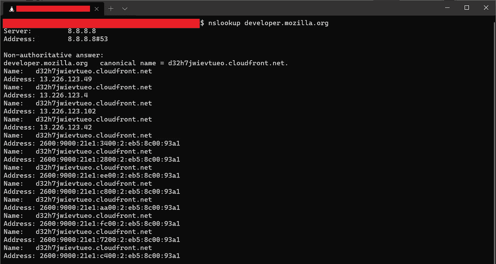
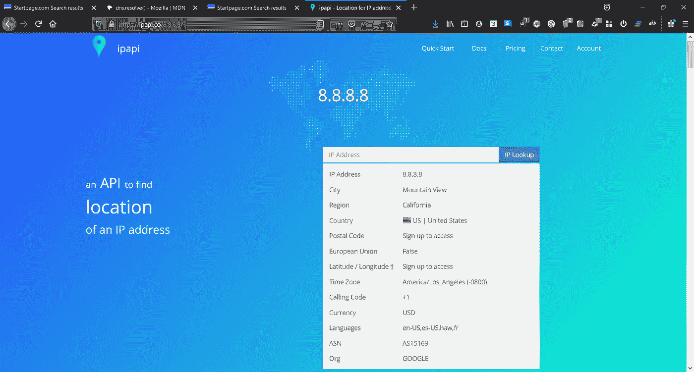
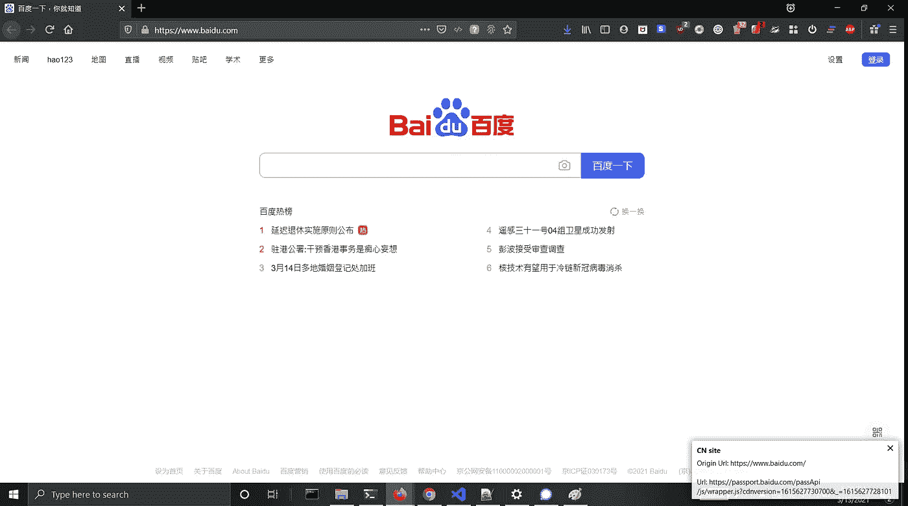
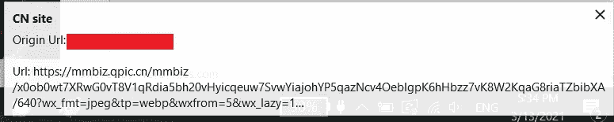

# 我构建了什么(3) —用于拦截和检测请求的 IP 地址所在国家/地区的浏览器扩展

> 原文：<https://medium.com/geekculture/what-i-built-3-browser-extension-for-intercept-and-detect-requests-country-of-ip-address-5fa843186097?source=collection_archive---------13----------------------->

这是关于我可以用浏览器扩展做什么的学习之一，这个扩展现在只是 Firefox，因为我利用了 Chrome(还)不支持的 DNS 解析功能。

 [## dns.resolve()

### 将给定的主机名解析为 DNS 记录。这是一个返回. string 的异步函数。的主机名…

developer.mozilla.org](https://developer.mozilla.org/en-US/docs/Mozilla/Add-ons/WebExtensions/API/dns/resolve#browser_compatibility) 

# 意图和背景

由于数据隐私更受关注(至少我确实关注)，我想知道当我在互联网上浏览时(用我的浏览器)下面是什么样的请求。有一种手动方式来检查这些请求，例如，使用浏览器开发工具检查网络，然后 nslookup IP 地址，然后从一些提供商/API 请求来源以解析国家来源。



the developer.mozilla.org is hidden behide cloudfront and the IP in above nslookup does not resolve in this API, this is a failed example…so using 8.8.8.8 to screen capture

# 我建造的东西



Notification pop up when a site make request to some county code



Zoom in notification (sample from yet another site)

# 开始吧

我遵循的参考是 MDN 文档:

 [## 拦截 HTTP 请求

### 要拦截 HTTP 请求，请使用 webRequest API。这个 API 使您能够为不同的制作阶段添加监听器…

developer.mozilla.org](https://developer.mozilla.org/en-US/docs/Mozilla/Add-ons/WebExtensions/Intercept_HTTP_requests) 

我的 manifest.json 如下:

```
{
  "description": "Checking webRequests geo location",
  "manifest_version": 2,
  "name": "check_geo",
  "version": "1.0", "permissions": [
    "webRequest",
    "webRequestBlocking",
    "dns",
    "storage",
    "unlimitedStorage",
    "notifications",
    "<all_urls>"
  ], "background": {
    "scripts": ["background.js"]
  }
}
```

对于权限:

*   拦截 web 请求的核心项是“web request”和“webRequestBlocking”。
*   “dns”是使用 dns.resolve()的权限
*   因为我添加了通知功能，所以我需要“通知”权限
*   最后，我需要减少对 location API 的访问，因此每当域被访问时，它都被缓存在本地存储中，因此我需要“storage”权限，而“unlimitedStorage”实际上并不需要(取决于我想要存储什么)
*   我希望插件适用于所有的 URL，所以添加了

background.js 中的核心代码逻辑是注册一个事件侦听器:

```
browser.webRequest.onBeforeRequest.addListener(
  logURL,
  {urls: ["<all_urls>"]},
  ["blocking"]
);
```

上述代码在所有 web 请求之前添加事件侦听器，并调用一个处理程序“logURL”并使其应用于所有 URL，配置处于“阻塞”模式，这意味着在处理程序调用完成之前不会发送请求，我使用阻塞方法是因为:

1.  如果这不是我想要的请求，我会拒绝它
2.  即使我允许它通过，我也想缓存我做了位置 API 检查的所有域，因为所有这些 API 每分钟/每月的点击率都是有限的，一个现代网站即使看起来闲置也会有很多请求(例如，为了跟踪或改善 UX 目的，比如记录你上次停止阅读/查看的地方)

logURL 处理程序应该很简单(这里跳过 localstorage 代码和异常处理):

```
async function logURL(requestDetails){
  // Get hostname from requestDetails object
  const hostname = (new URL(requestDetails.url)).hostname; // DNS resolve
  const ip = await browser.dns.resolve(hostname); // check location API
  const ipapiUrl = `[https://ipapi.co/${ipAddress}/json/`](https://ipapi.co/${ipAddress}/json/`);
  const response = await fetch(ipapiUrl);
  const result = await response.json();
  const country_code = result.country_code;

  // if country_code = "XX", notify
  if (country_code === "XX"){
    browser.notifications.create("XX", {
      type:"basic",
      title: "XX site",
      message: `Origin Url: ${requestDetails.originUrl}\n\nUrl: ${requestDetails.url}`
    })
  }
}
```

# 棘手的部分

棘手的是，因为事件侦听器应用于所有 URL，所以对 ipapi.co 的调用以获取位置信息也是事件的一部分，这就形成了创建 ipapi.co 调用和检查 ipapi.co 调用的无限循环。

最后，我的解决方案(我不确定这是否是最佳实践)是在上面的核心代码之前使用正则表达式检查 URL，调用如下函数:

```
function excludeUrl(requestDetails){
  if(/ipapi.co/.test(requestDetails.url)) {
    return true;
  } //else
  return false;
}
```

# 结论

这个插件的实现离完美还很远，我认为它还不能解决以下问题:

1.  ipapi.co 不需要注册，是免费的，但不能太频繁(官方规定每天 1000 个电话，但如果太频繁，就会被拒绝访问)，可以使用这种 API 的付费版本，还有更多选择，付费计划可以执行批量查找。
2.  大多数流行的域名在你的国家周围都有本地服务器，所以 dns 解析的 IP 可能是本地的(对你的国家来说)，为了解决这个问题，你可以扩展它来匹配域名黑名单，但是我打赌有很多扩展可以帮助你管理它。