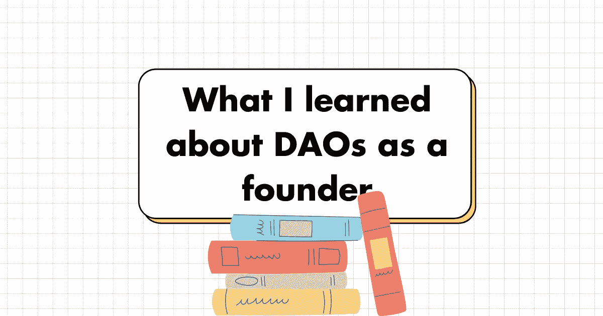
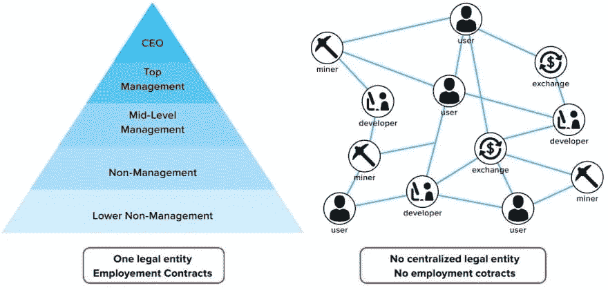
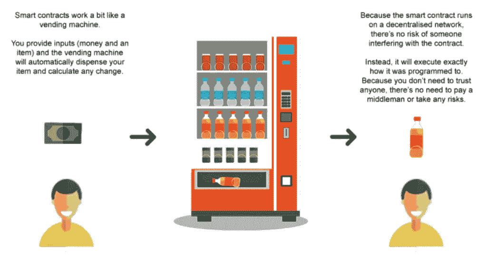
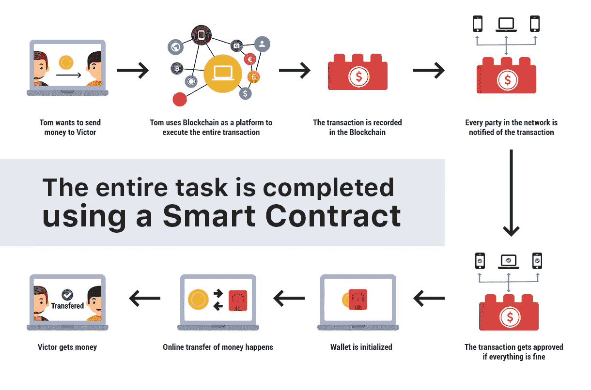

# 作为创始人，我对道斯的了解

> 原文：<https://medium.com/geekculture/what-i-learned-about-daos-as-a-founder-f93fe47f1c69?source=collection_archive---------14----------------------->

By Author

你可能以前听说过“道”这个术语，也许是在关于 Web3 及其未来的讨论中。一会儿，我们将能够掌握它的基本知识。

# 什么是刀？

DAO(去中心化自治组织)是一个自治的去中心化的组织。

> 这是一个由使用智能合同自主执行任务的在线人员社区建立的组织。

它是一个基于代码的组织，由创建 DAO 的人管理。

From Dev Community

# 自动售货机类比

我将使用一个类比来尽可能简单地说明这一点。

自动售货机是一种自动机器，它向顾客出售商品，无需人工参与。

## 尽管是自动化的，它仍然需要有人的帮助

1.交电费
2。检查是否需要补货
3。订购一批存货
4。发货补货
5。重新进货
6。从它的仓库里取出现金，换成零钱。

我们看到这个系统并不是理想的自治系统。这是一个典型的公司或组织的工作方式。实现真正自主的一种方式是拥有一个反馈系统，理想情况下是一个机器人来代替人类执行所需的活动。
这就是刀是什么的想法。实现这一目标的最有效方式是使用智能合同。

From Luniverse

# 什么是智能合同？

智能契约只是一段代码，如果发生其他事情，它会做一些事情。这就像是以太坊网络上用一种叫做 Solidity 的编程语言写的“if-else 条件语句”。

智能合约是写在区块链上的一段代码，旨在消除人为错误。

你可以在这里阅读更多

From IEEE Web Hosting

以我们的自动售货机为例，a DAO 是由一群在线人员使用智能合同自主执行任务而建立的组织。

因此，在现实生活中的自动售货机无法自我持续的所有方面，DAO 将让智能合约在其区块链(通常是以太坊)上运行代码，以无缝地执行该任务。

知道这些 Dao 是一群人在网上的组织，当要做出决定来执行一项任务时，*成员提交一份提案并投票表决。*

# 选票是如何产生的？

当一个 DAO 被创建时，他们通常用几百万个令牌来启动它。每一个令牌都是一张选票，道的每个成员拥有一个令牌就有投票权。谁拥有最多的代币，谁就拥有最多的选票。

## 因此，道令牌是有价格的

使用，并允许道改进，改变和成长。这可能是:

▪️Hiring 新进员工
▪️Voting 上工资
▪️Voting 换了刀的代号
▪️Employing 新进开发商
▪️Paying 员工多了去了

## 拥有一个道符能有什么好处？

**▪️Voting 在道中的权利:** 正如道的创立者可以使用道的令牌对提案进行同意和投票，任何拥有道令牌的人也可以在道中投票。

**从道代币案:** 在常规组织中，不属于它的人可以购买和拥有股份。

每当这些股票的价值上升时，任何拥有这些股票的人都会获利。

这与刀是完全一样的，在这种情况下，任何拥有刀的令牌的人都会获利。

# 刀的好处

▪️ **它是永恒的**:刀是为了万无一失而造的，所以不管发生什么，刀都会继续运转。

▪️ **关不掉**:关一把刀几乎是不可能的，唯一的原因就是必须要投票。
要做到这一点，你需要有许多代币，提交一份提案，并通过投票反对创建 DAO 的人，这很可能会有一个更大的代币网络。这还没有发生。

**▪️开源**:Dao 的代码是用一种叫做 Solidity 的编程语言写在区块链上的。

这使其分散化并可供公众使用。也就是说，网络上的任何人都可以看到代码，甚至可以对其进行改进。

# 刀的缺点

**▪️攻击漏洞:**黑客可以查看 DAO 的代码，对其进行逆向工程，测试代码并对 DAO 发起攻击。

在这种情况下，任何事情实际上都是可能的；黑客可以获得道的令牌并窃取它们。

**▪️没有商业秘密:**在一个常规的组织中，保持和保护商业秘密是可能的，但商业秘密却很难在道中保密。因为代码是开源的，几乎任何人都可以访问它。

# 只是陪我走了这么远的一点小奖励。

以下是一些 Dao 的真实例子:

uni swap[@ uni swap](https://twitter.com/Uniswap)
git coin[@ git coin DAO](https://twitter.com/GitcoinDAO)
bank less DAO[@ bank less DAO](https://twitter.com/banklessDAO)
ENS[@ ENS _ DAO](https://twitter.com/ENS_DAO)

你可以在这里找到完整的列表

## 👇关于 DAOs 的创始人，你还了解到什么？

> 👋**在[媒体](/@pooriaarab)—[LinkedIn](https://www.instagram.com/pooria.arab/)—[Twitter](https://twitter.com/pooria_arab)—[insta gram](https://www.instagram.com/pooria.arab/)—[抖音](https://www.tiktok.com/@pooria.arab)**
> 
> 更多关于 Web3，Crypto，NFTs，DeFi 等的好东西…
> 
> 点击获取 NFT 发布战略

**参考文献**

*   [什么是北海巨妖的刀？](https://www.kraken.com/learn/what-is-decentralized-autonomous-organization-dao#:~:text=Examples%20of%20operational%20DAOs%20include,virtual%20worlds%2C%20such%20as%20Decentraland.)
*   [最具影响力的道](https://www.benzinga.com/money/most-influential-daos/)
*   [什么是去中心化自治组织？](https://cointelegraph.com/ethereum-for-beginners/what-is-a-decentralized-autonomous-organization-and-how-does-a-dao-work)