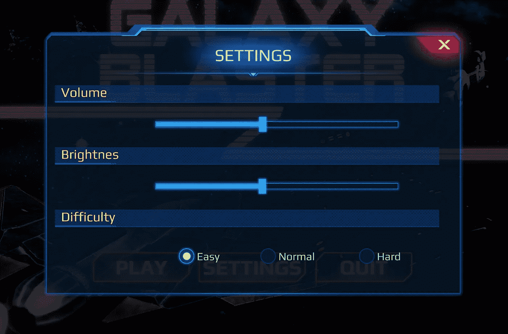
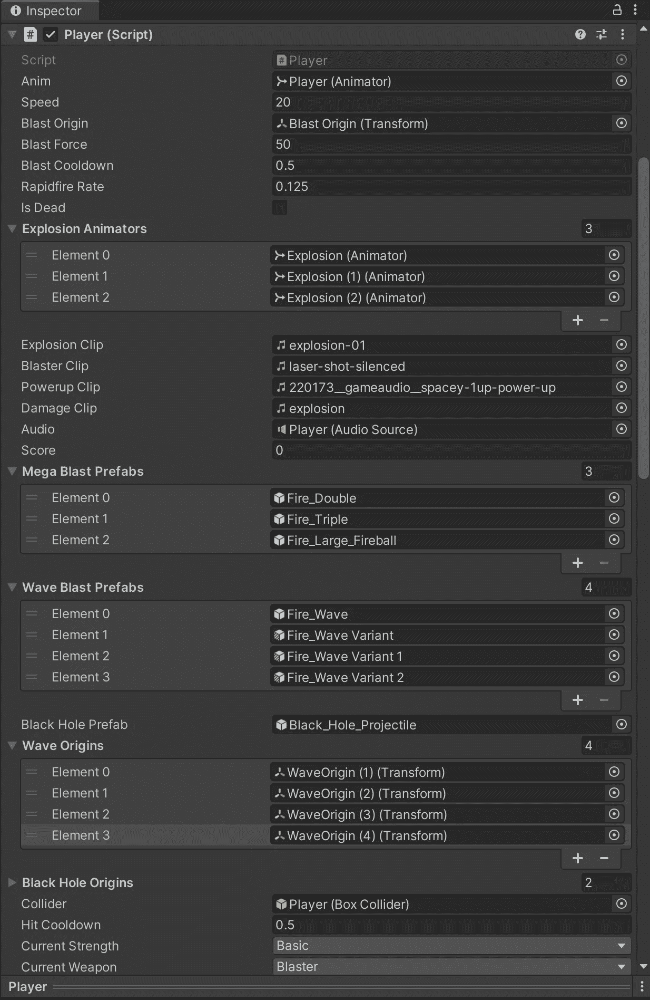

# 我从我的第一次软件开发冲刺中学到了什么

> 原文：<https://medium.com/geekculture/what-i-learned-from-my-first-software-development-sprint-d5e658abec1b?source=collection_archive---------32----------------------->

## Galaxy Blaster Z 开发回顾

在过去的一周里，我疯狂地致力于在一次冲刺中创造一个完整的游戏体验。目标是一个最小可行的产品——我需要的一切来决定这个游戏是否能吸引观众并获得成功。这个项目是一个 2.5D 的太空射击游戏——非常类似于我的第一个项目——完成了一系列不同强度的武器类型，12 波敌人以独特的队形飞行，两次 boss 遭遇战，一切都有声音和视觉效果，都是 80 年代的 synthwave 爵士配乐。

哦，最重要的是，一个漂亮的用户界面可以改变游戏的难度，调节音量和亮度。

I’d never tried to do any of this stuff before.

但这一经历并非没有重大挑战。我从第三天的非常自信到第五天的紧张不安，不知道*还会有多少错误？* 这是我第 n 次测试另一个“最终”版本。

当我交上去的时候，我已经筋疲力尽了。我睡了一天。然后今天下午我回来发现了另外两个我认为已经修复的严重错误。但事实证明它们很容易修复，所以就这样了。

那么，我学到了什么？

## 不要太依赖 Unity 编辑器

为了让事情变得“快速和简单”,我决定序列化所有内容，并跟踪编辑器中的所有交互。事实证明这不是一个好主意。主要是因为这不是我通常的工作方式，但也因为如果你不小心，事情会很快变得一团糟。

一方面，假设我能够在这个过程中保持有组织性，那么在 inspector 中分配所有内容会更容易阅读。我担心浪费太多时间摆弄细节，但我也担心在杂乱无章的变量堆中遗漏一些细节。我在这里找不到一个合适的中间点，到最后我只是把每个新变量放在列表的底部，不管它是否和它的邻居相处得好。

此外，有些东西不应该序列化，如果序列化，可能会导致问题。如果你发现你需要在一个变量中使用一个‘幻数’(哈！)，编辑可能会在你不注意的时候给你重新分配一个数字(通常是 0)。

我还使用序列化字段来存储组件和对象引用，我可以通过利用 C#中更好的信息处理实践来实现这些引用——c#还具有比 Unity 编辑器更好的空值检查。有几次，游戏似乎在欢快地运行，而代码的某些方面仍然停留在一个空白点，无法执行。

这是一个大杂烩，但我认为在这次经历之后，最好花时间多键入几行代码。我不确定依靠编辑是否真的节省了时间。

## 调整自己的速度

这被称为“冲刺”,但与其说是关于速度，不如说是关于满足所需的间隔。我开始稳步前进，但我越来越不确定自己是否能完成任务。到了第四天的中段，我确信第五天将会是一场噩梦，所以我额外增加了 4 个小时，以确保我有所松懈。

这真的让我筋疲力尽，也让第五天变得更加艰难。如果我在应该离开的时候离开，我敢打赌，我休息过的大脑会更加灵活地处理我的最后一轮 bug 粉碎。

## 关注你的目标

我觉得我处理得很好。有无数个****的场合，灵感袭来，我很想从最有价值球员名单中剔除，加入一些很酷的临时演员。我列了一个小清单，然后把它放在一边，重新关注我的设计文档中的 MVP 细节。如果我接受了其中的一条小路，我可能就不会成功地完成这次冲刺。****

****我仍然计划有一天回到那些好主意上来。如果不是这场比赛，那么下一场。我很庆幸我保留了他们，但我也很庆幸我保持了距离。****

****所以，这就是我在第一次软件开发冲刺中学到的东西。这是一段相当长的旅程，我期待着未来的冲刺，有一支车队在我身边。我一个人冲刺很有挑战性，也很有收获，但我想如果有其他人分享成功，我会享受得多。****

****如果你想玩 Galaxy Blaster Z，[你可以在 itch.io](https://emeldi.itch.io/galaxy-blaster-z) 上找到。****

****明天我将回到这些文章的一贯精神:应对新的编码挑战。我希望你能加入我。****