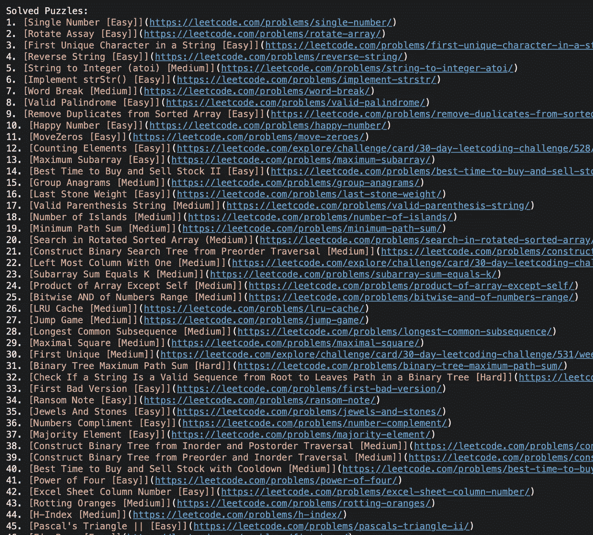

# 我学到了连续 45 天每天解决一个 Leetcode 问题

> 原文：<https://medium.com/geekculture/what-i-learned-solving-a-leetcode-problem-a-day-for-45-straight-days-5294c3cf2da7?source=collection_archive---------5----------------------->

作为一名工程师，我每天都要解决很多问题，所以你很容易就能进入状态。但是在工作中，你每天都在解决相同类型的问题，以至于你忘记了还有其他令人兴奋的问题需要你以不同的方式思考。一个很好的起点是 Leetcode 或任何其他日常编码难题网站。让我们回顾一下如何开始和最佳实践！

# **解决编码难题的基础**

我认为 Leetcode 做得很好，在他们的“每月挑战”中出现了日常难题。每个月问题开始时都很容易或中等，然后逐渐变得更难。你有 24 小时来提交你的解决方案，之后你仍然可以做这个问题，只是不需要任何 Leetcode 硬币。

第一步是阅读问题，理解他们给你的示例解决方案。如果有必要的话，浏览纸上的例子，将每个问题分解成一系列的步骤来解决。开始思考潜在的边缘情况，这些情况是您的设计不需要考虑的。

第二步是写一些缩写的伪代码。我倾向于把这一步想成高级白板编码面试。运行你将要用来解决问题的算法。写下你可能需要的任何数据结构，并考虑时间和空间的复杂性。这是最容易修复的一步，但是当我陷入困境时，这是我回头参考的工作，以帮助我回到正轨。

第三步是编写测试用例。既然您已经很好地了解了您需要做什么，那么编写一些额外的测试，如果您是在它们的编辑器之外编码，那么用代码编写您的测试用例。Leetcode 不会告诉你除了他们给你的测试之外还有哪些测试失败了(如果你有 premium 的话可能会告诉你？不确定 tbh)

**亲提示:代码在你的编辑器里。不在浏览器中。**

第四步是对你的设计进行编码和迭代。仅仅因为它通过了所有的测试并不意味着它是完美的。考虑潜在的优化或方法，使您的代码更加灵活。

第五步是看看其他人做了什么，看看你能从他们解决问题的方法中学到什么。通常有多种解决方案，所以如果你看到一些稍微不同的东西，不要感到惊讶。

# **一致性是关键**

这可能并不奇怪，但是你解决的问题越多，你得到的就越多。事情就是这样。Leetcode 做得很好，它只给你解决问题所需的信息，你做的这类问题越多，你就越容易理解提示和计划你的方法。希望通过经常做这些练习，你将继续提高你的编程技能，这样当你在工作中不得不处理不同类型的问题时，你可以利用任何数量的例子。

Here’s the list of every Leetcode problem I solved

**感谢阅读此文和** [**如有任何问题，发微博给我**](https://twitter.com/maurerpwer) **！**