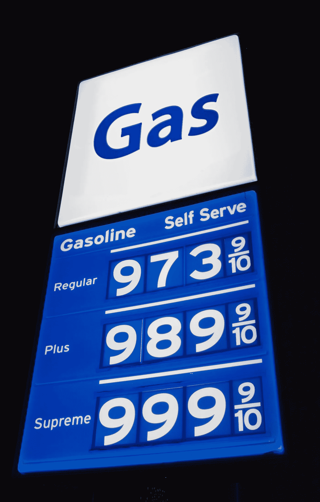

# 我学会了花 13 美元去转移价值 67 美元的以太坊

> 原文：<https://medium.com/geekculture/what-i-learned-spending-13-to-transfer-67-worth-of-ethereum-79df35d65a22?source=collection_archive---------7----------------------->

## **我知道以太坊的煤气费很高，但是拜托**

Image courtesy of [Canva](https://canva.com)

**请不要用你的以太坊做任何事情，除非是深夜交通流量少的时候。或者，除非你的大脑供氧充足。**

还记得你年轻的时候，有时不得不为你的汽车讨要油钱吗？这种情况可能仍然存在。但是现在，你还必须在数字世界里处理油费(Yay)。

如果你还没被介绍过以太坊的燃气费，那就别费劲了。你什么都没错过。以太坊需要矿工来让网络发挥作用。这些矿工需要为他们的工作得到回报。回报就是 ETH，或者如我们非矿工所知的，汽油费。

让我们仔细看看我今天的痛苦。

[如果你点击这个链接并订阅 Medium，我会得到一点现金。](https://tcgunterwriter.medium.com/membership)

# 以太坊气费是什么？

以太坊气费是在以太坊网络内运行智能合约和执行交易的成本。矿工们以每气含乙醚量的可变比率为天然气定价，用户可以用任何 ERC-20 代币支付。ETH 的最小单位是 Gwei。你也可以在像 [CoinMarketCap](https://coinmarketcap.com/) 这样的地方查看当前的 Gwei 费用。

例如，在撰写本文时，平均天然气转让费为 **177 Gwei** 。如果你去 [ETH 加油站](https://ethgasstation.info/)，你会看到以美元计算的转让费是**15.43 美元/转**。无论你转让价值 10 美元还是 10，000 美元的 ETH 都无关紧要。重要的是网络拥塞。车流量越大，油费就越高。

以太坊燃气费是支付以太坊区块链所需计算的必要费用。例如，假设您想在以太坊的区块链上书写，验证交易，或者从一个钱包向另一个钱包发送代币。在这种情况下，你必须向运营网络的矿工支付相应的费用。

# 什么能让以太坊气费高？

以太坊网络是处理和验证交易的节点的集合。每个节点运行 **EVM** 来维护整个网络的一致性。EVM 需要天然气来进行计算和执行智能合同，因此每个节点都需要少量的天然气来运行。

汽油费防止网络垃圾邮件，并确保所有的交易都有一些成本-即使他们不做任何事情！市场力量也决定了天然气价格，这使得价格不稳定。如果您希望您的交易或合同得到快速处理，您将需要相应地支付更多的交易费用。

**以下是导致以太坊天然气价格高的一些因素:**

1.  **以太坊网络的可扩展性限制意味着交易不能足够快地完成，以保持低油价。**
2.  **以太坊的区块链上运行的新平台进一步堵塞了流量并提高了费用。**
3.  **市场大幅上涨或下跌。**

以太坊正在寻找几种途径来解决汽油费问题。但都还在进行中。直到 2021 年底你才会看到变化。

# 你如何能减少你的以太坊燃气费？

以太坊是仅次于比特币的第二大流行加密货币。它于 2015 年推出，希望为“智能合约”提供一个平台，这是一种不需要中央集权的自动化交易。

矿工在以太坊网络上设置燃气费，它可以根据拥堵情况、硬件的开采能力和其他因素而变化。在高使用率或高交易量期间，成本也会上升。

降低费用的最佳方式是避免在高使用量或高流量期间发送交易。另一个选择是使用这个网站，它会显示任何一天任何一个时间网络上的最低天然气价格。您也可以等到更多人不再使用网络后再发送您的交易。

每个交易的气费是交易长度、ETH 的当前**气价以及执行该交易所需的计算步骤数的函数。**

以太坊区块链为交易提供了有限的空间。有限的空间意味着如果你有很高的汽油费，你的交易可能需要更长的时间来处理。为了减少以太坊的天然气费用，你应该通过限制交易时间和利用智能合同来降低天然气价格。

你可以采取几个步骤来有效地组织你的以太坊交易。首先，最好按类型对事务进行分组。然后，考虑使用批处理事务，它允许在一个事务中将许多事务类型捆绑在一起，以节省油费。

# 以太坊 2.0 会降低燃气费吗？

**以太坊 2.0** 是一个提高以太坊安全性和可扩展性的计划。其结果是，以太坊交易的天然气费用将大幅降低(有人预计会降低 97%)。

较低的费用可以让普通人更负担得起使用以太坊网络，而不是使用另一个区块链的服务，如 Ripple 或 Stellar。

以太坊的目标一直是为分散式应用程序(dApps)和智能合约提供一个平台，不依赖于任何中央实体进行验证或执行。如果以太坊可以达到这个目标，那么你应该会看到天然气费在未来大幅下降。

# 开发 dApps 有什么以太坊的替代品？

以太坊的替代品包括 EOS、Cardano 和 Solana。两者之间的主要区别在于，这些替代方案比以太坊更快、更具可扩展性。这是他们的简介。

**索拉纳(SOL)**

Solana 是一个较新的区块链，它有三个主要特性:高效的共识机制、高效的分片机制和轻量级客户端验证过程。 **Solana** 的共识机制允许交易非常快速地发生，无需依赖矿工或采矿设备进行确认——这使得它比比特币或以太坊等其他区块链更具可扩展性。

**卡尔达诺(阿达)**

ADA 加密货币在很多方面都优于 ETH 加密货币。它更具可扩展性，具有更快的阻塞时间和更低的费用。它还提供了股权共识算法的证明。ADA 相对于 ETH 的一些特殊优势是，

1.  九头蛇协议是卡尔达诺未来的重要组成部分。它旨在成为第一个使用跨学科方法建立更强大系统的区块链。开发人员可以利用协议的基础设施在主链之外创建更多的链。随后，更多的链条从这些链条上脱落。
2.  **硬分叉组合器**是一个新的功能构造，允许 Cardano 在不中断网络的情况下体验硬分叉。这对于未来可能需要发散的项目是有用的。用任何其他函数或转换进行扩展也很容易。
3.  彻底的分权是其最后阶段的基石:**伏尔泰**。

**EOS (EOS)**

EOS 区块链是一个分散式操作系统，用于处理其他网络的可扩展性问题。它可以扩展到每秒数百万次交易(在纸面上)。它的实际 TPS 是~2800。宪法管理网络并在没有任何中央权力机构的情况下维护自身。

# 结论

除非万不得已或者交通晚点，否则不要用以太坊做任何事情。至少在 ETH 2.0 上市之前。

以太坊是一个伟大的网络，为加密领域带来了更快的处理速度和智能合约创新。然而，随着时间的推移，它的业务费用已经飙升。在 ETH 2.0 到来之前，你和我都必须应对高昂的汽油费。

不要像我一样。相反，等待最佳时机移动你的 ETH。你可以使用像 **ETH 加油站**这样的工具来帮助你决定转移的最佳时间。

保持坚强。

如果你点击这个链接并订阅 Medium，我会得到一点现金。