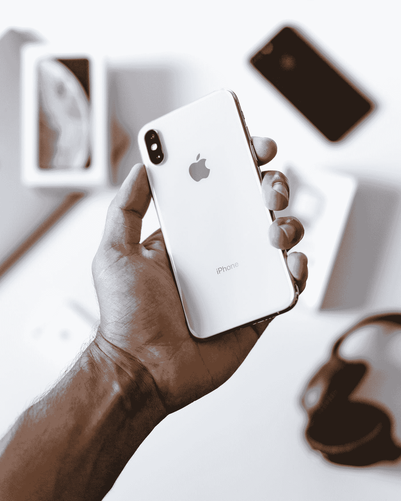

# 我们用的是什么 iPhone？

> 原文：<https://medium.com/geekculture/what-iphone-are-we-on-ed9b88684e56?source=collection_archive---------24----------------------->

## iPhone 的天才营销

Photo by [Kevin Bhagat](https://unsplash.com/@kevnbhagat?utm_source=medium&utm_medium=referral) on [Unsplash](https://unsplash.com?utm_source=medium&utm_medium=referral)

自从 2007 年 iphone 开始发布以来，我们并没有被手机本身所左右，但现在我们已经到了 2021 年，似乎每个人都有了。我甚至为每两年左右买一部新 iPhone 而感到内疚。作为一个社会，我们被每部 iPhone 拥有的漂亮颜色和新功能迷住了。虽然所有的手机都很棒，而且每个手机都有它自己的…