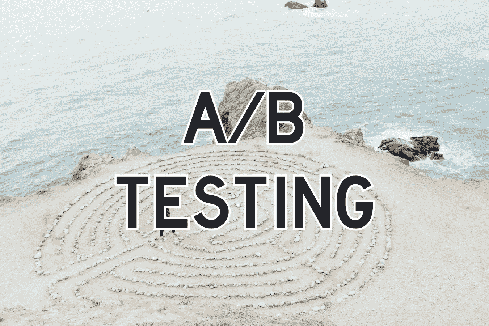

# 什么是 UI/UX 和软件中的 A/B 测试？|定义和示例

> 原文：<https://medium.com/geekculture/what-is-a-b-testing-in-ui-ux-and-software-some-definitions-and-examples-1280b8e55153?source=collection_archive---------28----------------------->

Original photo by [Ashley Batz](https://unsplash.com/@ashleybatz) on [Unsplash](https://unsplash.com/photos/betmVWGYcLY)

在本文中，我们将从较高的层面概述什么是 A/B 测试。这篇文章的范围主要是定义 A/B 测试，并给出一些例子来真正地解释这个定义。我们将在另一篇文章中深入探讨更复杂的设计和思考过程。