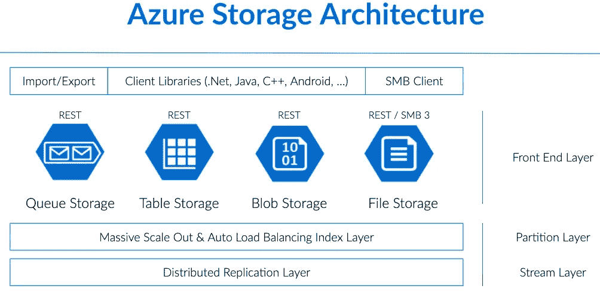
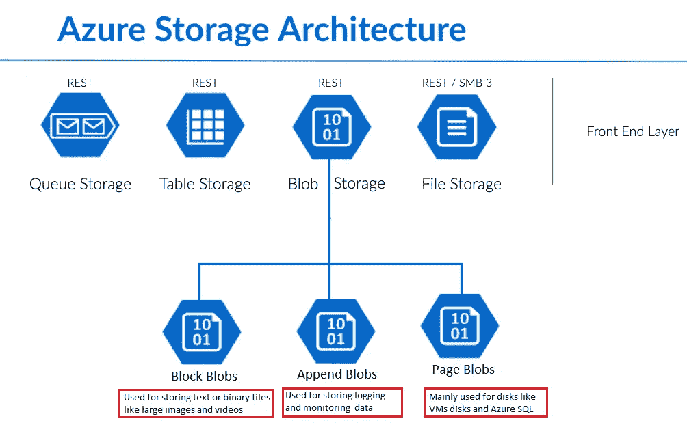
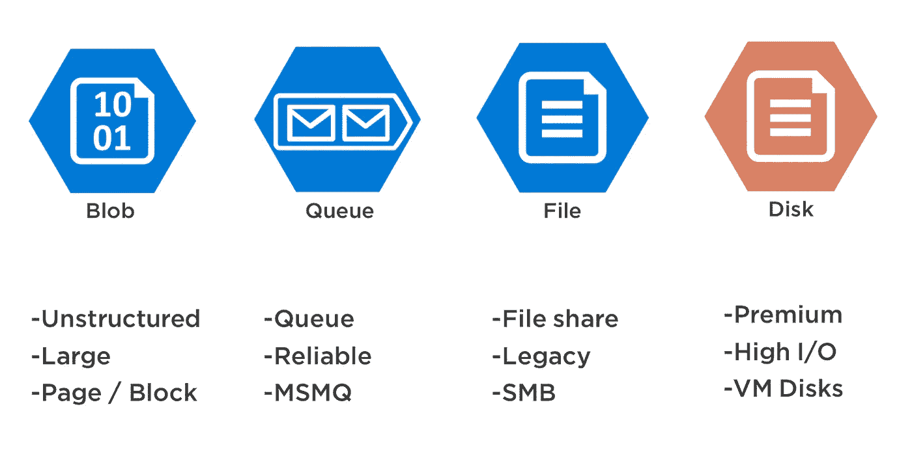
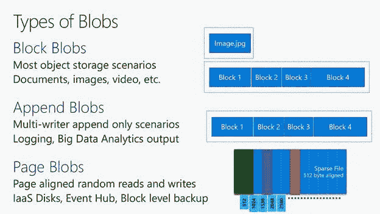
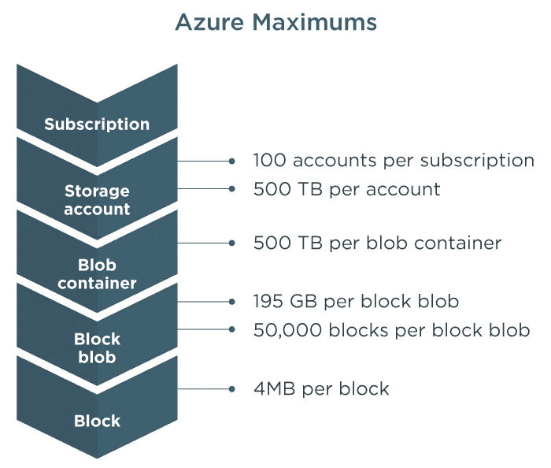

# 什么是斑点？

> 原文：<https://medium.com/geekculture/what-is-a-blob-83e65f590694?source=collection_archive---------9----------------------->

## Blob，BLOB 存储，Azure Blob 存储，BLOB 操作，Azure BLOB 存储功能

一个 [***二进制大对象(BLOB)***](https://en.wikipedia.org/wiki/Binary_large_object) 是一组[二进制数据](https://en.wikipedia.org/wiki/Binary_data)作为单个实体存储在[数据库管理系统](https://en.wikipedia.org/wiki/Database_management_system) (DBMS)中。

Photo by [Pat Whelen](https://unsplash.com/@patwhelen?utm_source=medium&utm_medium=referral) on [Unsplash](https://unsplash.com?utm_source=medium&utm_medium=referral)

由于 blobs 可以存储二进制数据，因此可以用来存储图像或其他多媒体文件。因此，blob 通常是[图像](https://en.wikipedia.org/wiki/Image)、[音频](https://en.wikipedia.org/wiki/Sound)或其他[多媒体](https://en.wikipedia.org/wiki/Multimedia)对象，尽管有时[二进制可执行](https://en.wikipedia.org/wiki/Binary_executable)代码被存储为 blob。

它用于在[数据库](https://techterms.com/definition/database)中存储信息，并且对 blobs 的数据库支持不是通用的。它们通常比其他数据类型需要更多的空间，这也是 blobs 用于存储图像、音频文件和视频剪辑等对象的原因。blob 可以存储的数据量因数据库类型而异，但有些数据库允许 blob 大小为几千兆字节。

# Blob 存储

*Blob 存储中的对象可以通过 HTTP 或 HTTPS 从世界任何地方访问。*

## Blob 存储非常适合于:

*   直接向浏览器提供图像或文档。
*   为分布式访问存储文件。
*   流式视频和音频。
*   为备份和恢复、灾难恢复和归档存储数据。
*   存储数据以供内部或 Azure 托管的服务进行分析。

Blob 存储支持最流行的开发框架(即 Java，。NET、Python 和 Node.js)，是唯一一种为低延迟和交互式场景提供基于固态硬盘的优质对象存储层的云存储服务。

Blob 存储满足 HPC 应用苛刻的高吞吐量要求，同时提供必要的规模来支持从物联网端点流入的数十亿个数据点的存储。

Blob 存储是从头开始构建的，旨在支持移动、web 和云原生应用程序开发人员的规模、安全性和可用性需求，可用作 Azure Functions 等无服务器架构的基石。

# Azure Blob 存储

Azure Blob storage 是微软的云对象存储解决方案。Blob 存储针对存储大量非结构化数据(如文本或二进制数据)进行了优化。

[Azure Storage Architecture](https://www.dremio.com/img/explained/azure-storage/image_0.png)

[Front End Layer in Azure Storage Architecture](https://1.bp.blogspot.com/-6sXQH9q-Eqw/X1zewfmDshI/AAAAAAAAcrI/bPwjfm5ePcc-X6azXJstT8P-vvBOnBkBACLcBGAsYHQ/s1004/1.png)

[Different storages and their features in the Front End layer](https://stackify.com/wp-content/uploads/2017/09/Azure-Storage-Options.png)

[Types of Blobs](https://csharpcorner.azureedge.net/article/getting-started-with-azure-object-blob-storage/Images/image004.jpg)

用户或客户端应用程序可以通过 URL、 [Azure Storage REST API](https://docs.microsoft.com/en-us/rest/api/storageservices/blob-service-rest-api) 、 [Azure PowerShell](https://docs.microsoft.com/en-us/powershell/module/azure.storage) 、 [Azure CLI](https://docs.microsoft.com/en-us/cli/azure/storage) 或 Azure Storage 客户端库访问 blobs。存储客户端库支持多种语言，包括[。NET](https://docs.microsoft.com/en-us/dotnet/api/overview/azure/storage) 、 [Java](https://docs.microsoft.com/en-us/java/api/overview/azure/storage) 、 [Node.js](https://azure.github.io/azure-storage-node) 、 [Python](https://azure-storage.readthedocs.io/) 、 [PHP](https://azure.github.io/azure-storage-php/) 、 [Ruby](https://azure.github.io/azure-storage-ruby) 。

Azure Blob 存储可帮助您为分析需求创建数据湖，并提供存储来构建强大的云原生和移动应用。利用长期数据的分层存储优化成本，并针对高性能计算和机器学习工作负载灵活扩展。

Azure 数据湖存储是一个高度可扩展且经济高效的大数据分析数据湖解决方案。它将高性能文件系统的强大功能与巨大的规模和经济性相结合，帮助您加快洞察速度。数据湖存储扩展了 Azure Blob 存储功能，并针对分析工作负载进行了优化。

## Azure Blob 存储功能

*   大规模存储和访问非结构化数据。
*   可扩展、耐用且可用。
*   安全了。
*   针对数据湖进行优化。
*   全面的数据管理。
*   构建强大的云原生应用。

[Azure Hierarchy with Azure Maximums](https://www.ctera.com/wp-content/uploads/2016/05/diagrams_01_azure_maximums.png)

# Azure Blob 操作

## [1。复制 blob](https://docs.microsoft.com/en-us/connectors/azureblob/#copy-blob) :

此操作复制一个 blob。如果 blob 在复制后立即在服务器上被删除/重命名，连接器可能会因其设计而返回 HTTP 404 错误。请在删除或重命名新创建的 blob 之前延迟 1 分钟。此操作不支持区块传输。如果源和目标在同一个存储帐户中，请使用相对路径。否则，复制 blob 操作的源的最大大小是 50 MB。

## [2。创建斑点](https://docs.microsoft.com/en-us/connectors/azureblob/#create-blob):

此操作将 blob 上载到 Azure Blob 存储。

## [3。创建块斑点](https://docs.microsoft.com/en-us/connectors/azureblob/#create-block-blob):

此操作将块 blob 上载到 Azure Blob 存储。

## [4。通过路径](https://docs.microsoft.com/en-us/connectors/azureblob/#create-sas-uri-by-path)创建 SAS URI:

此操作使用路径为 blob 创建 SAS 链接。

## [5。删除斑点](https://docs.microsoft.com/en-us/connectors/azureblob/#delete-blob):

此操作删除一个 blob。

## [6。将档案提取到一个文件夹](https://docs.microsoft.com/en-us/connectors/azureblob/#extract-archive-to-folder):

此操作将存档的 blob 提取到文件夹中(例如:。zip)。

## [7。获取可用的访问策略](https://docs.microsoft.com/en-us/connectors/azureblob/#get-available-access-policies):

该操作获取 blob 的可用共享访问策略。

## [8。获取 blob 内容](https://docs.microsoft.com/en-us/connectors/azureblob/#get-blob-content):

此操作使用 id 检索 blob 内容。

## [9。使用路径获取 blob 内容](https://docs.microsoft.com/en-us/connectors/azureblob/#get-blob-content-using-path):

此操作使用路径检索 blob 内容

## [10。获取 Blob 元数据](https://docs.microsoft.com/en-us/connectors/azureblob/#get-blob-metadata):

此操作使用 blob id 检索 blob 元数据。

## [11。使用路径获取 Blob 元数据](https://docs.microsoft.com/en-us/connectors/azureblob/#get-blob-metadata-using-path):

此操作使用路径检索 blob 元数据。

## 12。列出 blob:

这个操作列出了容器中的 blobs。

## 13。列出根文件夹中的 blobs:

此操作列出了 Azure Blob 存储根文件夹中的 Blob。

## [14。通过路径设置 blob 层](https://docs.microsoft.com/en-us/connectors/azureblob/#set-blob-tier-by-path):

此操作使用路径为标准存储帐户上的块 blob 设置层。

## [15。更新 blob](https://docs.microsoft.com/en-us/connectors/azureblob/#update-blob) :

此操作更新 Azure blob 存储中的 Blob。

# 参考:

 [## Azure Storage 简介-Azure 上的云存储

### Azure 存储平台是微软针对现代数据存储场景的云存储解决方案。核心存储…

docs.microsoft.com](https://docs.microsoft.com/en-us/azure/storage/common/storage-introduction)  [## Azure Blob 存储| Microsoft Azure

### CarMax 通过 Azure 推动在线创新“事实证明，Azure 非常适合解决我们的图像存储问题……

azure.microsoft.com](https://azure.microsoft.com/en-in/services/storage/blobs)