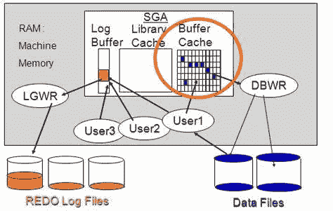

# Oracle 中什么是缓冲区缓存？

> 原文：<https://medium.com/geekculture/what-is-a-buffer-cache-in-oracle-706f13eb8455?source=collection_archive---------7----------------------->

在这里，我们将更详细地了解缓冲区缓存。

**缓冲缓存:**

*   数据库缓冲区缓存是 SGA 中最大的内存区域。该存储区域存储从数据库光盘中读取的数据块的副本。
*   由于该区域位于 SGA，因此该数据可供所有用户使用。
*   因此，当第一个用户运行查询时，将从磁盘中读取相关数据并存储到缓冲区缓存中。
*   当任何其他用户或者可能是同一用户想要访问相同的数据时，在检查盘之前，服务器首先检查缓冲区高速缓存。
*   如果我们需要的所有数据都已经在缓冲区缓存中，它可以直接从缓冲区缓存中读取数据。
*   如果一些数据不在那里，但其中一些已经在缓冲区高速缓存中，则它只针对缺少的块进入磁盘。
*   如果缓冲区高速缓存中没有与我们的查询相关的数据，服务器就将所有数据从磁盘读入缓冲区高速缓存。

**Oracle Buffer Cache**

**为什么要读入缓冲区缓存？**

*   它比数据库光盘快得多。
*   如果下一次要使用相同的数据，最好将其存储在内存中。
*   但是让我用另一种方式来解释，让你更好地理解。
*   如果您正在进行连接操作。假设它是一个笛卡尔积，那么第一个表的所有行将与另一个表连接，或者如果它是嵌套连接，它将是这样的。
*   数据可能被读取几次。如果我们一直从光盘中读取数据，那么这将是一个非常昂贵的操作。
*   因此，数据存储在缓冲区高速缓存中，并从这里快速读取。
*   因为内存的大小是有限的，所以我们不能将所有的数据都存储在缓冲区缓存中。
*   这类数据库被称为“内存数据库”。但是将所有数据存储在内存中的成本非常高，Oracle 不会以这种方式实现这一点。
*   它存储“一些”块。因此，缓冲区高速缓存中的缓冲区由复杂的算法管理。
*   它存储最近使用的数据和最常接触的数据。
*   所以它删除第一个存储的，但是如果它经常从缓存中被读取，它不会删除它。相反，它会删除最老的文件中最少使用的文件。
*   数据库写进程处理对盘的写操作。在缓冲区缓存和数据库文件之间
*   缓冲区高速缓存可以从盘中读取，也可以向盘中写入。实际上，这不是由缓冲区缓存完成的。因为它是一个内存，不能进行任何处理。
*   因此，从光盘读取由服务器处理。它从光盘中读取相关数据，并将其存储到缓冲区高速缓存中。
*   为了从缓冲区高速缓存写入盘，
*   Oracle 使用数据库写进程。

**更新声明作品:**

*   这也很重要。因为假设您对缓冲区缓存中的块执行 update 语句，
*   它不会直接更新到光盘上。

**脏块:**

*   我们对缓冲区缓存中的块进行更新，当您提交时，这些块将使用数据库写入程序写入磁盘。
*   这也提高了性能，因为它不是逐个写入，而是一步写入所有已更改的数据块。
*   在数据库术语中，这些已更改的块称为“脏块”。
*   缓冲区缓存不仅存储表数据，还存储索引数据。因为如果一个索引是常用的，那么存储它的数据也将是高效的。

**结论:**

*   正如我们所记得的，索引也存储在数据库块中，我们可以轻松地将这些块存储到缓冲区缓存中，并快速访问它们。
*   因此，基本上，数据库缓冲区缓存存储最近和最常用的块，以便在接下来的使用中更快地访问。
*   如果您的查询需要完全相同的数据，它很可能来自结果缓存
*   如果没有从那里删除。但是，即使您编写一个不同的查询来请求服务器之前读取的数据，因为这些数据存储在缓冲区缓存中，您的查询也将比第一次调用快得多。
*   因此，缓冲区缓存不仅提高了相同查询的性能，还提高了请求相同表或相同索引的查询的性能。