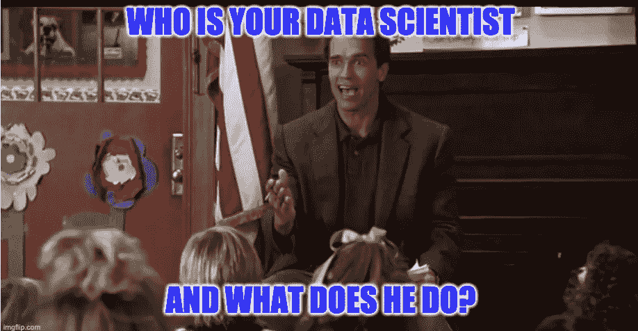
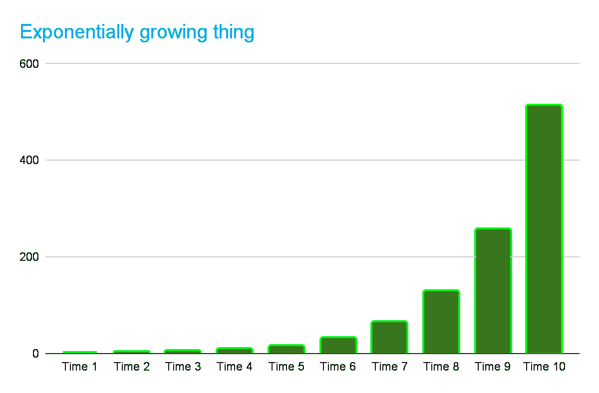
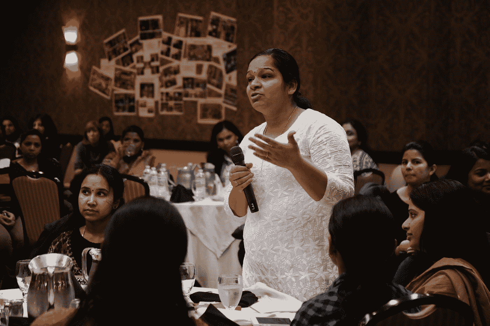

# 数据科学家的工作描述是什么？

> 原文：<https://medium.com/geekculture/what-is-a-data-scientists-job-description-ece7604a6bc9?source=collection_archive---------27----------------------->

谁是您的数据科学家？他是做什么的？*

Terrible joke, I know. I appoligise to the international Data Science community.

数据科学家是拥有分析和解释大量数据的技能的人。他们从事的工作类型千差万别，但通常涉及开发统计模型，以了解不同类型信息之间的趋势或关系。数据科学家是任何公司运营中的重要成员，因为他们可以帮助根据数据做出决策，并提供对业务实践的见解。

什么是数据科学家的工作描述？数据科学家的任务包括分析和解释大型数据集，构建统计模型以过滤掉社交媒体帖子等原始数据源中的噪音，创建预测分析算法，将大数据集组织成有用的格式(如电子表格)等等！在此了解成为数据科学家需要了解的内容。

在我看来，数据科学是抽象科学的最高形式。它不够抽象，不足以成为数学(但确实包含许多数学)，而且它是科学，所以你正在做的事情在别人看来像是魔术。

这也是一种信息技术。抽象的东西比非常实用的东西获得更多的杠杆作用(帮助更多的人)，信息技术发展非常快，并以指数方式改变世界！

如果你不知道指数增长是什么样子，或者像我一样，你只是喜欢图表的外观，这里有一张图片。

后面的时代那么大，你连开始都看不到！它每走一步就翻倍，每一步都比之前所有值的总和大！
Sum(时间 1 到时间 9) = 511。
时间 10 是 512。
这就是信息技术快速改变世界的原因。

然而，这确实意味着，如果你是一名数据科学家、数据工程师、机器学习专家或程序员，你必须快速学习以保持相关性，因为你脚下的地板移动得越来越快。

Data Scientists be like:

通常，这意味着跑步是为了保持静止(保持在工作中)，并最终进入更以人为本的领导和管理角色。

在这种情况下，你想学习如何用简单的方式沟通非常复杂的事情，并且用演讲技巧影响各种各样的人。事实上，作为一名数据科学家，你总是希望与你工作的组织中的各种人交流。如果你不这样做，你的建议就不会被听取，你认为需要做出的改变也不会被实施。所以你的雇主永远也不会知道你的真正价值，你将会被雇主认为是多余的，而不是提升你的职业生涯。

许多数据科学家拥有出色的技术技能，但没有很好的沟通技巧。沟通技巧用你的技能最大化你的影响力。

另外不像技术技能。他们不会改变。人还是人。你需要使用新的交流工具，但它们不会改变你需要成为一个有趣的演讲者或作家。

因此，从投资提高你的沟通技巧中获得回报。

Get yourself heard. Photo by [Wonderlane](https://unsplash.com/@wonderlane?utm_source=medium&utm_medium=referral) on [Unsplash](https://unsplash.com?utm_source=medium&utm_medium=referral)

下面显示了你在 DS 工作中需要多少沟通能力，以及其他一些东西。

# 数据科学家的一天看起来有点像这样

这是一个无领导的 DS:

1.  用 Python 进行编码和调试，就像你昨天做的那样。
2.  被召集到团队开会——大部分是数据和科学人员——笔记本，如果有更多的员工/老板在场，可能还有 PowerPoint。
3.  向领导或老板汇报你目前的进展——虽然没有你希望的那么多，但一个有经验的科学家领导会有这样的期望。
4.  听取领导的建议并倾听他人的意见，尝试提出好的问题并为他人提出好的建议。就非常难做的事情进行非常技术性的对话。
5.  会议结束后，喝咖啡/喝茶休息，多聊聊工作/技术方面的事情。从同事那里获得一些好主意。不一定不同于在线聊天。
6.  回到办公桌前，计划并编写更多代码。这通常是大量的调试工作。
    在看板板上多写一些需要你做的事情。
7.  与另一个团队的人交谈，可能是数据的来源，或者是在设备或网站上实现你的代码的程序员，可能是质量控制或监管人员。
    在倾听他人需求的同时，试着解释你所有材料的含义，不要让对方感到困惑。
    以吸引他们注意力的方式说话，清晰但不简单。多听听，试着看看你是否应该改变他们的想法或者你的技术工作。
    编码人员很懒(这通常是件好事，因为他们会自动处理一切)，所以要意识到这会影响其他事情。
8.  吃点午饭。是的，你*确实*想离开办公桌*一步，因为午餐时间工作意味着你更累，效率更低。此外，去厨房、厕所或买午餐这些简单的动作有助于你的大脑更好地思考。但是当你没有时间去获得食物或者和别人谈论工作的时候，试着集中注意力。*
9.  总是将代码和文档备份到 Git/SVN/GitLab 等。
    如果你*不*这么做，你会失去一切*哭*！我见过这个。
    如果你*做到了*这一点，你的贡献就能被你的团队看到并得到提高。
10.  更多的喝咖啡/喝茶时间，聊聊工作之类的事情。
11.  试着从精神上退一步，看看大局，看看你的人在努力实现什么。不要总是专注于你的一个微小的细节。
12.  完成其他事情:计划、文档和编码、电子邮件/即时消息和培训:组织程序和数据科学技能。
13.  多喝点咖啡聊聊天。
14.  更多的调试。
15.  你现在可以回家了。
16.  当你有空间和平静地思考时，想想你的工作问题——痴迷有利于解决问题(获得结果)，这对你的职业生涯也有好处。
17.  尽量在晚上或者清晨多做一些训练。

第二天，你会为自己的工作感到高兴，在这份工作中，你可以做大多数人做不到的复杂事情，并利用你所在的组织，利用你的贡献帮助成千上万的人？)的人。

这是一个相当繁忙的示例日，也许不是所有这些都发生在同一天。

Plate spinning, like a job with lots of tasks.

其他工具和任务:使用 SQL 查询数据，使用 Excel/TextEdit/notepad 或 R 或 Python 甚至 MATLAB 等编码语言清理数据，进行超参数调整以改进您的最佳 ML 模型，检查和评论团队成员的代码，查看组织程序和 DS 计划的文档，为世界人民制作代码库，会见合作者或潜在合作者，参加会议以分享您在数据科学/ML/AI 方面所做的和/或听到的其他事情。

# 总结一下

数据科学家是一个很有吸引力的职业，多年来一直有需求。这是因为数据科学家和类似的人做了很多真正困难的事情，需要利用技术工具从信息(数据)中带来更大的变化。这份工作需要从编码和数据处理到良好沟通、统计知识和机器学习专业知识的技能。

随着世界变得更加数字化，将越来越需要能够处理大数据集并从中提取有价值的信息，并让组织采取建议的行动以从数据中获得结果的专业人士。

如果数据科学家能够更好地交流和影响，这对世界是非常好的。

Influencing (with education and good arguments) improves your life and others.

# 词汇表

在现实生活中。

DS:数据科学家或数据科学。

ML:机器学习。

AI:人工智能(不是线性回归或逻辑回归)。

*:“你爸爸是谁，他是做什么的？”幼儿园警察里的？在你出生之前？

## 关于作者:

我是文斯·霍尔博士，数据科学家职业转型蔻驰:我是 DSs 的职业教练，帮助数据科学家获得晋升和新工作，我也是一名 DSs。我这样做是为了帮助数据科学家提高他们的演讲和在线表现(简历、个人资料)，有时也是为了帮助我使用过的技术工具(如 Python、ML、Git)。要了解更多关于我的信息，请访问我在 LinkedIn 上的简介:[https://linkedin.com/in/vincent-hall-consulting](https://linkedin.com/in/vincent-hall-consulting)

为读书欢呼。

最后的思考:最好的运动员是在有教练或没有教练的情况下成为最好的吗？