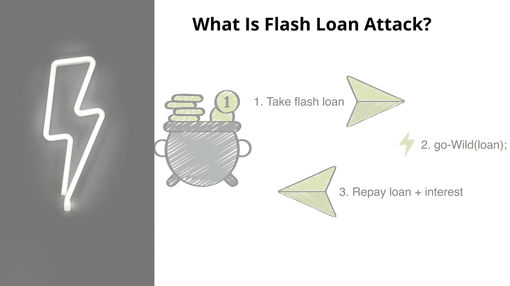
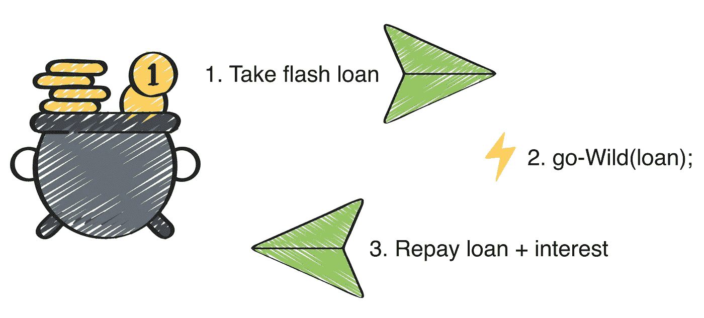

# 什么是 Defi 闪贷&如何防范闪贷攻击？

> 原文：<https://medium.com/geekculture/what-is-a-defi-flash-loans-flash-loan-attack-c130c83d9811?source=collection_archive---------2----------------------->

## 了解 Defi 快速贷款攻击和保护您的钱免受其害的方法

## 我觉得:

> “分散金融的魔力刚刚开始，并将持续下去，所以如果你是 Defi 项目和硬币的早期采用者之一，请保持耐心，继续做你的功课，挑选它的多用途案例，以赚取一些额外的现金。因为 Defi 仍然容易受到许多黑客攻击和安全漏洞的攻击，所以额外的一点谨慎将保持其魔力不变”

今天，我们将了解另一个很酷的 Defi 产品，称为快速贷款，并了解使用案例以及应该了解的相关风险因素。

我们将在 Defi 快速贷款之旅中学习以下内容:

*   *什么是闪贷？*
*   *闪贷的关键属性是什么？*
*   *如何使用闪贷？*
*   *什么是闪贷攻击&它是如何运作的？*
*   *如何保护自己免受闪贷攻击？*
*   *结束语&总结*

# 什么是闪贷？

source: [hackingdistributed](https://hackingdistributed.com/images/2020/flash-loan.png)

在加密定义领域，**快速贷款**是一种非常独特的交易工具，用户可以在没有任何第三方中介的情况下从贷方借入无担保贷款。智能合约管理交易，并确保只有在严格遵守合约中给出的所有规则时，交易才能执行。

在我们的传统银行系统中，贷款分为两类:担保贷款和无担保贷款，担保贷款要求用户附上某种担保作为抵押，但在无担保贷款的情况下，不需要抵押，贷款会根据您过去的 CIBIL/CRIF 评分进行审批，这将考虑您过去的还贷记录。

*同样，无担保快速贷款也适用于你，在这里，某些规则是预先确定的，如果你遵守了这些规则，那么只有你的贷款交易才能通过*

# 你应该知道的闪付贷款的独特特征:

## 由智能合同规则驱动:

智能合同区块链软件包含所有的规则，以促进快速贷款交易。智能合同确保在交易结束之前，直到借款人偿还贷款，握手才算完成。

**借款人违约怎么办？**

如果借款人违约，智能合同将撤销交易，这意味着贷款从未发生过。

## 快速且即时:

从闪光这个术语可以清楚地看出，它表示突然出现并停留很短时间的东西，也就是瞬间。同样，快速贷款是即时的，贷款寻求者必须使用智能合约来执行针对贷方借出的贷款的即时交易，该交易必须在交易结束前发生，交易通常会停留几秒钟。

## 它是无抵押的(无担保工具):

正如我们已经讨论过的，快速贷款是一种无担保贷款，借款人不需要担保就可以获得贷款。虽然说它是无抵押的，但我们必须明白，这并不意味着贷款人无法收回他借出的金额。

这种情况确实发生在智能合同的使用中，在合同到期前，借款人必须立即还钱，而不是提供抵押品

**所以总结一下:**

*快速贷款的寿命非常短，所有的借贷都必须在它像手电筒一样到期之前的短时间内发生*

# 为什么要用闪贷？

我觉得:

> 首先，如果你精通套利交易，这种工具确实为你提供了一个很酷的工具，让你获得可观的收益。对于新手来说，使用它可能看起来有些力不从心，所以建议您在完全了解加密市场并获得足够的经验之前，不要使用这个工具

**那么让我们来讨论一些流行的闪贷用例，**

## 套利交易:

由于时区差异、交易量和订单，加密领域的不同交易所对于交易的相同代币/硬币确实存在一些价格差异(1–3%)。不同交易所之间的价格差异为交易者快速获利打开了一扇小窗口。这种机制被称为套利交易。

这些交易员利用这种快速贷款工具进行杠杆操作&从一家交易所低价买入硬币，然后在另一家交易所以较高价格卖出，从而快速获利并偿还贷款。所有这些都发生在很短的时间内，以使套利有效&是的，这也有一点风险，所以需要一点谨慎。

## 交换抵押品:

交易员还利用快速贷款，迅速将支持贷款的低质量抵押品与其他一些高质量抵押品进行互换。

## 为了节省交易费用:

由于快速贷款推出聚合所有复杂的交易到一个单一的步骤，这通常要经过多个步骤，在正常的交易，所需的天然气费是相当低的一方。Son 交易者也可以使用快速贷款工具来购买和出售相关的数字硬币/代币，从而节省一些汽油费。

现在你已经理解了什么是快速贷款以及如何从中受益。理解它的消极面是极其重要的。闪贷一开始可能看起来很诱人，很美好，但要注意，它并非没有安全漏洞。

**让我们讨论一下这些安全问题是什么，以及如何解决这些问题**

# **闪贷相关风险:**

> “你最大的优势有时也会成为你最大的弱点”

## 快速贷款攻击:

闪贷的优势在于智能合约软件，同样智能合约也是其最大的弱点。这种智能合约容易受到一种非常突出且常见的安全攻击，称为“**闪贷攻击**

## **什么是闪贷攻击&它是如何运作的？**

假设安吉拉想借价值 20，000 美元的 USDT，一个支持闪贷的借贷协议立即向安吉拉提供，而无需任何担保，但现在安吉拉有义务在闪贷交易结束前偿还相同的贷款。为了做到这一点，Angela 必须迅速行动，因为在交易被撤销之前，债务必须按时偿还给贷款协议。

由于不需要抵押品，借贷协议完全依赖智能合同来确保 angela 还钱，这就是漏洞所在，如果软件由于一些错误而开始行为不端怎么办？或者规则被入侵者操纵，协议被篡改。这种利用智能合同的区块链软件导致对快速贷款协议的攻击，通常被称为快速贷款攻击。

让我们通过过去发生的一些真实事件来进一步理解对闪贷的攻击

## 一些流行的闪贷攻击事件:

1.  **dydx 闪贷攻击:**

这一事件发生在 2020 年，攻击者从 dYdX lending DApp(**Defi exchange)，**将这笔贷款分成两部分，在两个不同的名为复合&支点的借贷平台上进行交易

攻击者使用一部分**以太坊**贷款在支点交易所做空 WBTC，触发支点通过将该信息转发给另一个名为 Kyber 的 Defi 协议来获取该 WBTC，最终使用 Uniswap DEX 完成订单请求。由于 Uniswap 的流动性池在当时流动性非常低，WBTC 的价格大幅上涨，这意味着 Fulcrum 最终为其购买的 WBTC 支付了过高的价格。

与此同时，当支点交易发生时，攻击者利用剩余的 dYdX 贷款金额从复合 Defi 平台借入 WBTC 作为闪付贷款，一旦价格飙升，攻击者就在 Uniswap 上翻转借入的 WBTC，并获得一些健康的利润，并用这些利润偿还从 dYdX 中提取的贷款，并将剩余的 ETH 收入囊中。

这一事件凸显了我们的智能合约协议的明显漏洞，在这种情况下，它恰好是支点使用的 **bZx 协议。通过与 5 个不同的 Defi 协议进行多次交易，攻击者能够欺骗 **bZx 协议**认为 WBTC 比实际价值高得多。这是一种纯粹的市场操纵，实际上没有违反在闪贷交易结束前偿还贷款的智能合同规则。**

**PancakeBunny 攻击:**

这是最近发生在 2021 年 5 月 PancakeBunny 的事件:一个基于 Defi 的产量农业平台。借款人(攻击者)使用 PancakeSwap 购买了大量 BNB 代币，并利用它操纵 PancakeBunny 流动性池中 USDT/BNB 和邦尼/BNB 的价格。

这帮助攻击者积累了一大块兔子令牌，并将其倾销到市场上，造成价格暴跌。这有助于他使用 PancakeSwap 清理债务。

根据 bscscan 的数据，据报道，攻击者利用闪贷智能合同协议赚取了近 300 万美元的利润

事实上，2020 年和 2021 年发生了更多的闪贷攻击，这凸显了我们支持闪贷即服务的借贷协议中存在的漏洞。那么，如何保护他们辛苦赚来的钱免受这种恶意攻击呢？

# DeFis 如何保护自己免受闪贷攻击？

快速贷款的概念仍然不成熟，也不到 2 岁，所以他们的协议还没有变得强大，并完全净化所有这些技巧和操纵。但是，可以采取一些预防措施，在一定程度上克服这个问题，如果不是完全克服的话。让我们探索同样的问题。

## 使用像 Chainlink & Band 协议这样的分散定价 Oracles:

Defi 的可以减轻这种闪贷攻击的一个最佳方法是利用 Chainklink 和 Band Protocol 等分散定价 oracles 来获取价格反馈，而不是依赖单一的 DEX 平台(这很容易受到攻击)

> Alpha Homora 从他过去的闪贷攻击事件中吸取了教训，并决定在 2021 年 5 月推出他们的 Alpha Oracle 聚合器。

## 使用能够识别快速贷款攻击可能性的工具:

闪贷攻击者利用 Defi 平台造成的延迟来兑现交易，有什么工具可以帮助您防止这种循环利用，是的，有一些工具，如 OpenZeppelin

> OpenZeppelin Contracts 通过为以太坊和其他区块链使用久经考验的智能合约库，帮助您将风险降至最低。它包括最常用的 ERC 标准的实现。

Defi 平台可以利用此类工具来检测智能合同漏洞和利用，还可以跟踪任何异常活动，以便可以采取主动防御机制来压制攻击。

Openzepplin 已经被 Synthetix、Yearn Finance 和 T2 Opyn 区块链项目用来挑选出这样的攻击。

> “更多类似于 OpenZeppelin 的工具正在开发中，并且将会被需要，随着更多攻击被发现，随着时间的推移，这个 Defi 平台将变得更加安全。在此之前，作为一名用户，你需要格外小心地对你决定使用的平台进行深入研究。”

# 让我们总结一下:

“AAVE 通过提供这种独特的赚钱工具在竞争中领先，许多其他公司如 UniSwap 和其他 Defi 项目也纷纷效仿。这种工具本身还不成熟，还需要 4-5 年的时间才能变得更加安全、可靠和值得信赖。因此，作为一个明智的用户或交易者，在进行第一次快速贷款交易之前，做好你的功课，并考虑相关的风险。

我觉得:

> 如果你的目的是赚一些额外的钱，你肯定应该利用它，但是极度贪婪可能会让你面临一些不必要的风险和一系列可能对你不利的事件。”

# 免责声明！

CryptoWise 在此表达的观点不是投资建议，仅用于教育目的。投资者应该在对比特币、加密货币或数字资产进行任何高风险投资之前进行尽职调查。请注意，您的转账和交易风险由您自己承担，您可能遭受的任何损失由您自己负责