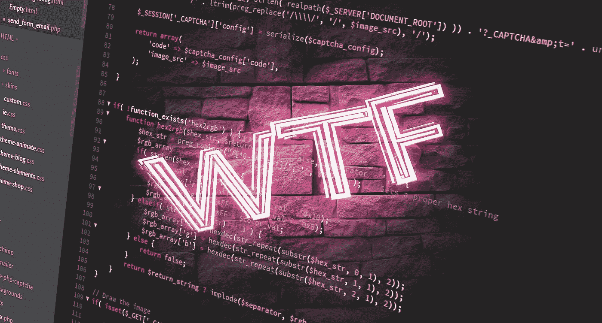

# 什么是好的代码，为什么都是关于别人，而不是我们自己？

> 原文：<https://medium.com/geekculture/what-is-a-good-code-and-why-is-it-all-about-others-not-ourselves-40730c7a03e5?source=collection_archive---------5----------------------->



软件工程师写了很多代码，但是如果你知道如何识别的话，你会很快发现这些代码通常质量很差。这有不同的原因。从没有足够的时间在注重功能的公司里把事情做好，到在过去的工作中养成的坏习惯，再到懒惰和不给一个该死的结局。

# 什么是好的代码？

所以让我们回顾一下好代码的主要方面。因为我主要用 JavaScript 编写，所以所有的例子都是基于这种语言的，但是它们可以很容易地翻译成其他任何语言(很少需要注意)。

## 命名约定

如果命名是一致的，并且风格不是随机混合的，我们可以识别出好的代码。它有助于在最基本的层面上消除困惑。

*   **驼峰** —变量和方法命名
*   **PascalCase** —用于类、组件和导入，因为它们的行为都类似于类(更具体地说，是单例)。
*   **SNAKE_CASE** —为常量。这在很大程度上取决于一个人的写作风格，因为人们经常完全按照驼峰式写作。

> 提示: **let-first 方法**假设任何东西都可以被重新赋值，因为默认感觉更好，并且在 let 和 const 之间创建了一个明显的区别。常量是一个有意识的决定，因为 SNAKE_CASE 突出了“重要”和“不能改变”。

## 变量和方法的可读名称

变量和函数名应该容易记住。经验法则是，它们不应该由超过 4 个单词组成，因为它们会变得难以理解。命名可能是编码中唯一困难的事情，我们花了太多时间却仍然会出错。名字是多么的准确和不言自明，这充分说明了编写代码的人。

```
/* BAD */
let n = 'No Title'; //you have no idea what 'n' means.let cbo = 'Chief Banana Officer'; //acronyms are usually a bad idealet mojeDane = 'Some data'; //use names in English!function toggle(){} //what the hell I'm toggling? Although, this might be OK as a method in a class as it will be within a context.function togglePopupAndRefreshWindowTrack () {} //try to remember that! Not only it's long, but it also describes what function does.
```

## 高效功能(干态)

理想情况下，函数只做一项工作，而不改变输入(纯函数)。所有的代码和分支都应该是可测试的，快速的，易于更新的。可重用性是我们经常寻找的优秀代码的标志。这也延伸到像函数式和面向对象式这样的写作风格，如果你看到两者的混合，它可能不是好代码。

## 结构和风格良好

结构是代码在文件中的组织方式——根据职责或目的。一个好的代码应该有一个逻辑流程。您应该能够识别几个块，每个块负责做一件特定的事情(按职责组织)，或者从定义配置和变量开始，到私有方法，最后是公共方法(按目的组织)。

样式包括一致的缩进、样式和换行符。所有这些小事都很重要。一个人如何格式化他们的代码可以很好地洞察他们是如何思考的。对细节的关注是优秀工程师之所以伟大的原因。如今，它们中的大多数应该由 IDE 和构建工具来处理。

## 容易理解

易于理解的代码是许多东西的集合。它包括命名、结构和格式。如果已经应用了所有的常识规则，并且已经为人类编写了代码，那么它将很容易阅读和理解。

> 提示:写代码就像**说另一种语言**。有科学证据表明，在编写优秀的代码时，最重要的不是数学，而是语言技能。Js、Python、C、Java……都只是为了人类和机器交流而创造的外语。如果你是唯一一个了解你的代码在做什么的人，那么你作为一个软件工程师是失败的。

最好的代码总是简单的代码。使用奇特的方法、意想不到的方法和甜蜜的俏皮话经常会导致可怕的结果——对任何人来说都是缓慢和不可读的。最后，你总是为其他人写代码(当你不得不在性能上极客化时，偶尔为机器写代码)，好代码的一个最重要的标志是易读性。

```
// Sweet one-liner but good luck trying to figure out what it does. 
// Plus, it is not performant code.
function doCoolThings(n){
    return (n).toString(2).split('').reverse().map((v,i)=>v==="1" && Math.pow(2,i)).filter(Boolean);
}// Does the same thing as above, but ultra-fast (2.4M ops/sec)
// Even junior can understand what is happening here
function doCoolThings(value) {
    var returnArray = [];
    var highestValue = Math.pow(2, Math.floor(Math.log(value) / Math.log(2)));

    while (value > 0) {
        if (value >= highestValue) {
            returnArray.push(highestValue);
            value-=highestValue;
        }

        highestValue/=2;
     }

     return returnArray;
}
```

## 可测试和已测试

好的代码是伴随测试而来的，不仅仅是虚拟行覆盖，而是真正好的单元测试。这也包括“破坏性的”场景，检查优雅的故障处理。如果测试有突变测试支持就更好了。

> 提示:**突变测试**——如果你还没听说过，那就去看看 Stryker 吧。这个小测试套件会故意破坏你的代码来测试你的测试质量。

## 评论很好

令人困惑的事情应该得到解释，方法应该得到充分的描述。完全没有评论是很可怕的。另一方面，太多的评论也不好。好的代码有正确的平衡，注释主要解释为什么，有时解释什么，从不解释什么

> 提示:如果有人说他们的代码是**所以** **干净、不言自明**并且不需要任何注释，他们可能是个混蛋。

## 证明文件

文档支持的代码主要与库和更重要的解决方案相关，因为通常情况下，没有它你就无法开始项目。这就是为什么 jQuery 在前十年广受欢迎并统治了 JavaScript——他们的文档比什么都好。易于使用的好文档推动互联网的采用率超过 70%。

> 提示:当您在团队中编写代码并遵循 JSDoc 之类的**标准时，您就拥有了自动生成文档的所有工具，而没有在某些第三方工具中管理它的开销。代码注释和文档一气呵成！**

## 逻辑文件夹结构

这有点脱离代码本身，但是在代码所在的地方有一个坚实的文件夹结构是很重要的。文件应该适当命名，并且在命名约定中不同文件夹之间保持一致。这也意味着不要以包含所有内容的文件夹告终。

> 示例:/tests 文件夹，其中包含 100 个文件，每个特性和组件的测试位于另外 100 个不同的文件夹中。这是一个糟糕的设计，会导致未来的问题(尤其是当团队快速成长的时候)。

## 表演

代码应该很快，没有理由让它变得很慢。虽然，在大多数情况下，这是由于缺乏知识或简单的懒惰，经常用“我一直是这样做的，而且很好”来解释。当然，代码的性能应该取决于它在整个应用程序中的使用频率，但是让事情变得更快通常会导致一个更干净和更可读的应用程序。所以是双赢。

```
// Both examples are easy to read.
// So why would you use the slower one?// SLOW
// You can use for object and array
for (let item in items) { 
    console.log('got item', items[item]);
}// FAST
// Only for arrays. For objects, you might go with Object.keys loop.
for (let i = 0; i < arr.length; i ++) {
     console.log('got item', items[i]);
}
```

## 实施示例

我们能看看实现的例子吗？我们有呈现特定对象、特性、组件或功能的实际代码示例吗？这主要适用于库，但对于可重用组件和设计系统也非常重要。从某样东西开始并了解它是如何工作的最简单的方法是通过简单地复制/粘贴代码来观察它们的运行。这是优秀文档的一部分，回答了列表中的另一个问题…

[](https://blog.devgenius.io/web-design-system-that-is-not-a-build-it-from-scratch-with-some-confidence-af77fb1d23e5) [## 更好的网页设计系统策略——组件、可重用性、技术和成功。

### 为您团队的未来 web 应用程序构建“乐高积木”时，计划、构建并避免常见错误。拿一些…

blog.devgenius.io](https://blog.devgenius.io/web-design-system-that-is-not-a-build-it-from-scratch-with-some-confidence-af77fb1d23e5) 

## 这是正确的解决方案吗？有用吗？

如果代码看起来像有人因为看到钉子而用了锤子，那很可能就是这么回事。如果开发者只有一把锤子，那么一切看起来都像钉子。我们的知识对于找到问题的正确解决方案至关重要，而不是相反。学习是必须的，即使是最初可能觉得无关紧要的事情。一个问题是如何解决的，很大程度上说明了程序员的技能。

最后，代码应该工作了！你的 It 有多好的结构和组织并不重要。这可能是最重要的，我们应该回答的第一个问题是，“它有效吗？”:)


A doughnut

# 代码质量就像一份食谱

如果你试图戒掉甜食，将很难抗拒，但最终，当你改变你的自然“默认设置”时，你将达到一个点。处理代码的方式类似。努力提高质量，后期会有回报，成为自然的“牛逼默认”。

> 优秀不是一种行为，而是一种习惯

代码质量不是你做一次就排序的。事物在不断发展，新功能不断增加，产品需求也在不断增加。Web 应用程序是活的有机体，你需要确保代码质量是它们 DNA 的一部分，就像卡路里是甜甜圈的一部分一样。


# 知与行

如果开发人员不在现实世界中应用这些东西，那么知道所有这些东西就毫无意义。当工程师被问到，“什么是好的代码？”这是我在采访中经常谈到的话题之一，他们的回答差别很大。大多数人会提到变量名、结构、样式，也许还有文档。这些都是显而易见的事情，但很少能详细解释它们真正的意思。尤其是当你开始寻找答案，需要在编写好代码的背景下考虑整个团队的时候。

人们谈论高质量代码的方式很大程度上说明了他们的关注点。无论他们是以自我为中心，还是明白写好代码几乎与他们想要什么无关，都是为了别人。