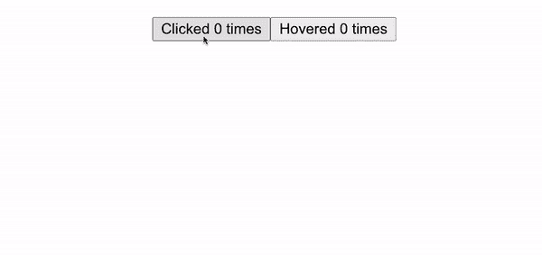

# 什么是高阶分量？

> 原文：<https://medium.com/geekculture/what-is-a-higher-order-component-204f0cd7bcfb?source=collection_archive---------23----------------------->

React 的组件逻辑复用系统详解


Bruce Wayne is enhanced by his Batsuit like a Higher Order Component enhances a normal component (Source: [https://chrisnolan.fandom.com/wiki/Bruce_Wayne](https://chrisnolan.fandom.com/wiki/Bruce_Wayne))

您是否曾经在代码库中工作过，或者在线观看过教程，并且遇到过类似这样的事情:

```
export default withResponsive(Home)
```

不管你有没有意识到，你已经遇到了一个更高阶的成分。

高阶组件(简称 HOC)是 React 的方式，它给多个组件一些重复的功能或行为，而不必在组件中一次又一次地重用相同的代码。这是遵循 DRY(不要重复自己)格言和减少代码混乱的一个非常聪明的方法。

HOC 是一个函数，它接受一个组件作为参数，并返回一个新的增强组件。

```
const EnhancedComponent = higherOrderComponent(OriginalComponent)
```

在这篇文章的标题图片中，我使用了布鲁斯·韦恩对蝙蝠侠的例子。两者的主要区别在于，蝙蝠侠是布鲁斯的加强版，有着花哨的西装和无数用来打击犯罪的小工具。在这个例子中，布鲁斯是原始组件，蝙蝠侠是增强组件。他的套装(以及小配件和蝙蝠战车)是特制的。

```
const Batman = withBatSuit(BruceWayne)
```

这个特殊的蝙蝠装可以让布鲁斯接触到他的蝙蝠装物品，并把他变成哥谭市自己的黑暗骑士。

那么它到底是如何工作的，什么时候使用合适呢？

## 何时使用特设

假设您有一个项目，其中有多个不同的计数器对一些行为进行计数。在一个组件中，有一个按钮计算它被点击的次数，然后在另一个组件中有一个计数器跟踪鼠标经过某个 div 的次数，然后在另一个组件中计算某个页面被访问的次数。所有这些组件将具有相似的行为(在某个特定动作后将计数增加 1)，但是由于它们都略有不同，因此很遗憾我们不能制作完全相同的组件。

现在，在 HOCs 之前，您必须将 incrementCounter 行为写入每个对象，然后使用某种状态变量来跟踪计数。但是这需要大量的复制、粘贴和重复代码。如果我们给每个组件一个 incrementCounter 函数和一个 state.count 变量，然后只调整每个组件中触发 incrementCounter 函数的动作，会怎么样？

这正是我们能做的！

另一个用例是根据用户是否从笔记本电脑、手机或平板电脑访问页面来决定如何显示页面。如果你的网站是移动响应的，当你给组件传递一个名为 isResponsive 的对象时，有一个很常见的模式，它是一个布尔值，表示真或假。您可以使用一个名为 withResponsive 的 HOC 来呈现组件，而不是将它作为道具传递给每个需要访问的组件，它将为每个组件提供对 isResponsive 对象的访问，指示它应该如何向用户显示。

这是两种常见的用法，但是您可以在任何需要多个组件共享某种行为的地方使用它。

# 在您的应用中实现特设

让我们回到我们的第一个例子，在应用程序中为多个组件添加一个计数器。

如果我们将计数器行为硬编码到每个应用程序中，您最终会得到如下结果:

## **App.js**

```
function App() {return (
  <div className="App">
    <ClickCounterWithoutHOC/>
    <HoverCounterWithoutHOC/>
  </div>
  );
}export default App;
```

## **点击没有声音的计数器**

```
import React, {useState} from 'react'const ClickCounterWithoutHOC = () => { const [count, setCount] = useState(0)
  const incrementCount = () => setCount(prevCount => prevCount + 1) return ( <button onClick ={incrementCount}>
    Clicked {count} times
  </button>
  )
} export default ClickCounterWithoutHOC
```

## 无 tHOC 的悬浮计数器

```
import React, {useState} from 'react'const HoverCounterWithoutHOC = () => { const [count, setCount] = useState(0)
  const incrementCount = () => setCount(prevCount => prevCount + 1)return (<button onMouseOver ={incrementCount}>
    Hovered {count} times
  </button>
  )
}export default HoverCounterWithoutHOC
```

如你所见。这种模式很好，也很有效，但是我们在 HoverCounter 和 ClickCounter 之间重复了很多代码。现在想象一个场景，有 5 个甚至 50 个其他组件需要这个计数器行为，突然之间你有了一个非常低效的代码库。



It works!

相反，让我们创建一个名为 withCounter.js 的高阶组件，它将为我们添加这个 count 和 incrementCount 行为。

## 带计数器

```
import React, {useState} from 'react'const withCounter = OriginalComponent => {
  const EnhancedComponent = () => { const [count, setCount] = useState(0)
   const incrementCount = () => setCount(prevCount => prevCount + 1) return ( <OriginalComponent
        incrementCount ={incrementCount}
        count={count}
      />
    )
  }
  return EnhancedComponent
}export default withCounter
```

您将看到该组件所做的是将 count 和 incrementCount 的声明移动到 withCounter.js 中，然后它返回一个 EnhancedComponent，它只是原始组件，increment count 和 count 作为 props 提供给它。

一旦你在实践中看到它，这是一个非常简单的概念。让我再重复一遍。

**高阶组件只是一个函数，它接受一个组件，并通过将一些行为作为道具传递给它来增强它。然后，高阶组件返回新的、增强的组件供您使用。**

现在让我们看看这是如何影响 ClickCounter 和 HoverCounter 的

## 点击计数器

```
import React from 'react'
import withCounter from './withCounter'const ClickCounter = ({count, incrementCount}) => { return (
    <button onClick ={incrementCount}>
      Clicked {count} times
    </button>
  )
}export default withCounter(ClickCounter)
```

## 悬浮计数器

```
import React from 'react'
import withCounter from './withCounter'const HoverCounter = ({count, incrementCount}) => {return (
    <button onMouseOver ={incrementCount}>
      Hovered {count} times
    </button>
  )
}export default withCounter(HoverCounter)
```

看看与没有 withCounter HOC 的对应物相比，这要干净得多。

我们需要做的就是将 withCounter 导入到每个组件中，并在底部用 withCounter 包装我们的导出。这将导出我们组件的增强版本。

然后，我们所做的就是析构我们的道具，让我们在我们的 JSX 体中访问 count 和 incrementCount，我们就完成了！

确保您的 App.js 文件看起来像这样，以便您可以测试它:

## App.js

```
function App() {return (
  <div className="App">
    <ClickCounter/>
    <HoverCounter/>
  </div>
  );
}export default App;
```


Works exactly the same as before but much cleaner.

现在你知道了！如果你想访问这篇文章中的任何代码来自己玩，这里是我的 GitHub Repo 的链接。