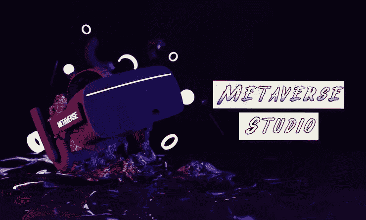
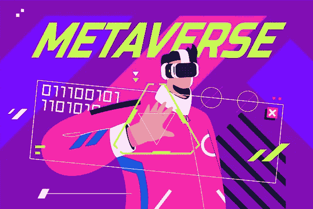

# 什么是元宇宙工作室？它怎么会是元宇宙王国潜在的金鹅呢？

> 原文：<https://medium.com/geekculture/what-is-a-metaverse-studio-how-can-it-be-a-potential-golden-goose-in-the-metaverse-realm-3f84f8b7c9d?source=collection_archive---------14----------------------->

## 让我们更深入地研究一下元宇宙工作室，以及它如何成为元宇宙王国的一个有利可图的商业机会。

Metaverse Studio

走进商店，试穿衣服，然后买你喜欢的衣服是很简单的，对吗？没什么吸引人的。但是，如果你不在商店里也能做所有这些事情，会怎么样呢？听起来很有趣，对吧？多亏了元宇宙，所有这一切才成为可能。元宇宙是一项迷人的技术，吸引了全世界数百万人的兴趣。通过元宇宙工作室，用户可以创建自己的增强现实体验。这已经成为近年来元宇宙地区最成功的商业模式之一。让我们更深入地研究一下 [**元宇宙工作室**](https://bit.ly/3ePgsUj) 以及它如何在元宇宙王国成为一个有利可图的商机。

## **元宇宙工作室**

元宇宙工作室使用户能够创建增强现实体验。您可以创建一个帐户并安排元宇宙组件来安排 storyboard connect 上的项目，而无需任何编码。元宇宙工作室允许在娱乐、购物、社交、工作等方面跨越物理和数字生活。用外行人的话来说，元宇宙工作室是一个块编程接口，在这里你可以不用编码就可以进行可视化编程。除了编码，你可以通过从菜单中选择命令和媒体并将这些命令编译在一起来创建你的增强现实。然后你可以在任何 iOS 或 Android 设备上体验增强现实。

到 2030 年，全球元宇宙工作室的市值预计将达到 8488 亿美元，CAGR 为 39.1%。以这样的指数增长速度，元宇宙工作室准备塑造游戏行业的未来。人工智能和虚拟现实也有望在未来经历相当大的转变。这极有可能导致全球元宇宙工作室的大幅增长。

## **元宇宙工作室开发如何成为一项有利可图的业务？**

元宇宙工作室提供了巨大的商机，为企业带来巨大的利润。据估计，到 2025 年，虚拟现实游戏可能达到 4000 亿美元，元宇宙可能创造 1 万亿美元的总额。元宇宙工作室的一些商业机会是

## [**玩赚游戏:**](https://bit.ly/3shcarH)

> 博彩业是最成功和最赚钱的行业之一。“玩赚”是一种独特的游戏模式，在全球广受欢迎。它可以让玩家一边玩游戏一边赚钱。当元宇宙加入进来时，P2E 游戏可能是最有利可图的商业机会之一。

## **用户 3D 配件:**

> 有了一个好的设计团队，你可以为虚拟现实游戏创造配件。以元宇宙游戏为例，用户喜欢尝试不同的配件、可穿戴设备和头盔。这些配件、可穿戴设备和头饰可以使用工作室提供的工具包在市场上设计和销售。

## **元宇宙工作室的自由演出:**

> 元宇宙有自己的经济；拥有独特技能的用户可以提供自由职业者的工作。例如，虚拟现实艺术画廊可能需要导游来帮助游客探索环境，虚拟现实办公空间可能需要虚拟助理，玩家可以雇用战利品猎人，等等。

## **举办元宇宙活动:**

> 在元宇宙举办虚拟活动在元宇宙是一个非常有利可图的商业机会。例如，在元宇宙上发布产品可以吸引人群，同样，组织者可以从用户那里获得音乐会的费用。最近，华纳音乐与沙盒合作建立了一个虚拟音乐厅。

## [**3D NFT 交易:**](https://bit.ly/3TggpzZ)

> 3D NFT 交易是元宇宙工作室的另一种赚钱方式。元宇宙可以以国家艺术博物馆的形式收藏 3D 艺术品；用户可以在元宇宙工作室投资和交易这些 3D NFTs。

## [**出租元宇宙房产:**](https://bit.ly/3ePgsUj)

> 用户可以出租场地、房产和游戏场地，而不是出售房地产。音乐厅、办公场所等。这为业主提供了稳定和被动的收入。但请注意，在虚拟世界繁忙而重要的地区，房地产有时会很贵。

## **开发自己的元宇宙房地产:**

> 还可以用 VR 设计开发技能开发自己的房地产物业。此外，请注意，房地产开发需要一些时间，所以它可能需要一些时间，可能会有点昂贵，不像元宇宙上的游戏开发。

## **土地买卖:**

> 许多领先公司，如摩根大通和普华永道，已经开始在 Metaverses 购买土地，然后以更好的价格出售。在元宇宙，购买房地产是一种流行的获利方式。

# **元宇宙工作室赚钱的步骤:**

C **创建加密钱包:**用户可以在元宇宙平台上已经存在的钱包上创建一个账户，或者将他们现有的钱包链接到工作室。

选择元宇宙平台:元宇宙平台可能有点贵，但有很大的商业潜力。

房地产金融:即使你对房地产投资不感兴趣，也建议你投资房地产。房地产是元宇宙工作室最普遍的赚钱方式之一。

D **evelop VR 开发技能:**有了 VR 开发技能，就可以开发 VR 游戏或空间出租或出售。

D **evelop VR 资产:**根据你的技能，你可以从零开始开发 VR 资产，也可以和元宇宙的开发公司一起开发。然后你可以把它们放在元宇宙的市场上。

**总而言之，**元宇宙正在成长为数字领域的下一个大人物。元宇宙工作室是一个为普通用户、B2B 品牌和企业家提供大量商业机会的平台。任何拥有合适技能、投资和努力的人都可以在元宇宙工作室赚钱，从中赚取大笔收入。如果你是一个元宇宙爱好者，想在元宇宙这个有利可图的未来投资，强烈建议你聘请专业的 [**元宇宙发展公司**](https://bit.ly/3ePgsUj) 来指导你的元宇宙工作室。