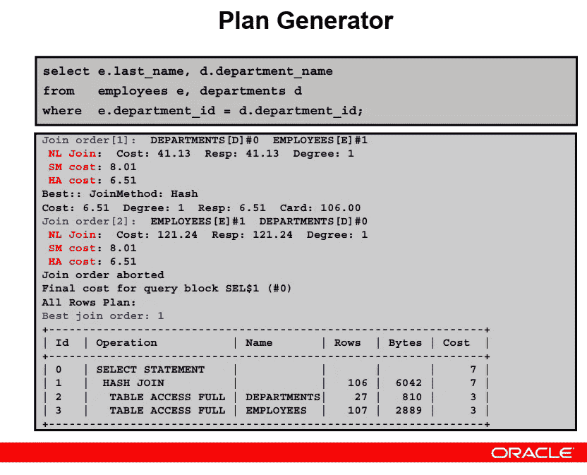

# Oracle 中的计划生成器是什么？|采访问答

> 原文：<https://medium.com/geekculture/what-is-a-plan-generator-in-oracle-fc0ba51c5a11?source=collection_archive---------11----------------------->

在这里，我们将了解执行计划的生成

*   计划生成器生成各种计划，并让估算者计算这些计划的估算成本。然后，根据生成的执行计划的成本，它挑选性能最佳的计划，并将该计划传递给行源生成器。

Oracle Plan Generator

它是如何生成计划的？

*   它基于尝试不同的访问路径、连接方法和连接顺序来生成计划。

让我们看看下面的例子。

Source: oracle

*   该模式显示了计划生成的一小部分。根据你的代码，可能有很多计划。
*   如果您看到下图，计划生成器会生成两个不同的连接订单。
*   在第一个示例中，它尝试将部门的表连接为驱动表，将员工的表连接为连接表。
*   这里的驱动表意味着，在连接两个表时，服务器首先从驱动表中选取一行，然后将该行与另一个表的相关行连接起来。
*   大多数情况下，如果它选择驾驶表作为较小的表，它会找到更好的成本。但当然，这并不总是正确的。所以它也需要尝试其他计划。
*   这里重要的是，在大多数情况下，连接顺序对性能很重要。
*   在第一个连接顺序中，它计算了 3 个不同连接的开销。

***嵌套循环(NL)连接**

***排序合并(SM)连接**

***哈希连接(HA)。**

*   稍后我们可以看到更多关于连接的细节
*   如果你看看这些连接方法的成本，哪一个成本最好。正如我们在这里看到的，散列连接是最好的连接，其值为 5.20。
*   在另一个连接中，它选择雇员的表作为驱动表，并计算这个订单的连接方法的成本。
*   现在，它选择雇员的表作为驱动表，并计算连接方法的开销。哈希连接的开销是最小值，为 5.50
*   该订单高于第一个连接订单的最低成本。所以它为连接方法选择第一个连接顺序和散列连接。然后，它创建访问路径。
*   它决定完全读取 departments 和 employees 表，并用散列连接方法将它们连接起来。
*   它是我们上面查询的执行计划。

**结论:**

*   到目前为止，我们已经采取了查询的最小部分来解释这里，特别是如果我们使用更复杂的查询，将会有很多不同的连接顺序和访问路径。