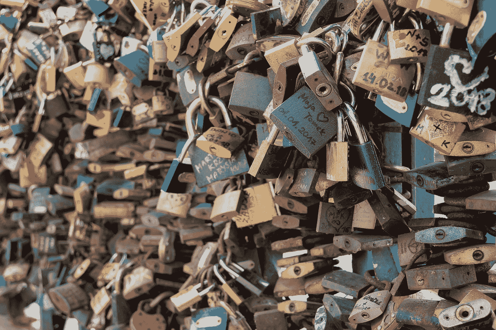

# 什么是安全密码？

> 原文：<https://medium.com/geekculture/what-is-a-secure-password-97263aeedea9?source=collection_archive---------5----------------------->

## 非开发人员的网络安全

Photo by [Paweł Czerwiński](https://unsplash.com/@pawel_czerwinski?utm_source=medium&utm_medium=referral) on [Unsplash](https://unsplash.com?utm_source=medium&utm_medium=referral)

密码是保护我们账户的锁的钥匙:你的电子邮件，银行和投资账户，社交媒体，公司门户网站，以及更多使用基于密码的认证。他们都要求你创建一个安全的密码，有时会给你这样的规则:

*   最少 8 个字符
*   至少一位数字…