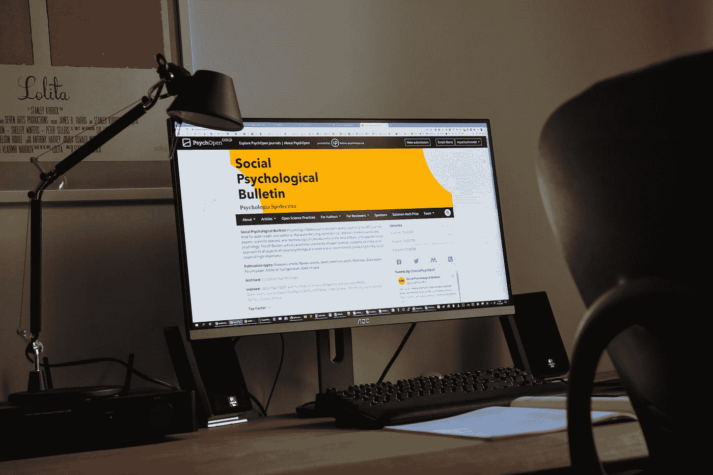

# 什么是社交媒体审计？

> 原文：<https://medium.com/geekculture/what-is-a-social-media-audit-6decb3205afc?source=collection_archive---------14----------------------->

社交媒体在过去几年里呈爆炸式增长。今天，超过 31.96 亿人使用社交媒体，了解如何最大化您的社交媒体存在非常重要。社交媒体审计将帮助你确定哪些平台、内容和渠道对你的品牌最有效。结果将允许你调整你的活动，并确定你是否花了太多时间还是不够。

Photo by [Michał Parzuchowski](https://unsplash.com/@mparzuchowski?utm_source=medium&utm_medium=referral) on [Unsplash](https://unsplash.com?utm_source=medium&utm_medium=referral)