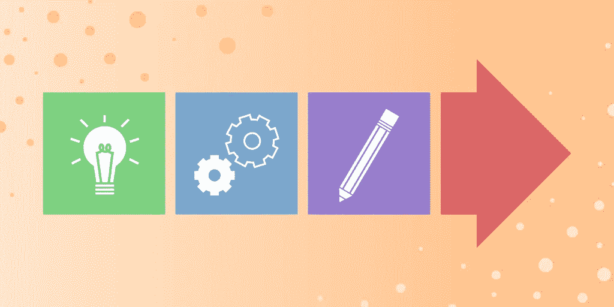
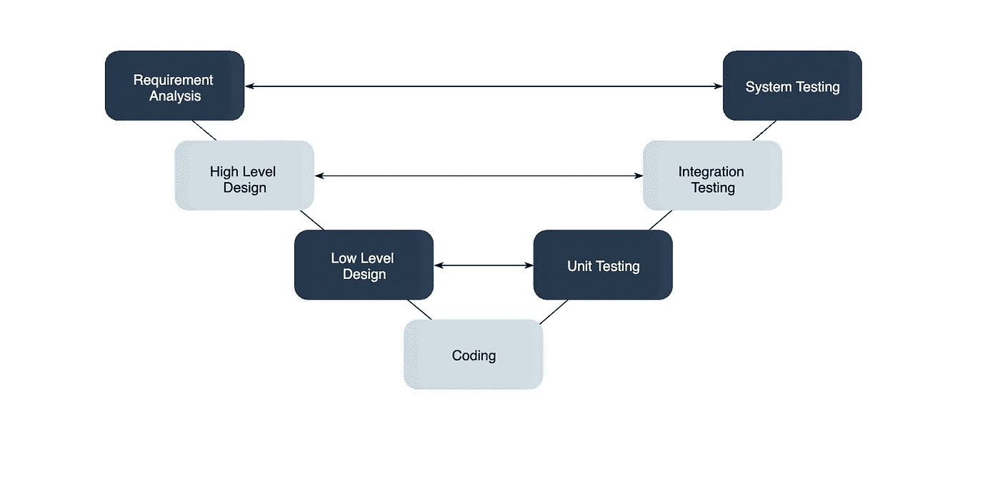
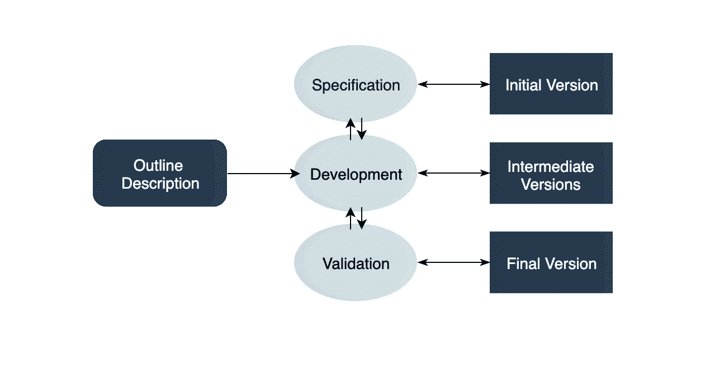
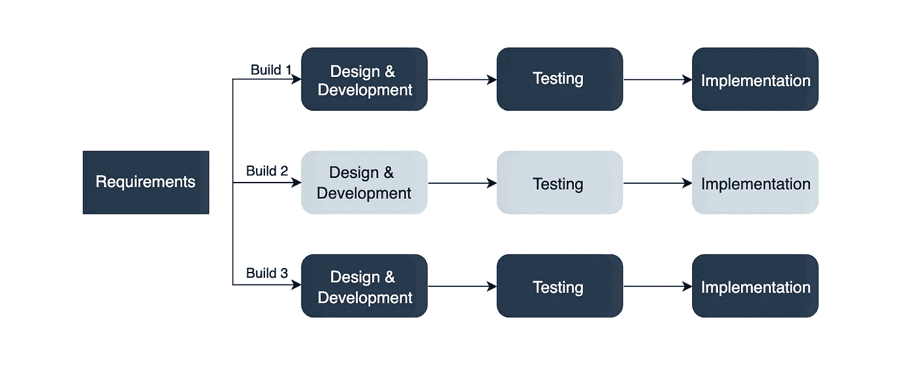
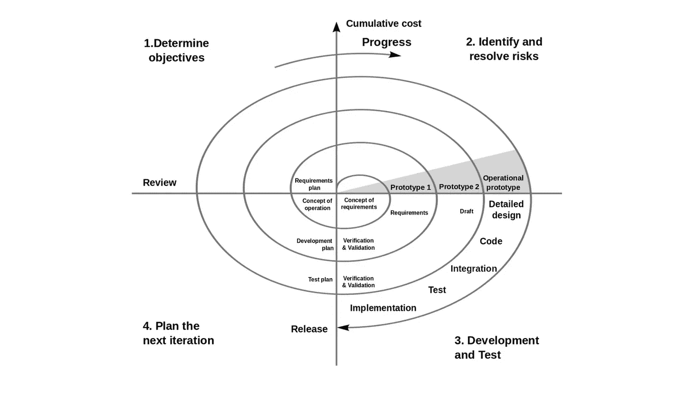

# 什么是软件过程模型？解释的前 7 款车型

> 原文：<https://medium.com/geekculture/what-is-a-software-process-model-top-7-models-explained-6240fa8ee310?source=collection_archive---------1----------------------->

## 软件过程模型是项目开发过程的抽象表示。请继续阅读，我们将探索顶级流程模型以及何时使用它们。

软件过程是设计、实现和测试软件系统的活动。软件开发过程很复杂，涉及的不仅仅是技术知识。

这就是软件过程模型派上用场的地方。软件过程模型是开发过程的抽象表示。

在本文中，我们将向您介绍七大软件过程模型，并讨论何时使用它们。

**我们将学习以下内容:**

*   [什么是软件过程模型？](https://www.educative.io/blog/software-process-model-types#what)
*   [选择软件流程的因素](https://www.educative.io/blog/software-process-model-types#factors)
*   [软件过程模型的类型](https://www.educative.io/blog/software-process-model-types#types)
*   [接下来学什么](https://www.educative.io/blog/software-process-model-types#next)

# 什么是软件过程模型？

软件过程模型是软件开发过程的抽象。模型规定了过程的阶段和顺序。因此，请将此视为流程中活动的**顺序以及活动执行的**顺序**的表示。**

**模型将定义以下内容:**

*   要执行的任务
*   每个任务的输入和输出
*   每项任务的前置和后置条件
*   每个任务的流程和顺序

> 软件过程模型的目标是为控制和协调任务提供指导，以尽可能有效地实现最终产品和目标。

有很多种过程模型可以满足不同的需求。我们称之为 **SDLC 模型**(软件开发生命周期模型)。最流行和最重要的 SDLC 模型如下:

*   瀑布模型
*   v 型
*   增量模型
*   RAD 模型
*   敏捷模型
*   迭代模型
*   样机
*   螺旋模型

# 选择软件过程的因素

为您的项目选择正确的软件过程模型可能很困难。如果您非常了解自己的需求，那么选择最符合您需求的型号将会更加容易。在选择软件过程模型时，您需要记住以下因素:

## 项目要求

在您选择一个模型之前，花一些时间仔细检查项目需求，并根据您的组织或团队的期望阐明它们。在每次迭代会议之后，用户需要详细指定需求吗？需求*在开发过程中会改变*吗？

## 项目规模

考虑你将要从事的项目的规模。更大的项目意味着更大的团队，所以你需要更广泛和详细的项目管理计划。

## 项目复杂性

复杂的项目可能没有明确的需求。需求可能经常变化，延迟的成本很高。问问你自己，这个项目是否需要持续的监控或者来自客户的反馈。

## 延误成本

项目是否有很高的时间限制和巨大的延迟成本，或者时间表是否灵活？

## 客户参与

过程中需要咨询客户吗？用户需要参与所有阶段吗？

## 对技术的熟悉程度

这涉及到开发人员在项目领域、软件工具、语言和开发方法方面的知识和经验。

## 项目资源

这包括资金、员工和其他资源的数量和可用性。

# 软件过程模型的类型

正如我们之前提到的，有多种软件过程模型，每一种都满足不同的需求。下面，我们将看看你应该知道的七种软件过程模型。

## 瀑布模型

瀑布模型是一个**顺序的、计划驱动的过程**，在开始项目之前，你必须计划和安排你所有的活动。瀑布模型中的每个活动都被表示为一个以线性顺序排列的独立阶段。

它有以下几个阶段:

*   要求
*   设计
*   履行
*   测试
*   部署
*   维护

每个阶段都会生成一个或多个文档，这些文档需要在下一个阶段开始之前获得批准。然而，在实践中，这些阶段很可能重叠，并可能相互提供信息。

> *软件过程* ***不是线性的*** *，所以产生的文档可能需要修改以反映变化。*

瀑布模型易于理解和遵循。在规范制定完成后，不需要大量的客户参与。既然不灵活，就不能适应变化。直到最后一个阶段，才可以看到或试用该软件。

瀑布模型有一个严格的结构，所以它应该用在需求被完全理解并且不可能彻底改变的情况下。

## v 型

V 模型(验证和确认模型)是瀑布模型的扩展。所有的需求都是在开始时收集的，不能更改。每个阶段都有相应的测试活动。对于开发周期中的每个阶段，都有一个**相关的测试阶段。**

> 开发阶段的相应测试阶段是并行计划的，如上图所示。

V 模型高度规范，易于理解，并使项目管理更加容易。但是对于复杂的项目或者需求不明确或者不断变化的项目来说，这并不好。这使得 V 模型成为不允许停机和故障的软件的好选择。

## 增量模型

增量模型将系统的功能划分为**小增量**，这些小增量以快速连续的方式一个接一个地交付。最重要的功能是在初始增量中实现的。

后续的增量在前面的基础上扩展，直到所有的东西都被更新和实现。

增量开发基于开发一个初始的实现，将它暴露给用户反馈，并通过新的版本对它进行改进。过程活动通过反馈交织在一起。

> *每个迭代都经过需求、设计、编码和测试阶段。*

增量模型让涉众和开发人员看到第一次增量的结果。如果利益相关者不喜欢任何东西，每个人都会很快发现。这是有效的，因为开发人员只关注重要的东西，错误出现时就被修复，但是在开始之前，你需要对整个系统有一个清晰完整的定义。

增量模型非常适合具有松散耦合部分的项目和具有完整和清晰需求的项目。

## 迭代模型

迭代开发模型通过**构建所有特性的一小部分**来开发系统。这有助于快速满足初始范围并发布反馈。

在迭代模型中，您从实现一小组软件需求开始。然后这些在进化版本中被迭代增强，直到系统完成。这个过程模型从软件的一部分开始，然后被实现和评审以识别进一步的需求。

像增量模型一样，迭代模型允许您在开发的早期阶段看到结果。这使得识别和**修复任何功能或设计缺陷**变得容易。它还使得管理风险和变更需求变得更加容易。

截止日期和预算可能会在整个开发过程中发生变化，尤其是对于大型复杂项目。迭代模型对于大型软件来说是一个很好的选择，这些软件可以很容易地被分解成模块。

## RAD 模型

快速应用程序开发(RAD 模型)基于迭代开发和原型开发，几乎不涉及**规划**。您并行开发功能模块，以便更快地交付产品。它包括以下几个阶段:

1.  商业建模
2.  数据建模
3.  过程建模
4.  应用生成
5.  测试和移交

> RAD 概念关注于通过焦点小组和研讨会、重用软件组件和非正式沟通来收集需求。

RAD 模型适应不断变化的需求，减少开发时间，并增加组件的可重用性。但是管理起来可能很复杂。因此，RAD 模型非常适合需要在短时间内生产并具有已知需求的系统。

## 螺旋模型

螺旋模型是一个风险驱动的迭代软件过程模型。螺旋模型以循环的方式交付项目。与其他流程模型不同，它的步骤不是活动，而是用于解决最有可能导致失败的问题的**阶段**。

> *它的设计包含了瀑布的最佳特征，并引入了风险评估。*

每个周期有以下阶段:

1.  解决风险最高的问题，并确定目标和备选解决方案
2.  评估备选方案，确定涉及的风险和可能的解决方案
3.  开发一个解决方案，并验证它是否可以接受
4.  计划下一个周期

您在最初的几个周期中开发概念，然后它演变成实现。尽管这种模型对于管理不确定性来说很棒，但是拥有稳定的文档却很困难。螺旋模型可以用于**需求**不明确的项目或者还在研发中的项目。

## 敏捷模型

敏捷过程模型鼓励**开发**和测试的持续迭代。每一个增量部分都是在一次迭代中开发的，每一次迭代都被设计得很小并且易于管理，因此可以在几周内完成。

每一次迭代都专注于完整地实现一小部分功能。它让客户参与到开发过程中，并通过使用非正式的交流将文档减到最少。

> **敏捷开发考虑了以下几点:**
> 
> 假设需求会发生变化
> 
> 系统在一系列的短期迭代中进化
> 
> 每个迭代过程中都有客户参与
> 
> 仅在需要时才进行记录

尽管敏捷为软件开发提供了一种非常现实的方法，但它并不适合复杂的项目。由于文件很少，这也可能在转让过程中带来挑战。敏捷对于需求**不断变化的项目**来说是很棒的。

一些常用的敏捷方法包括:

*   Scrum: 最流行的敏捷模型之一，Scrum 由称为 sprints 的迭代组成。每次冲刺持续 2 到 4 周，之前有计划。定义了 sprint 活动之后，您就不能再进行更改了。
*   **极限编程(XP):** 使用极限编程，一次迭代可以持续 1 到 2 周。XP 使用结对编程、持续集成、测试驱动的开发和测试自动化、小版本和简单的软件设计。
*   **看板:**看板专注于可视化，如果使用任何迭代，它们都保持很短。您使用看板，它清楚地展示了所有项目活动及其数量、负责人和进度。

# 接下来学什么

恭喜你坚持到最后！我希望您现在对什么是软件模型以及应该如何使用它们有了更好的理解。我们讨论了不同的过程模型，并学习了何时使用每一种模型。

当涉及到项目和系统设计时，还有很多东西需要学习。接下来，您应该看看:

*   面向重用的软件工程
*   RUP
*   通信（communication 的简写）
*   CMMI

## 继续学习项目管理

*   [如何用 8 个简单步骤规划一个编码项目](https://www.educative.io/blog/how-to-plan-a-coding-project)
*   [管理编码项目时间估计的 10 个技巧](https://www.educative.io/blog/10-tips-for-managing-time-estimations-on-coding-projects)
*   [7 种最重要的软件设计模式](https://www.educative.io/blog/the-7-most-important-software-design-patterns)