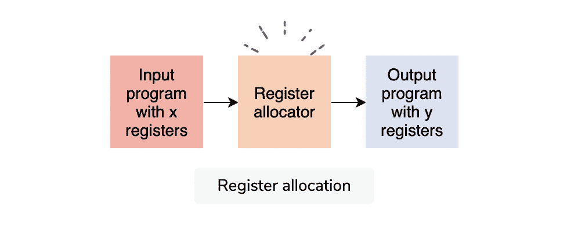

# 向函数传递参数的有效方法是什么？

> 原文：<https://medium.com/geekculture/what-is-an-efficient-way-of-passing-parameters-to-a-function-ffbc5def239d?source=collection_archive---------40----------------------->

我们的目标是在编程中最小化传递给函数的参数数量。

在 C 语言中，[编译器](https://www.educative.io/edpresso/definition-compiler)会尝试为你在函数中使用的每个局部变量分配一个处理器寄存器。当局部变量多于可用寄存器时，编译器会将多余的变量存储在处理器堆栈上。这些多余的变量被称为*换出*或*溢出变量*——与存储在寄存器中的变量相比，这些变量的访问速度较慢。

**寄存器**

**寄存器**允许您快速访问内存位置。寄存器分配是一个 NP 完全问题。

**寄存器分配**包括接收一个具有任意数量寄存器的程序，并输出一个具有有限寄存器集的程序，该程序可适合目标机器。寄存器分配决定了哪个值将驻留在寄存器中，哪个寄存器将保存某个值。



I/O Register

**最小化溢出变量的数量**

为了有效地实现一个函数，您需要最小化溢出变量的数量，同时确保最频繁访问/最重要的变量存储在寄存器中。每当我们向函数传递参数时，我们都必须考虑传递给函数的参数的数量:

*   C 语言最多四个参数
*   C++或 JAVA 最多三个参数(因为有了`this`指针)

如果您传递的参数比上面提到的更多，那么每次都会从 DRAM 中获取所有多余的参数，因为只有四个寄存器被分配给前四个参数。

**四种登记规则**

1.  具有四个或更少参数的函数比具有五个或更多参数的函数调用起来更有效。
2.  具有更多参数的函数必须通过调用方和被调用方访问堆栈来获取参数。

下面是一个带有五个参数的函数模板示例:

```
five_parameter_function(int a, char* p, int b, char* q, float f) {
____
____
}
```

**变通办法**

使用以下技术解决上述问题:

1.  使用 C 或 C++中的结构，并将结构指针传递给调用函数。
2.  您可以将一个功能划分为多个功能，参数集也会被划分。
3.  您可以创建另一个对象，它包含对函数中各个参数的引用——这被称为**对象隐藏**。
4.  您可以根据您想要从函数中实现的目标，使用`*args`(一种列表)和`**kwargs`(一种字典)来定义可变数量的参数。这将使你的代码更具可读性。

> 在 Golang 中，这是通过使用变量函数来完成的。

因此，选择三个以上的参数，或者在某些情况下，四个参数，从来都不是更好的选择。通过使用上面的技术，比如根据你要实现的目标来划分功能，你可以使你的代码更加高效。

最初发表于[向函数传递参数的有效方式是什么？](https://www.educative.io/edpresso/what-is-an-efficient-way-of-passing-parameters-to-a-function)在 [educative.io](https://www.educative.io/) 平台上。