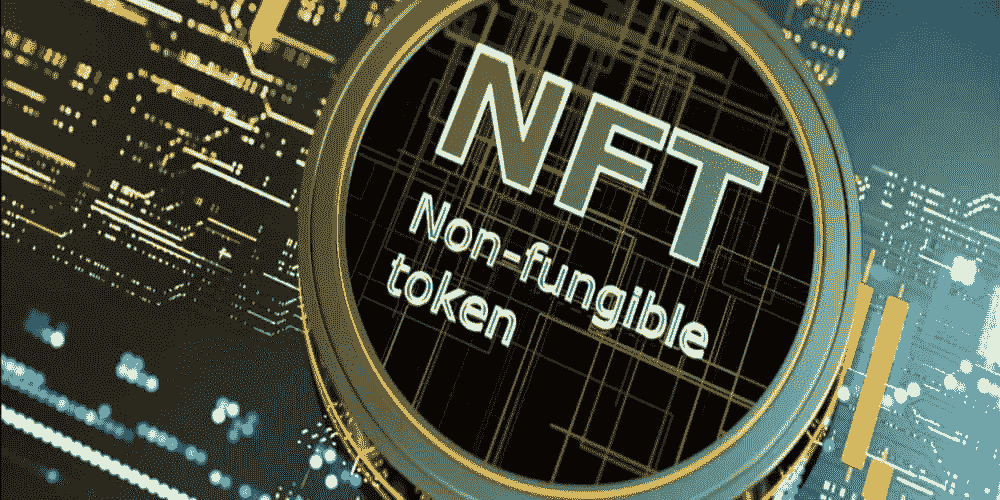

# 什么是 NFT 代币？这都是关于不可替代的令牌

> 原文：<https://medium.com/geekculture/what-is-an-nft-token-its-all-about-the-irreplaceable-token-fe908fb4536b?source=collection_archive---------17----------------------->

NFT 代币，和其他加密货币一样，活跃在区块链平台；如今，这是加密货币世界中最受欢迎和讨论最多的概念之一。NFT 是一种不可互换的专有类型的加密货币，可以在各种环境中使用，使其独一无二。

在本文中，我们打算回顾一下这些令牌的特性和应用。但在开始之前，我们需要提一下互换的概念(如果你对代币的概念不熟悉，最好先看一下关于硬币和代币区别的文章)。

# 互换性是什么意思？

可替代性是指一种货币或资产可以换成同等价值的另一种货币。该资产还能够被分成更小的部分。

为了更好地理解这个概念，假设你有一张 5000 美元的钞票，你可以用一张同样价值的钞票来兑换。或者你可以换成其他金额的钞票，总共是五千美元。

因此，你的 5000 美元钞票，除了可以用同值的其他钞票替换之外；可以分成其他金额。所以这张钞票是可兑换货币。

这个例子也适用于数字货币，如比特币、Ripple、以太坊、比特币现金和其他加密货币。一个比特币可以兑换成另一个比特币，并且可以分成更小的部分(satoshi)。

简而言之，一种货币的一个单位与另一个相同单位的价值相等，这种货币是可以交换或替代的。

# 什么是 NFT 代币？

不可替代令牌，简称 nft‌；一种加密的数字货币，在区块链空间发行数字作品的产权契约。

这些令牌最初是基于类似于 ERC20 标准的 ERC721 标准开发的，被称为特定以太坊令牌。但是现在它们也在其他区块链上被开发。

# NFT 代币的主要特点

# 1.不可替代性

这是 NFT 代币的主要特点。这些代币不能与他们自己的资产交换。

# 2.稀薄

这些令牌的开发者有能力大量生产它们，但是他们的偏好是生产有限数量的 NFT 并且保持这些令牌的唯一性。

# 3.不可分割

NFT 代币不能被分解成更小的部分。NFT 永远是一个单一的象征。

# 4.独一无二

这些代币具有注册的和不可变的信息，并且该信息是 NFT 真实性的证书。

# NFT 代币的优势

# 1.是可以转让的

这些代币可以在某些市场上买卖，但不能在数字货币交易所交易。NFT 的价格是根据它的独特性计算的。

# 2.它们是有效的

如你所知，在区块链领域不可能有伪造。在这种情况下，不可替代的标记也是活跃的；因此，它们的真实性是可以保证的。

# 3.所有权保留在他们身上

信息在区块链区块登记后，不得更改或删除。因此，由于 NFT 令牌数据存储在区块链上，在任何情况下都不可能更改其原始数据，作品原始所有者的原始权利始终受到保护。

# NFT 代币和可替换代币有什么区别？

不可替换的令牌与可替换的令牌有着本质的不同。这两种类型的数字货币代币之间的主要区别在于相同的可互换性，即在 NFT 代币中不可能交换相同类型(相同价值)的代币。

这些令牌还包含专门记录在其上的特定信息。这种信息的排他性可以与机票上的信息相比较。乘客信息、确切的旅行时间、旅行目的地以及航班号和座位号都被记录在机票上，其他任何人都不能使用该机票旅行。记录在 NFT 令牌上的数据也是该特定令牌所独有的。

NFT 和可互换代币的另一个区别是可分性。NFT‌代币不能被分解成更小的部分，并且总是保持单个代币。

最后，不可替换令牌比可替换令牌包含更多的信息。

# NFT 有什么用途？

NFT 代币可以在各种环境中使用，并且这些代币不限于特定的域或加密货币的世界。

# 1.数字艺术品的注册

在数字艺术领域工作的艺术家；他们可以用这些代币注册自己的作品，再也不用担心作品的版权和被盗问题。

# 2.博彩业

职业游戏玩家可以通过 NFT 代币将他们在游戏世界中的资产转移到各种游戏中，并在应用内购买受限的空间中使用它们。

# 3.数字资产

任何数字资产的所有权，如互联网域名或社交媒体账户，都可以通过不可交换的令牌以个人或团体的名义永久注册。

# 4.实物资产

这些代币甚至可以在交易非数字资产时使用，例如购买房屋或汽车，以及在区块链平台上注册财产或汽车的所有权。

NFT 令牌还可以用于个人身份识别或注册学术和个人文件。在收藏作品方面，NFT 也受到了收藏家的极大关注。但这些只是 NFT 的一些用途，当然在未来这些数字货币代币将进入更多的领域，并在世界各地变得更受欢迎。

# 到目前为止，一些成功的 NFT 令牌项目

CryptoKitties:热门虚拟猫以太坊区块链游戏
OpenSea 中生产、买卖猫的平台:通过 NFT 令牌
以太坊名称服务注册艺术品和收藏品的主动系统:提供域名服务并通过 NFTs
Async 进行注册的系统。艺术:注册和购买 NFT 艺术作品的平台
分散土地:虚拟土地分配的平台

Origin Protocol、FLOW 和 Rarible 项目、Azure Heroes 和 AlterVerse 游戏，以及诸如 NBA Top Shot 和苏斯博士等展示和记录可收集数字资产的项目是迄今为止成功使用不可替代代币的其他一些项目。但是，由于各个领域的人们越来越倾向于区块链世界，以及 NFT 教在不同阶层和领域越来越受欢迎，我们无疑将在不远的将来看到不可替代的基于令牌的项目的倍增。

# 结束语

考虑到我们迄今就 NFT 代币提出的观点；问题来了，为什么这些代币还没有在世界上被正确地提出和使用。

第一个原因是不可替代的令牌的衬底。对于那些有足够知识的人来说，区块链是一个迷人的世界；但是那些不熟悉这项技术和分散网络的人对加入这些网络的用户没有表现出太大的兴趣。NFT 技术本身可能非常诱人，但其平台尚未能打动所有个人和团体。

下一点是开发者保持这些令牌稀缺的决定。因为 NFT 代币成长发展非常缓慢；使用它们是昂贵的，并且组织和个人正试图使用较低成本的技术，并且较少访问这些数字所有权文档。