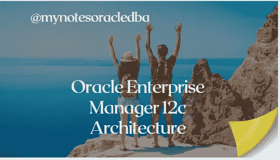
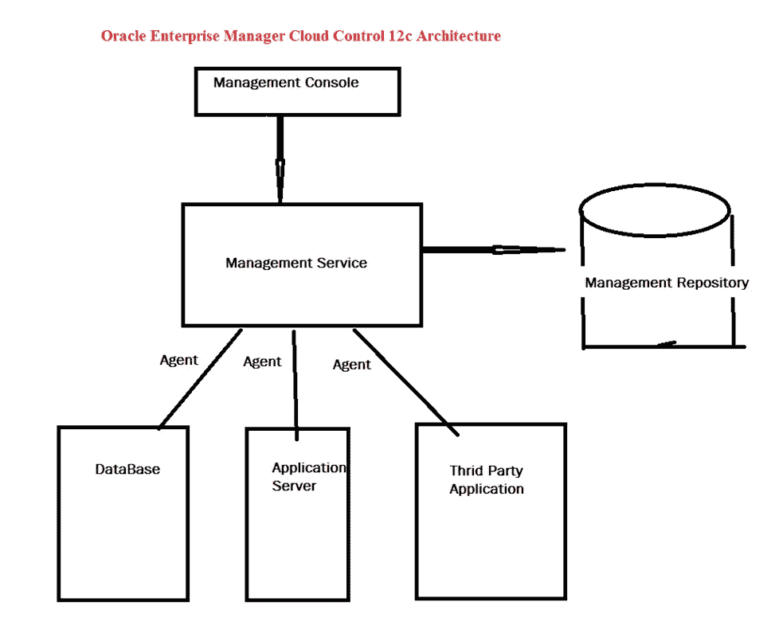

# 什么是 OEM 12c 架构？

> 原文：<https://medium.com/geekculture/what-is-an-oem-12c-architecture-98b235f06c24?source=collection_archive---------17----------------------->

在这里，我们将详细了解 oracle 12c OEM 架构

*   今天，我们将讨论新主题“**Oracle Enterprise Manager Cloud Control 12c 架构”。**

**贴牌有什么用？**

*   它用于从单个控制台管理和监控多个 oracle 数据库和相关的目标实例。
*   组件列表如下

**i)甲骨文管理代理**

**ii)甲骨文管理服务**

**iii) Oracle 管理信息库**

**iv)管理控制台**

**I) Oracle 管理代理:**

*   它是部署在每台受监控主机上的组件。
*   它负责监控所有数据库主机，并将信息传递给管理服务。
*   它维护和管理主机。

**II) Oracle 管理服务:**

*   它是一个 web 应用程序，连接到管理代理和管理插件(即发现目标、监视和管理这些目标)，并将收集的信息转储到管理资料档案库中
*   它为 Enterprise Manager Cloud Control 提供用户界面服务

**iii) Oracle 管理资料档案库:**

*   它是管理代理收集的数据的存储位置
*   它是一个数据库，Oracle Management Service 将从管理代理接收的监视数据上载到管理资料档案库。Oracle Management service 从该资料档案库数据库中检索数据，并将其显示在 Enterprise Manager 云控制控制台中

**四)管理控制台:**

*   这是一个基于网络的用户界面
*   借助这个接口，我们可以监控和管理数据库、主机、监听器、中间件和应用服务器。