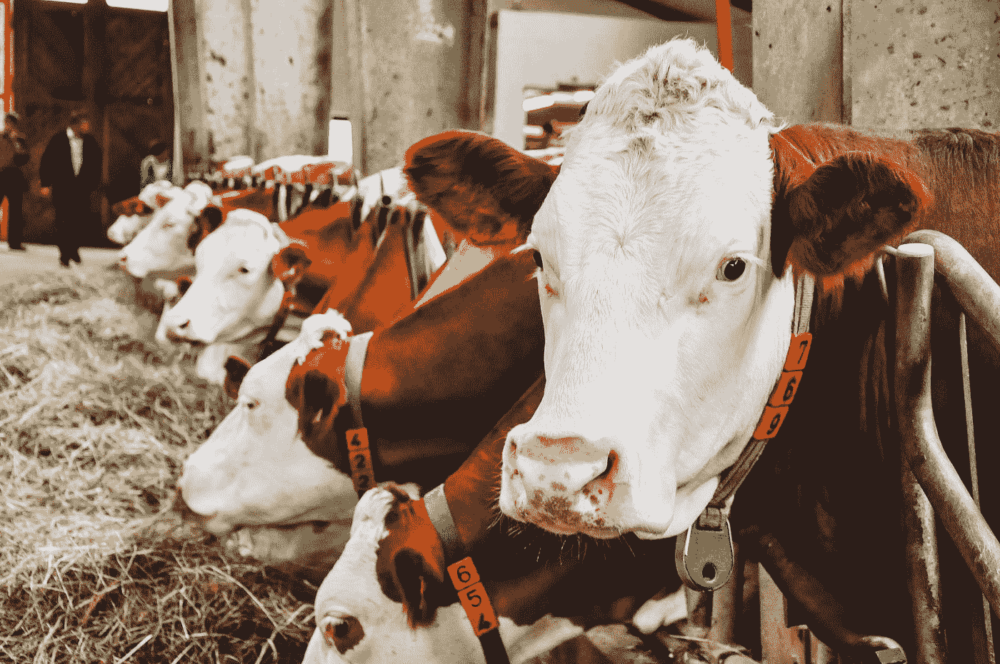
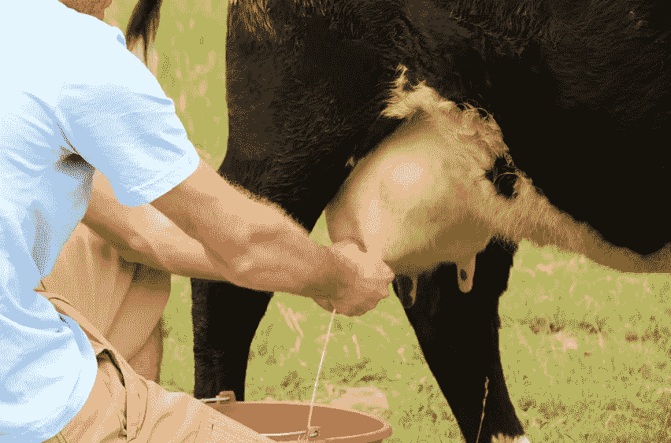

# 什么是 RSS 源？

> 原文：<https://medium.com/geekculture/what-is-an-rss-feed-9b9f46f9cbd4?source=collection_archive---------12----------------------->

## RSS 提要简介。

Photo by [Anastasiia Chepinska](https://unsplash.com/@anastasiiachepinska?utm_source=medium&utm_medium=referral) on [Unsplash](https://unsplash.com?utm_source=medium&utm_medium=referral)

工厂化饲养的奶牛的生活并不糟糕。周期性地，你被拥有农场的人挤奶。

