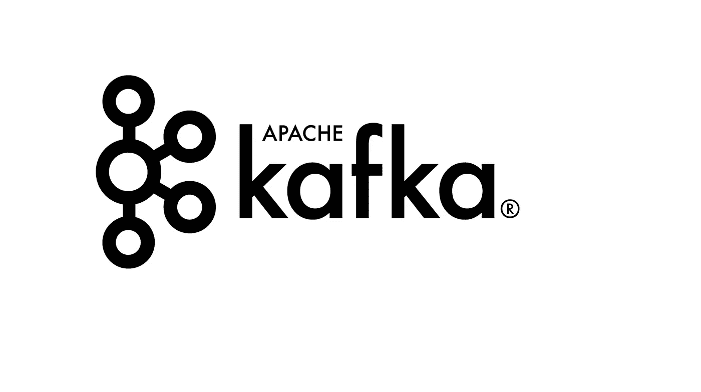
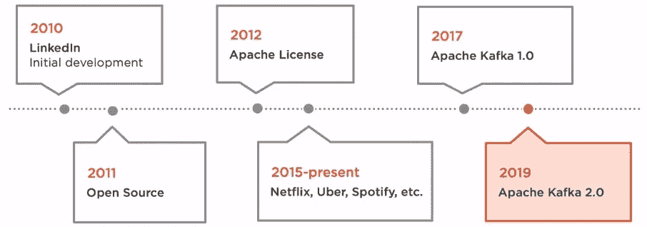
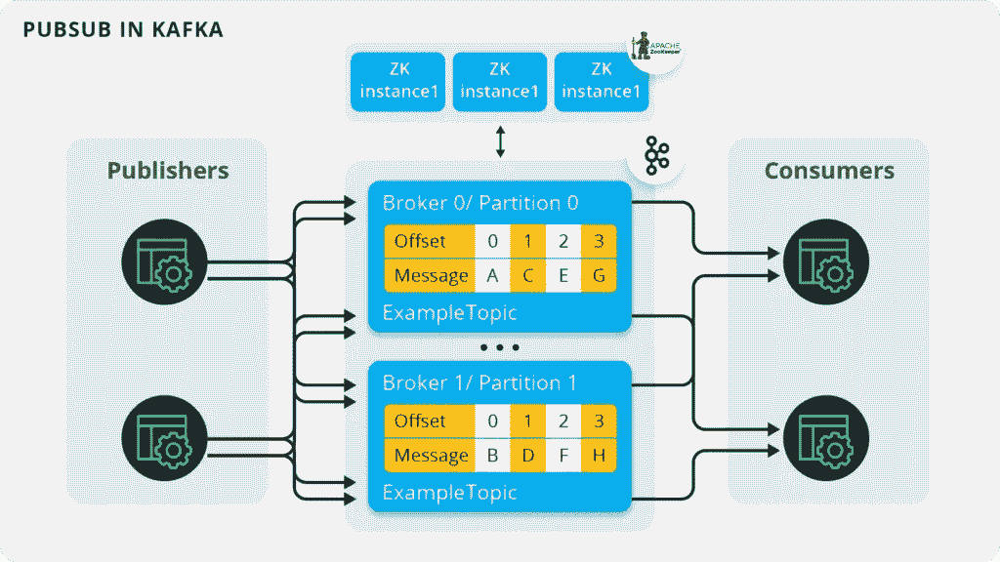
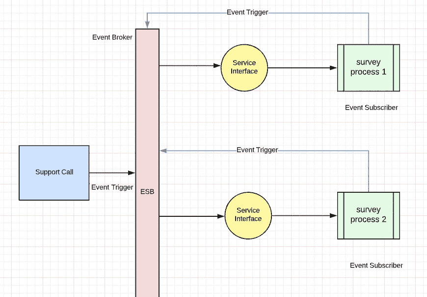
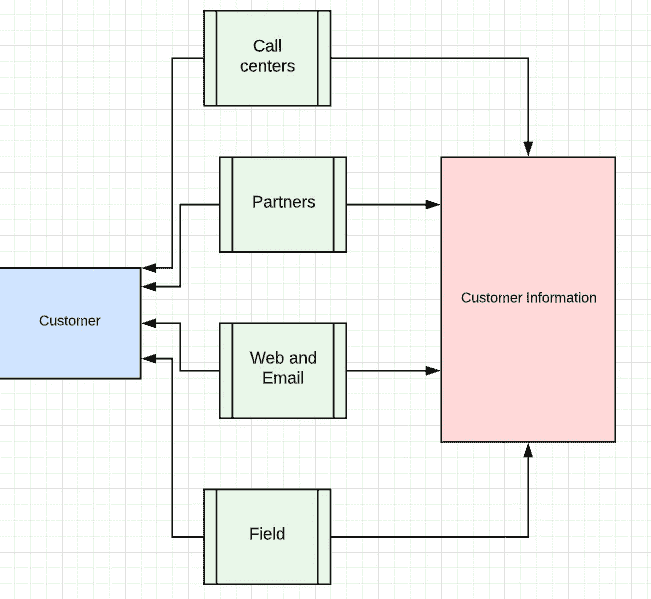
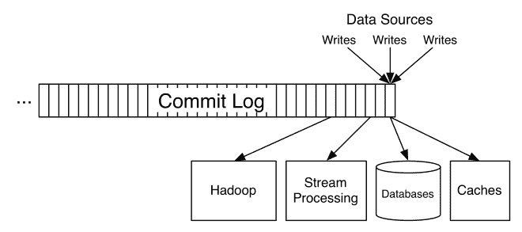
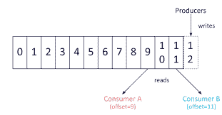
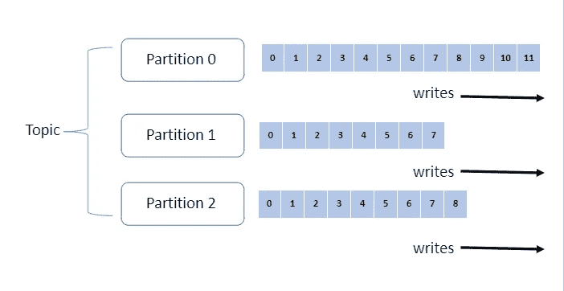
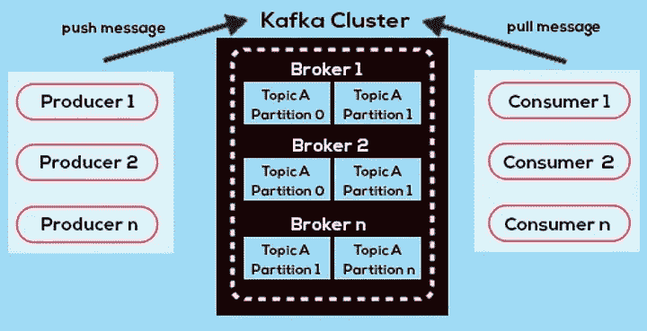

# 什么是阿帕奇卡夫卡？

> 原文：<https://medium.com/geekculture/what-is-apache-kafka-f81ce750ce6c?source=collection_archive---------6----------------------->

在本教程中，我将简单解释什么是阿帕奇卡夫卡，阿帕奇卡夫卡背后的历史是什么，使阿帕奇卡夫卡如此独特的平台的关键概念是什么，并提供一些例子和阿帕奇卡夫卡架构。

阿帕奇卡夫卡是一个，

*   **分发**
*   **事件流**
*   **消息发布/订阅**
*   **开源平台**

# 阿帕奇卡夫卡背后的历史

**Kafka 最初是在 LinkedIn 开发的，随后于 2011 年初开源**。杰伊·克雷普斯、内哈·纳克赫德和饶俊帮助共同创造了卡夫卡。2012 年 10 月 23 日从 Apache 孵化器毕业。

# 阿帕奇卡夫卡建筑的关键概念

## **1)发布-订阅方式**

**发布-订阅**方法，通常称为**发布/订阅**，是一种流行的消息传递模式，常用于当今的系统中，以帮助他们高效地分发数据和扩展等。发布/订阅消息传递模式可以通过一个事件代理轻松实现，例如 Solace PubSub+、 **Kafka** 、RabbitMQ 和 ActiveMQ。当你使用事件代理时，你有一套被称为生产者的应用程序和另一套被称为消费者的应用程序(T21)。生产者负责**发布数据**给代理，同样，消费者负责消费来自事件代理的数据。通过在我们的架构中引入代理，我们不再需要生产者直接与消费者沟通。这确保了我们有一个松散耦合的架构。此外，我们的代理现在负责**管理连接、安全性和订阅兴趣**，而不是在应用程序本身中实现这个逻辑。

要理解卡夫卡对 pub/sub 的实现，需要理解生产者和消费者。

## 生产者

**一个卡夫卡制作人**可以被编程为**写**数据到一个主题。如果主题有 3 个分区，数据将以**循环**的方式写入所有 3 个分区。这导致了一个严重的问题。因为我们的数据分散在多个分区中，所以我们不能跨分区进行排序。此外，Kafka publisher 应用程序在向 Kafka brokers 发布数据时会批量写入以提高**性能**。

## 消费者

如果我们想要消费我们刚刚写入主题的数据，我们将需要**创建一个消费者应用程序，并将其连接到我们的 Kafka 集群**。你的 Kafka 消费者可以很容易地订阅一个主题并消费必要的数据。然而，如前所述，有一个由主题划分引起的问题。因为我们的数据被写入 3 个分区，所以我们丢失了消息排序。当我们的消费者订阅主题并消费数据时，它将得到无序的消息。根据您的系统，这可能是一个关键问题。

为了解决这个问题，您需要在发布数据时使用一个键，这样所有与特定键相关的消息将总是进入同一个分区，从而保持顺序。但是，正如您可能已经猜到的那样，使用这种变通方法，您会失去平衡并行化的能力，导致一些分区溢出，而其他分区则很少使用。

此外，在卡夫卡那里，信息是被**轮询的，而不是被推给消费者**。当您编写您的消费者应用程序时，您应该提供一个计时器来不断地轮询数据。可以想象，如果您的应用程序频繁地轮询数据，尤其是在没有数据可用的情况下，这将是非常低效的。

这是卡夫卡架构的支柱，因为这使你能够拥有一个平台，完全**分离**生产者和消费者。另一个与此相关的实时例子是在机场，我们从传送带上取行李。作为消费者，我们只是站在传送带的另一边，等待排队领取行李。可能有些情况我们无法到达，但那时我们的行李不会丢失。它将继续在传送带上旋转，我们可以轻松地拿起我们的行李。当你有一个中央管道，每个人都可以屏蔽数据，根据需要每个人都可以取出数据，这给你带来了很大的灵活性。

## 2)卡夫卡基于事件的架构

为了理解基于事件的架构，让我们了解一下数据驱动编程和事件驱动编程。

**数据驱动编程**意味着存在一些*通用*代码。它不包含任何业务逻辑，也不控制流程。它只是一个读取和处理数据并输出结果的工具。控制流程和逻辑的是数据本身。所以，如果你想改变业务逻辑(字面意思是改变你程序的结果)，你改变的是数据，而不是代码。你的代码是，嗯，它是一种根据输入数据执行命令的管道。你可以把这样的代码想象成 javascript 中的 [eval](https://www.w3schools.com/jsref/jsref_eval.asp) 函数。

**事件驱动编程**逻辑由事件控制。这意味着数据只是数据，所有的业务规则都放在代码中。事件将携带一些数据，并且逻辑可以根据事件的数据而改变，但是这里的区别在于这些改变的逻辑规则被放置在哪里——在数据中还是在代码中；就电子数据处理而言，逻辑是用代码表示的。

**举例**:

在事件驱动的集成中，我们更感兴趣的是**共享一个系统中的变化，这个变化可能触发另一个系统中的动作**。我们通常共享少量的数据(事件一般是数据的小容器)。本质上，一个系统中的事件触发了另一个系统中的动作。我想到的一个例子是，假设我们完成了一个支持电话，我们想发起一个匿名的员工满意度调查。如果这些是独立的系统，一旦支持呼叫完成，可能会向另一个系统触发一个事件来触发调查过程。我们可能只与第二个系统共享通信渠道，而不与支持电话共享任何信息。第二个系统其实并不在意。

Event-Driven System

在**数据驱动集成**中，我们更感兴趣的是让系统保持**同步**。一个系统中的数据会发生变化，我们有兴趣将这种数据变化复制到其他系统中。它不一定会在第二个系统上引起动作。例如，我们可能希望我们的 CRM 系统和物流系统在客户送货地址方面保持同步。一旦这些信息通过 CRM 得到更新，数据就会被复制到物流系统中。有可能在那个时间点没有采取进一步的行动。

Data-Driven System

也许从数据交换的范围来考虑会有所帮助。事件通常很小，携带的信息仅够在需要时进一步查询。假设我们可以从一个文档管理系统触发一个事件，说一个文档被批准了，这个事件将只包含文档 ID 和状态变化。如果接收系统需要更多的信息，他们会用这个标识符回电以获得更多的细节。在数据驱动的交换中，我们可能会复制所有数据。

在卡夫卡那里，我们有事件驱动的架构。事件是一组业务活动，事件总是持续发生，并且是唯一的。与数据不同，事件不会被更新或删除。它只是作为一个新事件插入到队列或 ESB(企业服务总线)的末尾。Kafka 为您提供了将消息事件存储到其队列中的灵活性，无论您想要什么时间范围。这可能需要 7 天到 1 年的时间。所以收纳也是一个很重要的功能。与 ESB 等其他中间件产品不同，它不是提取消息，而是将**方法推送到目标。**

## Kafka 中日志提交

Kafka 使用**日志数据结构**作为下划线架构。如果你只是想理解 Kafka，它只不过是一个简单的日志数据结构，数据存储在日志的末尾。

您不能在前面添加任何条目，但只能在末尾追加数据。在这个日志中，你有偏移。这些偏移量是理解需要从哪里拾取数据的指针。

假设有 **2 个消费者**正在从一个特定的日志中获取数据。那样的话，假设消费者是 **A** 和 **B** 。 **A** 和 **B** 从日志中获取数据，他们需要了解自己的位置。**消费者 A** 正在指向**偏移=9** ，消费者 B 正在指向**偏移=11** 。下一次**消费者 1** 将从**偏移量=10** 中获取数据。这是日志数据结构，如果你看过任何日志文件，它们是如何在底部连续追加数据的。日志从不覆盖任何现有数据。您不能在日志中进行更新。日志中的任何新事件都会将这些数据附加到末尾。

## 4)什么是卡夫卡的信息、主题和分区

如上所述，信息是一种我们可以储存在卡夫卡中的事件。但是这个特别的信息属于一个特定的主题。必须定义该主题，然后在该主题中，您可以存储该消息。消息是卡夫卡中最小的数据单位。您可以将此消息与数据库表中的原始数据相关联。**例如:客户订单明细表 one raw，包含与订单号 0001** 相关的全部数据

主题可以是一个**业务活动**或一个**业务功能**。你想用来存储信息的唯一定义的任何东西。假设 topic 是一个客户，任何符合 Topic 客户条件的消息(事件)都会转到这个特定的主题。主题可以是数据库表。该表包含所有客户的**多条消息**。

分区是主题的**子集。一个主题可以有**多个分区**。**

在这里，我们为一个主题准备了 **3 个分区**。这 3 个分区可以与不同的环境相关联。这为您提供了容错和可伸缩性。如果**分区 1** 发生问题，消息不会丢失。信息可以从**分区 2** 或**分区 3** 中保留。

我们如何确保进入这些分区或队列的事件是按顺序写入的？假设客户 A 购买了产品 x。然后该客户改变了主意，再次用产品 y 替换了该产品。这是两个独立的事件，必须遵循一定的顺序以确保数据可用性和数据正确性。在 Kafka 中，您只能对分区内的数据或事件进行排序。事件只能在同一个分区中排序。在一个分区内，您可以定义一个具有唯一 ID/ID**(客户 ID 或事件 ID)** 的**唯一键**。然后，分区将始终确保当一个事件到来时，它是否有正确的序列。

5)卡夫卡经纪人和卡夫卡集群

在此图中，您可以看到一个包含多个 Kafka 代理的 Kafka 集群。一台 Kafka 服务器称为一个代理。您可以在多个代理中创建一个 Kafka 集群。代理接收来自生产者的消息，并将其存储在本地磁盘上。代理还满足来自消费者的获取请求，并提供已经写入下划线本地磁盘的消息。基于硬件**，一个 Kafka 代理每秒可以处理 1000 个分区和数百万条消息**。一个分区被分配给多个代理，所有者是单个分区。

在这个图中，你可以看到**分区 0** 和**主题 A** 被复制到**代理 1** 和**代理 2** 。以同样的方式，**分区 1** 和**主题 A** 被复制到**代理 1、代理 2 和代理 3** 。这为存储在分区中的消息提供了冗余。如果任何特定的代理失败，那么复制的分区将接管领导权。然而，在所有这些情况下，每个消费者和每个生产者总是连接到领导者(**列表中的第一个复制品总是优选的领导者。无论谁是当前的领导者，即使使用该组(集群)的副本重新分配工具**将副本重新分配给不同的代理，也是如此。

# 与卡夫卡有关的产品

这个整体 Kafka 平台附带了各种**产品**。在一个产品下为您提供多种功能。作为核心产品的一部分，您可以获得消息缓存和存储功能。

还有一个产品叫 **Kafka Connect** 。假设有一个像**大型机**这样的遗留平台，不太容易传输数据流。然后，您可以使用 Kafka Connect 来连接大型机环境。Kafka Connect 是 Apache Kafka 的一个免费开源组件，它作为一个集中式数据中心，用于数据库、键值存储、搜索索引和文件系统之间简单的**数据集成。此处提供的信息是针对 Kafka Connect 的。**

 [## Kafka Connect |融合文档

### Kafka Connect 是 Apache Kafka 的一个开源组件，是一个连接 Kafka 和外部系统的框架，例如…

docs .汇合. io](https://docs.confluent.io/platform/current/connect/index.html) 

KSQL 是一种专门为 Kafka 设计的结构化查询语言。如果您想在数据作为消息传输或存储到 Kafka 队列时查询数据，您可以直接连接 KSQL 并运行这些查询。

 [## KSQL 简介:Apache Kafka 的流| Confluent

### 我非常兴奋地宣布 KSQL，这是一个用于 Apache Kafka 的流 SQL 引擎。KSQL 降低了进入世界的门槛…

www.confluent.io](https://www.confluent.io/blog/ksql-streaming-sql-for-apache-kafka/) 

如果你想通过客户机连接 Kafka message broker，你可以使用 Kafka 客户端。

 [## Kafka 客户|融合文档

### 用 Apache Kafka 和 Confluent 构建数据管道

docs .汇合. io](https://docs.confluent.io/platform/current/clients/index.html) 

**Kafka Stream** 是一款专用产品，仅用于管理 Kafka 消息队列中的流数据。

 [## Kafka Streams 概述|合流文档

### Kafka streams 是一个用于构建应用程序和微服务的客户端库。

docs .汇合. io](https://docs.confluent.io/platform/current/streams/index.html) 

# 使用卡夫卡有什么好处？

1.  **松耦合** —大多数应用程序都是基于微服务的，您需要设计小型服务并将其存储在容器中。这些需要松散耦合。这就是为什么像 LinkedIn 和网飞这样的大公司使用 Kafka，因为它有助于保持一个灵活的环境。
2.  **全分布式** —你可以把你的消息拆分，订阅几个话题。你有不同的经纪人来容错。一个特定的代理倒下了，另一个就会过来，为您提供队列中的所有消息。
3.  **基于事件的**
4.  零停机时间——Kafka 给你零停机时间，因为它建立在可扩展的架构之上。
5.  **易于缩放**
6.  **没有厂商锁定** — Kafka 是开源软件，这就是为什么你可以在没有任何锁定协议的情况下使用它。

我希望你现在能更好地理解什么是卡夫卡，它是如何进入技术世界的，有哪些关键概念，有哪些与卡夫卡相关的产品，以及好处。另一篇文章再见。

谢谢大家！