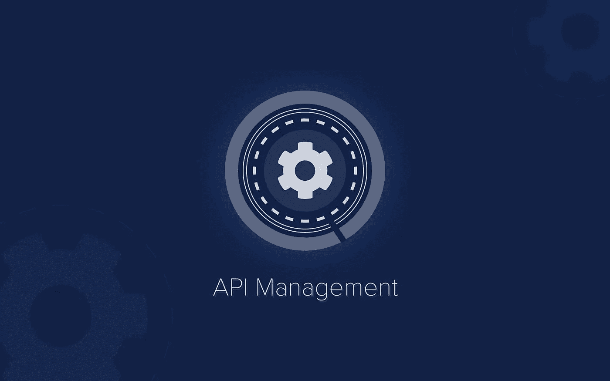
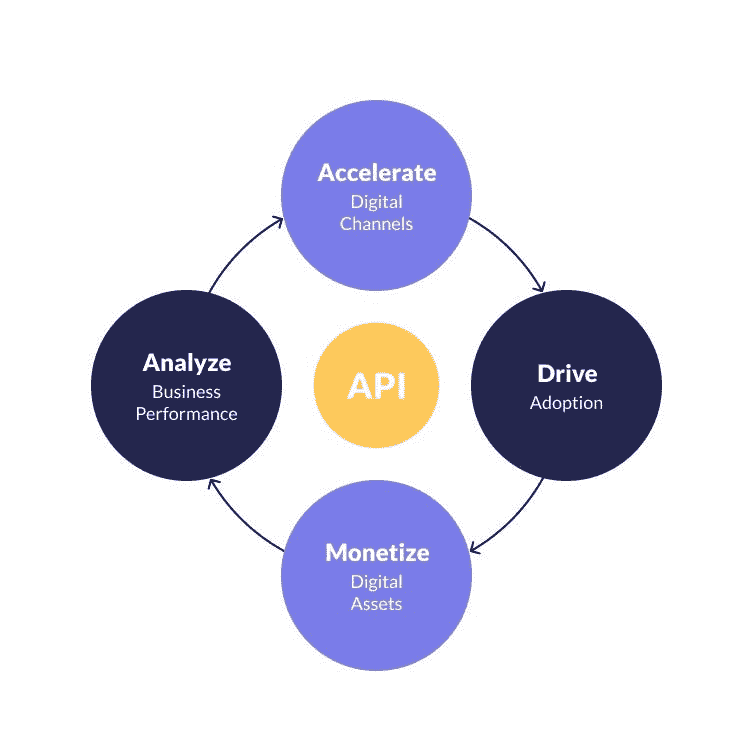
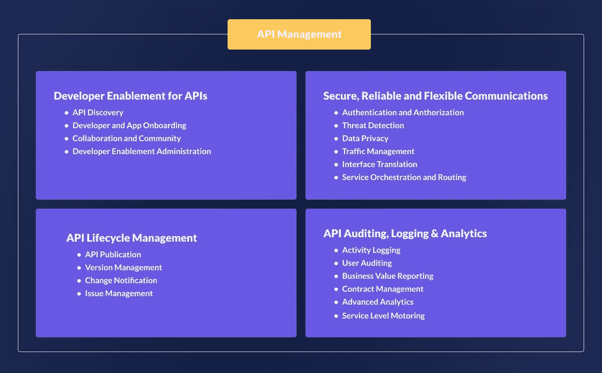

# 什么是 API 管理？

> 原文：<https://medium.com/geekculture/what-is-api-management-4cbd6e5ffee4?source=collection_archive---------35----------------------->

在我们上一篇关于 API 的文章中，我们看到了以下内容:

*   API 简介
*   原料药的类型
*   什么是 API 密钥
*   什么是 API 调用
*   流行的 API
*   API 价值链
*   公司为什么要建 API？
*   API 和 Quickwork

 [## 什么是 API？类型、用途和示例| Quickwork

### 本文旨在使 API 更简单，更具关联性！请告诉我们你对哪部分感兴趣:)…

blog.quickwork.co](https://blog.quickwork.co/what-is-an-api-types-uses-and-examples-quickwork/) 

# API 管理

谷歌、脸书、苹果和推特已经向大家展示了一些世界上最具影响力的技术解决方案。这些公司要么通过他们的 API 改造了现有的业务，要么创造了新的行业。

谷歌正在改变现有的业务，脸书正在创造新的产业，苹果正在让事情变得更有效率，Twitter 正在把我们所有人连接起来！

这些公司成功的关键是 API。它将人们和他们的计算设备连接到支持业务和其他公司的所有平台。

世界在变化，看看这些例子:

*   由于使用开放平台，Salesforce.com 拥有庞大而活跃的合作伙伴网络。该公司之所以做得这么好，只是因为它向合作伙伴开放了核心服务，合作伙伴可以自由创新和扩展。Salesforce.com 60%的流量来自 API。
*   **网飞**已经完全改变了我们消费电影和电视节目的方式，使它们可以通过流媒体传输到数百种设备上。他们之所以能做到这一点，是因为 API 允许他们以合理的价格支持许多不同的设备。

**为什么企业 API 如此重要？**

如今，客户希望能够通过各种设备和渠道访问数据和服务。企业 API 是实现这一点的最有效的方法。它们构成了了解企业数据和服务的窗口。它们是敏捷、灵活、安全和可扩展的。

以下是使用 API 时需要记住的事项:

API 是一组允许应用程序轻松相互通信的指令。

-开发人员使用 API 编写与后端系统交互的应用程序。它们就像允许应用程序相互交流的密码。

-开发 API 时，需要使用 API 管理平台进行管理。

# 什么是 API 管理？

API 管理是在组织内创建、发布和管理 API 连接的过程。该平台提供了一个可扩展的统一环境，企业可以在其中共享和社交他们的联系。此外，API 管理提供了对谁可以访问这些连接的控制。它还提供了收集、分析使用统计数据和实施安全策略的能力。

**API 管理的好处**

大多数企业已经使用 API 来集成到他们的日常操作中，但是对于一些企业来说，使用 API 还意味着管理他们的 API 在越来越多的系统和应用程序中的集成。这对公司的内部资源来说既耗时又耗力。通过 API 管理，企业可以重用 API 集成的功能。这既节省了时间和金钱，又不影响安全性。

API 管理的众多好处之一是集成资产的部署和重用。通过一个用于所有 API 的中央统一平台，您可以轻松地在团队之间共享文档和编码结构，这将降低成本并缩短上市时间。随着数据泄露和其他网络安全风险的出现，API 管理平台帮助企业保持其服务的安全性。这些平台跟踪 API 的使用，并允许它们集成新的和创新的安全协议，如 OAuth、JWT 和 OpenID。

# API 管理平台

API 管理平台将帮助您的公司发布 API，以满足内部、合作伙伴和外部开发人员的需求。它提供核心服务来帮助您的 API 计划，如开发人员参与、业务洞察、分析、安全和保护。

**API 管理产品**

**API 管理平台使您能够在安全和可扩展的环境中创建、分析和管理 API。**API 管理平台应提供以下能力:

*   API 的开发人员支持
*   安全、可靠、灵活的通信
*   API 生命周期管理
*   API 审计、日志记录和分析。

API 管理功能可以以几种不同的云格式交付。您可以将它托管在公共云、内部或混合方式上。如果您部署到公共云，它将作为托管服务交付。混合方法可以提供这两种优势，一些 API 管理功能通过公共云提供，而另一些则部署在内部。

# API 管理的组件

一个 **API 网关**是 API 管理平台不可或缺的一部分。它处理客户端和它们所连接的第三方之间的所有路由请求、转换和协议。API 网关是安全性不可或缺的一部分。他们部署关键的安全协议，如传输层安全(TLS)加密和 OAuth(开放授权)标准，以确保 API 连接保持安全。API 网关使开发人员能够快速访问和管理作为 API 的微服务。

**API 开发者门户:**开发者门户为开发者、应用注册、入职、API 文档、社区管理和 API 货币化提供功能。API 开发者门户旨在为开发者提供一个访问和共享 API 文档的中心。开发人员门户简化了团队之间的交流，并为开发人员浏览、构建和测试他们的 API 提供了一个简单的平台。

**报告和分析:**分析服务监控每个应用的流量，并为企业提供洞察、运营数据、API、应用性能和参与度指标。API 管理至关重要，因为它允许组织跟踪使用指标。API 平台使用综合方法来监控响应时间和 API 的可用性。他们还可以集成分析程序，并从协议中提取数据以实现报告自动化。

**API 生命周期管理:** API 集成是数字化转型战略的重要组成部分。它们通过简化 API 整个生命周期的管理，允许公司扩展他们的运营。最好的 API 管理平台为企业提供了入门所需的工具，并在 API 的剩余生命周期中提供了完美的定制。API 管理工具为企业构建、测试和管理他们的 API 提供了一种可持续和有效的方式。这样做的同时，确保产品在每一步都符合公司的标准和目标。

# API 管理用例

API 管理平台以多种方式帮助企业。以下是 API 管理解决方案的一些常见用例:

**支持数字化转型战略**

API 的管理已经成为数字化转型的一个关键方面。无缝连接数字资产的能力是公司取得成功的重要工具。随着您的业务持续增长，您会希望您的数字生态系统不断发展。

工具和服务是重要的，但是如果它们不是自动化的，对一个企业来说可能太多了。幸运的是，企业可以通过使用 API 管理平台并将其 API 连接到一个集中的平台来加速这一过程，在这个平台上，他们可以自动测试、部署、管理和监控 API 连接。

**GDPR 和合规注意事项**

隐私和合规性法规是 GDPR 事件后品牌的重中之重。为了解决这些问题，API 网关是一个很好的解决方案。网关保护用户数据和接入点，因为信息是通过 API 传输的，以保护人们的隐私权并确保合规性。安全令牌和访问密钥也用于保护用户信息。管理员可以控制谁有权访问 API 以及他们的访问级别。

**确保数据安全**

保护数据对企业来说变得越来越重要。API 管理解决方案是保护数据安全的绝佳方式，它对所有数据进行加密，并要求在适当的用户获得访问权之前进行签名。组织可以实时监控 API 活动。这有助于识别操作系统、网络、驱动程序和 API 组件中的潜在漏洞。监控数据泄漏有助于组织追踪潜在问题，并深入了解如何提高安全性。

# API 管理和 Quickwork

API 管理只是业务和 IT 运营中的一个工具。随着越来越多的组织转向以客户为中心的业务模式，对更好的客户体验的需求也在增加，对应用程序数量的需求也在增加。API 是这个过程中必不可少的一部分，但是人们经常忘记 API 管理的重要性，因为它只是一个更大难题的一部分。

Quickworks 的人工智能自动化功能将使每个流程更加智能，并加速创新。借助预构建的工作流，创建新产品的过程比以往任何时候都更加简单快捷。

当您想要实现应用现代化和业务转型时，您需要一个拥有合适工具的合作伙伴。如果你正在寻找一个 API 管理解决方案，有很多选择。但是，如果您还在寻找一个自动化和可扩展性解决方案，一个为数字化转型战略做好准备的平台，您需要一个能够提供这些服务的合作伙伴。

立即开始使用 [Quickwork](https://quickwork.co/?utm_source=Blog_Post&utm_medium=Organic_Interlink&utm_campaign=Contact_Us) ！

[**日程演示**](https://calendly.com/quickwork/demo)

你也可以阅读—

 [## 什么是应用程序集成:好处和用例

### 现代应用集成的成功类似于一个成功的团队。应用程序集成，如…

blog.quickwork.co](https://blog.quickwork.co/what-is-application-integration/)