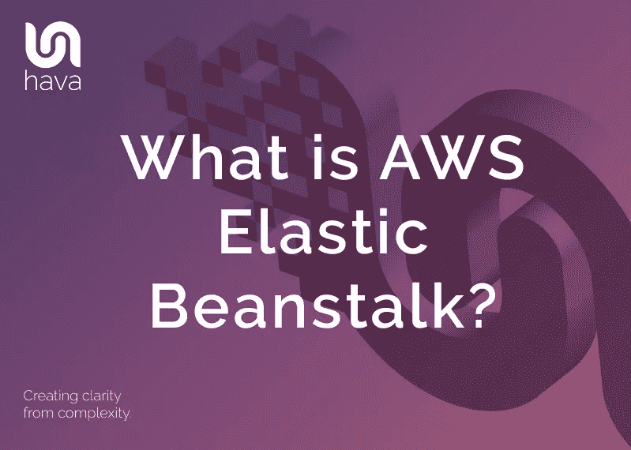
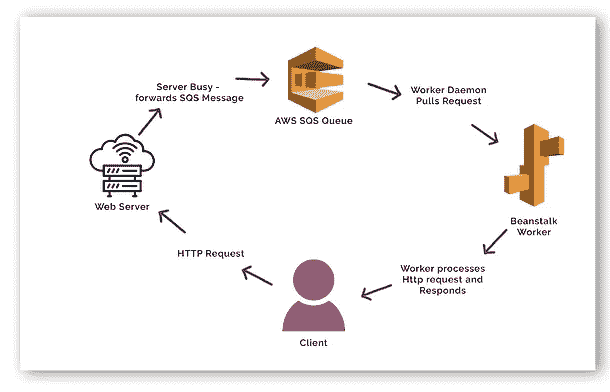
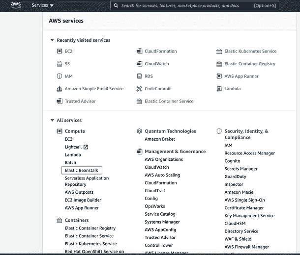
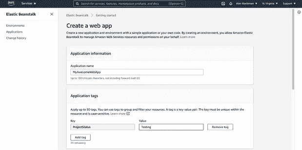
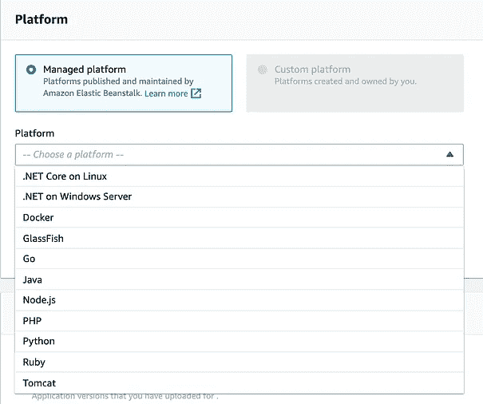
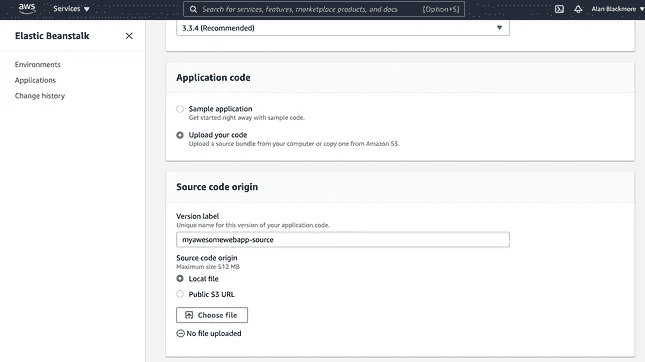
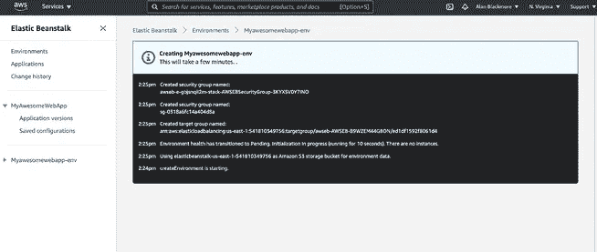
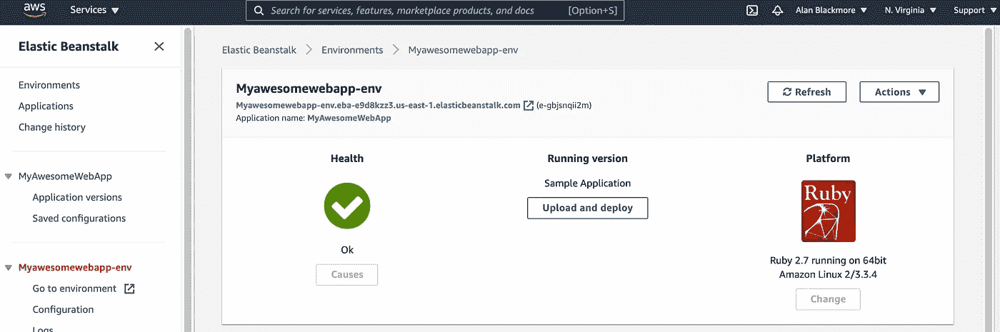
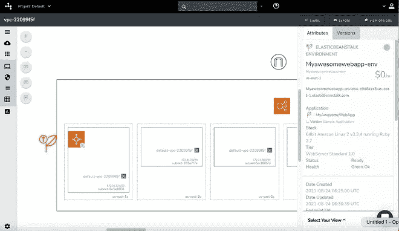

# 什么是 AWS 弹性豆茎？

> 原文：<https://medium.com/geekculture/what-is-aws-elastic-beanstalk-6bf56fde6c5?source=collection_archive---------43----------------------->

Elastic Beanstalk 是 AWS 中的一个平台，用于部署和扩展 web 应用程序。简而言之，这种平台即服务(PaaS)获取并部署您的应用程序代码，同时提供代码运行所需的支持架构和计算资源。Elastic Beanstalk 还完全管理那些供应资源的修补和安全更新。

云计算领域有许多 PaaS 解决方案，包括 Redhat Open Shift、Google App Engine、Scalingo、Python Anywhere、Azure App Service，但是 AWS Elastic Beanstalk 仍然是应用程序开发人员的主要 PaaS 选择之一。

使用 Elastic Beanstalk 部署您的应用程序是免费的，您只需为支持您的应用程序而创建的资源付费。

AWS Elastic Beanstalk 允许您快速部署应用程序和服务，而不必担心配置底层资源、服务、操作系统或 web 服务器。

Elastic Beanstalk 负责托管基础设施、编码语言解释器、操作系统、安全性、https 服务和应用层。你所需要担心的就是写你的代码。

您可以用多种语言开发代码，然后将代码压缩，在实例化一个新的 elastic beanstalk 实例时使用这个压缩文件。

支持的语言平台包括:

*   红宝石
*   计算机编程语言
*   服务器端编程语言（Professional Hypertext Preprocessor 的缩写）
*   去
*   节点. js
*   Java 语言(一种计算机语言，尤用于创建网站)
*   。Windows Server IIS 上的. NET
*   。Linux 上的 NET Core
*   包装工人
*   玻璃鱼
*   码头工人
*   雄猫

提供的 web 服务器将为大多数 web 开发人员所熟悉，包括 Apache、Tomcat、Nginx 和 IIS

在将应用程序部署到云中时，您仍然可以保持对 elastic beanstalk 使用的计算实例类型的控制，并且还可以保持对应用程序所需的数据库类型和自动伸缩级别的控制。

您可以访问已部署的 web 应用程序的服务器日志文件，根据需要随时更新应用程序，并根据需要在负载平衡器上启用 HTTPS。

使用 Elastic Beanstalk 平台可以将更多的时间用于开发，减少管理网络、存储、操作系统和计算运行时的时间，因为这些都由 Elastic Beanstalk 处理。这导致了更快的部署，因为你所需要做的就是打包你的代码，把它提供给 Elastic Beanstalk，然后平台从那里接收它。

您无需花费时间来选择计算实例、数据库和存储要求、安全性、监控服务、负载平衡资源等，从而大大加快部署速度。您负责代码，弹性豆茎完成剩下的工作。

部署之后，您的弹性 Beanstalk 托管应用程序的操作也更容易了。您不再需要承担监控服务器、监控存储、管理网络负载、保持操作系统最新的角色，因为这些都由平台负责。

# 弹性豆茎特征

Elastic Beanstalk 可能是在 AWS 上部署 web 应用程序最简单、最快的方式。

它允许您专注于编写代码，而不是供应和配置 AWS 资源。

随着需求的增加或减少，Elastic beanstalk 处理支持部署的应用程序所需的资源的自动伸缩。

当 Elastic Beanstalk 分析您的应用程序并选择将需要的资源时，它还允许您介入并选择可能更适合它可能不知道的预期用例的替代资源。例如，您可以选择更符合您需求的更高规格的 EC2 实例类型。

# 弹性豆茎组件

**应用:**

通常，当您创建应用程序时，您会将所有相关资产(如代码、资源配置模板、代码版本和所需文件)放在一个文件夹中。

elastic beanstalk 应用程序是一个类似的概念，当您通过 Elastic beanstalk 部署应用程序时，它是保存所有相关文件、平台资源和配置信息以支持应用程序的实体。

当您创建和部署一个新的应用程序或版本时，应用程序名称将出现在 elastic beanstalk 控制台中。

**应用版本:**

当您对应用程序进行更改时，您可以通过 elastic beanstalk 部署更新的应用程序。应用程序版本与您的 web 应用程序的可部署代码的特定标记迭代相关。

在 elastic beanstalk 中，应用程序版本是到 S3 对象的链接，该对象包含可部署的 Zip 或 Java WAR 文件

如果您选择将命名版本部署到不同的环境中，而不是从现有应用程序中进行部署，它将显示为新的应用程序。

**环境:**

当您使用 elastic beanstalk 部署应用程序时，会创建一个环境来存放您正在部署的应用程序版本。该环境托管所需的 EC2 实例、存储、负载平衡器、自动扩展组或该版本应用程序所需的任何其他东西。

一个环境只能运行应用程序的一个版本。您可以在现有应用程序环境的基础上部署新版本，比如生产环境，但是您也可以灵活地安装到替代环境，比如开发、试运行或测试环境。

每个环境都有一个唯一的 URL 来访问正在运行的应用程序。

**环境层级:**

当您通过 elastic beanstalk 部署应用程序时，有两个实例化的层。

Web 服务器环境层是面向前端的部分，它响应来自访问应用程序 URL 的用户的 http 请求。

工作环境层是一个后台服务，它处理 web 服务器层委托的请求，还可以运行处理后台任务的工作负载。您可以编写代码并将代码部署到工作环境，而不是主 web 服务器应用程序。

**环境卫生:**

Elastic beanstalk 监视您的 web 服务器应用程序和工作环境，并对应用程序的运行情况进行健康检查。

一个环境的健康状况是用颜色代码来报告的，这种颜色代码可以让人们立即视觉识别出一切正常与否。

灰色—让您知道您的环境正在更新或仍在调配中。

绿色—您的环境运行状况良好，并已通过最新的运行状况检查。

黄色—您的环境未通过一两次最近的检查

红色—您的环境最近三次或更多次运行状况检查失败。

# 弹性 Beanstalk Web 服务器架构:

当您使用 elastic beanstalk 将应用程序部署到 web 服务器环境时，该环境通常会创建以下体系结构。

弹性豆茎环境

弹性负载平衡器

自动缩放组

EC2 实例

主机管理器

安全组

Elastic Beanstalk 环境是这个独特版本的应用程序的容器，它为用户访问应用程序提供了 cname 和 URL 入口点。

弹性负载平衡器将 http 请求分发到已经在环境中提供的 EC2 实例。

自动扩展组将根据流量负载扩大和缩小环境中存在的 EC2 实例的数量。您可以在 elastic beanstalk 环境的设置中指定想要启动的 EC2 实例的数量以及允许自动缩放器实例化的数量。

EC2 实例是运行您的工作负载的计算映像。Elastic beanstalk 会建议 EC2 实例的大小和类型，但是如果您预计需要更高或更低的计算能力来为您的用户提供可接受的应用程序性能，您可以手动更改这些实例类型来增加或减少 CPU 容量和保留内存。

主机管理器存在于您的每个 EC2 实例上，负责监控和报告您的应用程序的性能，报告资源实例级事件，并将日志发送到您的 cloudwatch 仪表板。

将为弹性 beanstalk 应用程序环境提供一个新的安全组，该环境将允许使用端口 80 对您的应用程序进行 http 访问。使用修改设置 elastic beanstalk 仪表板，您可以向您的 web 服务器环境分配额外的安全组或现有的 VPC。

# 弹性豆茎工人环境

worker 环境是为了处理特定的后台任务而创建的，但也是为了在 web 服务器应用程序处于负载状态时为其提供帮助。

当 web 应用程序响应用户请求处理时间密集型任务时，如果第二个用户发出请求，用户将需要等待，并且请求有可能超时。

为了解决这个问题，当任务花费太多时间在 web 服务器上处理时，elastic beanstalk 会将用户请求传递到后台工作环境，后台工作环境会对请求进行排队并以有序的方式进行处理。这使得 web 服务器可以接受多个请求，而不会超时，因为它会将请求传递给 worker 进行处理。

# 弹性豆茎与 web 应用程序和工作者如何沟通？

当 web 服务器检测到一个请求花费的时间太长时，后续的请求通过 SQS 消息传递到 SQS 队列。worker 环境有一个正在运行的守护进程，它轮询 SQS 队列并按顺序检索 SQS 消息进行处理。然后，工作环境将 http 响应返回给发出请求的客户机。

# 如何使用 Elastic Beanstalk 部署应用程序？

Elastic beanstalk 服务可以在 AWS 控制台的计算服务下找到。

在这个例子中，我们将部署一个由 AWS 提供的样例应用程序，用于 Elastic Beanstalk

第一步是创建一个新的 web 应用程序，并给它一个唯一的名称。

此时，您还可以向应用程序添加多达 50 个标签。

现在您需要为构建选择一个平台。在撰写本文时，目前的选择有:

选择平台、平台分支(o/s)和平台版本

此时，您可以选择一个我们将在本例中使用的示例应用程序。在这个阶段，你可以上传你自己的代码。

如果你上传你自己的代码，它需要是一个 ZIP 或 WAR 文件，要么位于你的本地计算机上，要么存储在一个公共的 S3 桶中。此时，您需要为您的代码分配一个版本标签，该标签必须是唯一的。

然后继续创建应用程序。

Elastic Beanstalk 将开始创建所有需要的资源，并显示一个状态屏幕，显示正在创建的支持资源的日志。

示例应用程序的流程创建了:

*   S3 水桶
*   英国文学学士（bachelor of english literature）
*   安全组
*   自动缩放组
*   ASG 集团政策
*   CloudWatch 警报
*   负载平衡器监听器
*   EC2 实例
*   MyAwesomeWebApp 环境

现在，您可以打开运行状况检查上方显示的 URL 来打开应用程序。

从弹性的 Beanstalk 控制台上看不出已经创建了什么，但是使用 Hava 很容易看到已经创建了什么。当我通过交叉帐户角色连接我的 AWS 帐户时，我可以看到已经创建了一个新图表。

选择了 Elastic Beanstalk 服务后，我们可以看到基础设施图右侧的属性窗格告诉了我们关于 Elastic Beanstalk 环境需要了解的一切。

我们可以一眼看到 Myawesomewebapp-env 正在 us-east-1 中运行，应用程序名为 Myawesomewebapp。

我们可以看到用于部署应用程序的技术堆栈是运行 Ruby 2.7 的 64 位 Amazon Linux 2 v3.3.4。

我们可以看到该层是 WebServer Standard 1.0，运行状态为就绪，运行状况为绿色正常。

我们还可以看到访问应用程序的 URL。

在顶部的图表中，您可以看到已配置的互联网网关，以及位于子网上方的应用负载平衡器。

在第一个子网中，您可以看到右下角带有数字 1 的自动扩展组。这告诉我们当前有一个 EC2 实例正在运行。

当发生扩展时，这个数字将会增加，随着负载平衡，更多的自动扩展组将出现在其他子网中，运行的 EC2 实例的总数将分布在各个 ASG 之间。这都是由 Elastic Beanstalk 为您管理的，因为应用程序的流量会给 EC2 实例 CPU 和内存带来负载。

将 Hava 连接到您的弹性 Beanstalk 应用程序的优点是，所有这些更改都会被检测到，并且当检测到这些更改时，会自动生成新的图表。

被取代的图被放在版本历史中，所以您一眼就可以看出 Elastic Beanstalk 是因为流量下降而扩展了您的基础设施，还是为了满足增加的需求而进行了扩展。您可以直接在您的图表上看到这个活动，而不需要通过事件日志或 cloudwatch 控制台进行搜索。

如果你正在 AWS、Azure 或 GCP 上构建解决方案，请随意查看 Hava，看看你的 [AWS 网络拓扑图](https://www.hava.io/blog/aws-network-topology-diagram)是什么样子的。

你可以在这里随时免费试用: [https://www.hava.io](https://www.hava.io)

*原载于*[*https://www . hava . io*](https://www.hava.io/blog/what-is-aws-elastic-beanstalk)*。*