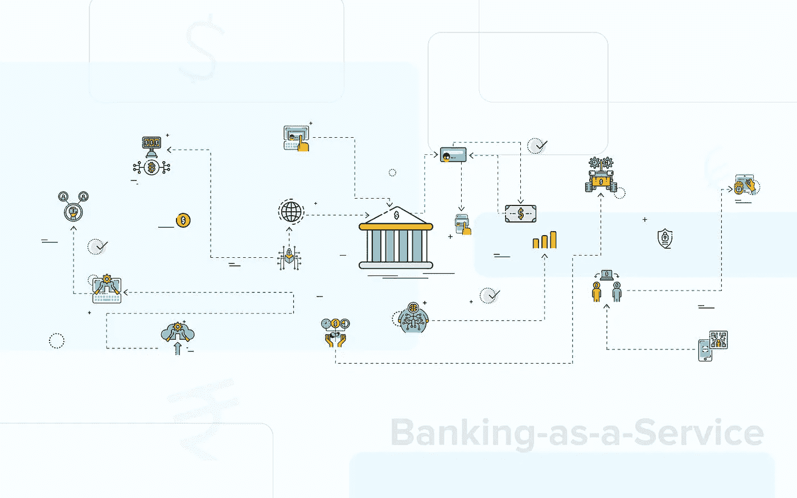
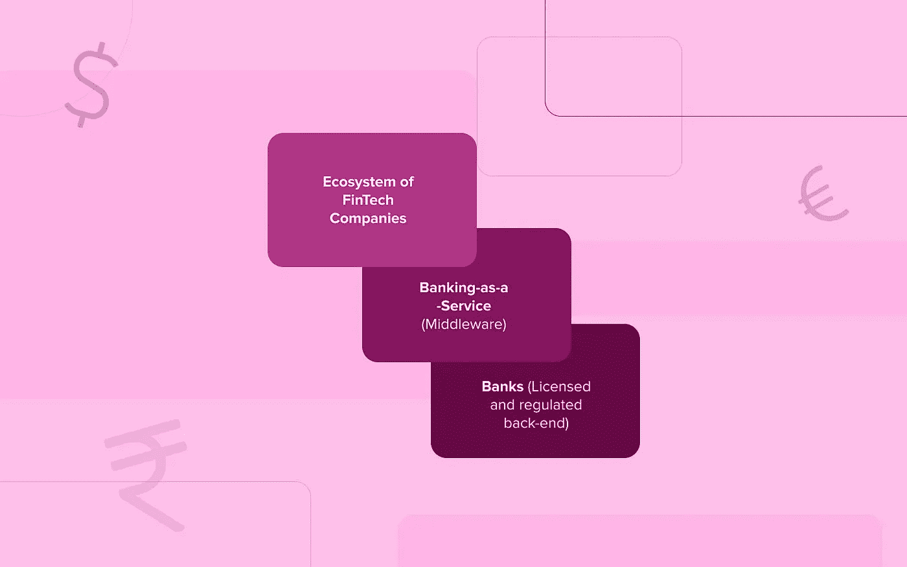
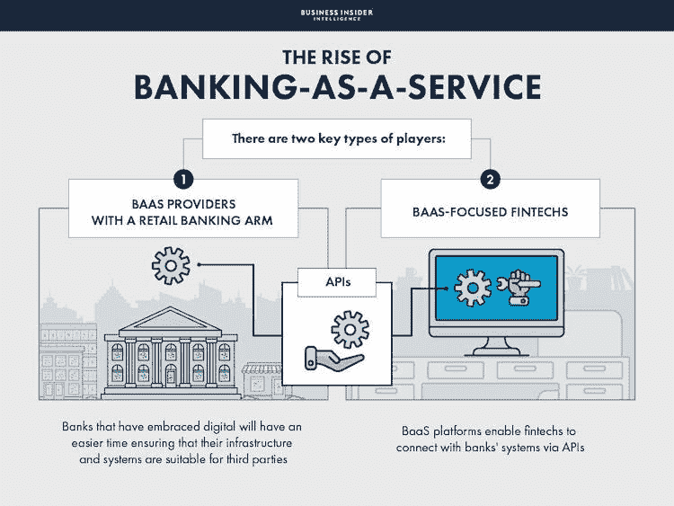

# 什么是银行即服务(BaaS ),它如何改变金融服务

> 原文：<https://medium.com/geekculture/what-is-banking-as-a-service-baas-and-how-is-it-transforming-financial-services-965a794d9c6d?source=collection_archive---------11----------------------->

*   银行即服务(BaaS)是发展最快的金融科技领域之一，正在改变银行的运营方式。
*   BaaS 提供商充当银行和金融科技之间的中介。通过向用户提供金融服务，BaaS 提供商为最终用户提供了更灵活的银行选项，从而帮助他们掌控自己的财务。
*   银行即服务是一个包含多个组件和行业领导者的生态系统，每个组件和领导者都有不同的监管要求。虽然这些参与者都应该有权访问银行数据，但隐私和安全对于让这些消费者满意至关重要。

**什么是银行即服务？**

*   优步和印度国家银行合作向司机提供车辆贷款。
*   Razorpay 和 RBL Bank 合作简化了数字商户的入职和支付解决方案。
*   电子商务巨头 Snapdeal 和 Freecharge 通过与 Yes Bank 合作提供“即时退款”

为了让这些合作成为可能，银行必须向外部开放它们的数据和技术。这种现象被称为**银行即服务(BaaS)模式。**

为了帮助理解银行即服务是如何工作的，我们将使用一个类比。假设你是一家出租车公司的经理。你面临着激烈的竞争，想要扩大你的客户群。如果你能为你的客户提供一张借记卡，你就能给他们积分，他们可以在你的应用程序上兑换。

然后，你可以根据每个客户的消费行为定制你的客户服务。你可以分析客户如何使用他们的信用卡，并通过短信、电子邮件和互动接触点为他们提供个性化服务。

任何企业或非银行都有数十种方式通过提供自己的银行服务来获得更多收入。但是如果你想提供银行服务，你必须有银行执照。这就是银行即服务可以真正发挥作用的地方。企业长期以来一直要求银行服务，但这些服务往往过于昂贵，或者不符合国际银行监管规定。与没有银行执照的传统银行相比，BaaS 允许公司以很低的成本提供银行产品和服务。

# 什么是 BaaS？

**银行即服务**描述了银行基础设施的拆分以及通过 API 访问特定银行功能的能力。

FinTechs 或运行数字平台的任何其他第三方开发者可以利用这些 API 及其提供的信息来构建新的面向消费者和面向企业的金融解决方案。

银行即服务(Banking-as-a-Service，简称 BaaS)描述了一种方法，银行通过构建在其 API 之上的应用程序来提供金融服务。BaaS 之所以受欢迎，是因为它让企业和消费者无需亲自与银行打交道，就能享受现代银行业的好处。

这为非银行企业(如您的出租车公司)提供数字银行服务(如移动银行账户、借记卡和贷款)提供了可能性，而无需获得银行牌照。

该银行的系统通过 API 和 webhooks 与出租车公司通信，使其客户的账户可以通过出租车公司的网站或应用程序直接访问。cab 公司不是作为客户和他们的金融机构之间的中间人，而仅仅是一个中介，这意味着它没有银行的任何监管职责。

因此，通过银行即服务，几乎任何企业都可以成为银行。借助云的力量，一行代码就可以构建一整个银行。企业可以控制自己的金融服务基础设施，而不必投资过多的系统和员工。这也被称为**白标银行**，因为银行服务是通过非银行品牌提供的。

# 银行即服务的工作原理

银行即服务已经成为金融科技领域一个有价值的创新解决方案，以敏捷灵活的方式提供银行服务。BaaS 解决方案提供商已经展示了通过 API 提供银行服务的能力，这些 API 可以在短时间内实施和启动，而无需大量资本要求或货币许可。

API 是数字银行核心框架的构建模块。它们组合成逻辑分组，可用于构建诸如创建和设置账户、取款、存款和贷款等功能。

以下是基于 API 的三层银行即服务体系的详细分类:

1.  底层是与 BaaS 提供商合作的传统的国家许可的金融机构(银行)，通常称为**“基础设施即服务(IaaS)层”**
2.  中间的**“银行即服务层”**描绘了银行服务，这些服务被定制为金融科技初创公司和其他企业向最终消费者交付产品的环境。这个堆栈元素充当银行和金融科技之间的中介，通过 BaaS 提供商来回发送数据。
3.  最顶层是金融科技公司**从客户那里接收交易数据。然后，它与第三方 BaaS 提供商共享该信息。反过来，BaaS 提供商将从银行收到的信息传递给金融科技层。**

整合银行服务的科技公司将有能力消除层层金融监管。例如，Amazon Web Services 获得了银行执照，现在作为主要的 IaaS 提供商运营，还提供服务器硬件。这是银行业的一次重大变革，将改变客户与银行的互动方式。

BaaS 是一个经过验证的模型，使银行和大型金融机构能够大规模部署其核心银行基础设施；但是，目前的模式需要一个中介。一个更可靠、更实惠的解决方案是让银行建立自己的 BaaS 解决方案。这将使企业能够接入核心银行基础设施，而不需要第三方提供商充当中间人。公司可以使用这种新协议直接向客户生产和销售产品，而不是使用单独的产品。有了这个新平台，他们可以向客户提供更广泛的服务，甚至定制信用卡、贷款和保险等产品。

相关:[什么是 FinTech？—金融科技中的 API，以及金融科技用例](https://blog.quickwork.co/what-is-fintech-apis-in-fintech-and-fintech-use-cases/)

# 银行即服务参与者

(鸣谢:[商业内幕](https://www.businessinsider.com/the-rise-of-banking-as-a-service-2019-7))

BaaS 生态系统中有两种类型的参与者:

1.  向其他公司提供 BaaS 功能以帮助他们快速扩大产品组合的金融科技公司，也称为纯粹的 BaaS 提供商。
2.  传统银行看到了即将到来的趋势，并使用 API 向其他金融科技企业提供银行服务。银行即服务功能有助于这些银行防范技术竞争，并在更广泛的细分市场中增加存款份额。

# 银行即服务用例

**卡支付和处理**

在当今的数字经济中，非金融公司正在利用银行即服务为其平台或应用提供支付功能。这使得这些组织可以降低管理成本，因为他们不需要开发和维护自己的支付基础设施。

**身份验证**

银行业是世界上发展最快的部门之一。为了打击高水平的欺诈和身份盗窃，该行业正在实施更严格的法规。例如，有了 BaaS 提供商，公司不必担心要跟上新的条款和法规。

欺诈和身份盗窃的增加给企业带来了巨大的压力，这往往导致需要使用更复杂的身份验证解决方案。通过与 BaaS 提供商合作，企业不必担心实施自己的 KYC 解决方案或跟上新法规。相反，企业可以连接到银行的 KYC 应用编程接口，让客户快速、经济地验证他们的身份。

**借贷**

随着越来越多的电子商务网站争夺客户，以及在线销售的持续增长，脱颖而出的唯一方法是提供全面的服务并帮助客户。借贷是一种非常强大的工具，可以帮助小商户与大型电子商务市场竞争。

**增强的客户体验**

将不同的服务集成到一个平台上是公司提高客户服务能力的一个很好的方法。通过提供 BaaS 解决方案，银行可以通过向不同行业的不同公司集成交付服务来扩大客户群。

**app 中的网上银行服务**

一些金融科技公司可以提供个性化的银行服务，甚至可以开办自己的纯在线银行。这些初创公司可以提供许多与大多数实体银行相同的服务，但提供服务的方式与传统银行截然不同。

# BaaS 是一种时尚吗？

几年来，银行即服务(BaaS)一直是现代的发展趋势。2012 年，法国农业信贷银行(Credit Agricole)推出了一个 API 市场，允许开发者通过他们的应用程序访问其数据和服务。接着，在 2013 年，两家印度银行 Yes Bank 和 RBL Bank 开创了 BaaS，为它们的业务数据创建 API，开发者可以在自己的应用中使用这些 API。

后来，花旗银行、摩根大通、富国银行、巴克莱银行等多家大银行开始向开发者提供 API。随着 HDFC、ICICI 和 Kotak 等私人银行以及 Zeta、Setu 和 Yap 等 BaaS FinTech 初创公司提供最新的 API，印度的 API 领域正在蓬勃发展。

虽然以前成立的银行正在开放其 API，并为初创公司提供产品创新，但新的挑战者和新银行已经将数字作为其业务的核心。这些挑战者和新银行出现在印度零售银行领域，如 Paytm 和 OPEN，为初创公司和小企业提供广泛的金融服务。

# BaaS 如何改变印度金融服务

正如我们所知，虽然 COVID 疫情极大地影响了银行业，但它也帮助数字银行迅速获得了认可。印度快速增长的金融科技公司正在蓬勃发展，并提供满足大多数消费者需求的金融产品。

看起来政府已经一针见血地推动增加对数字计划的资助。这是创业公司进入数字金融服务领域的绝佳时机，风险投资像瀑布一样涌入新的数字银行。传统银行的客户正流向数字金融服务提供商。这是因为数字金融服务更具成本效益，为用户提供了更好的整体体验，并为他们提供了无法从传统银行获得的工具。

然而，我们也看到了一些传统和新兴金融技术相结合创造新产品的成功案例:

*   优步和印度国家银行合作向司机提供汽车贷款。
*   Razorpay 和 RBL Bank 合作简化了数字商户的入职和支付解决方案。
*   电子商务巨头 Snapdeal 和 Freecharge 通过与 Yes Bank 合作提供“即时退款”。

为了使这种合作成为可能，银行必须向外部开放它们的数据和技术。这种现象被称为银行即服务(BaaS)模式。

# BaaS 革新客户亲密度

BaaS，即“银行即服务”，是银行业的一种模式，允许公司避免与传统系统相关的沉重成本，专注于价值创造。BaaS 允许公司通过从第三方购买服务并将其集成到现有系统中来简化其银行需求。这种模式的好处不仅仅是能够将现有基础设施货币化或扩大客户覆盖面。

他们的重点是改善银行系统的客户接触点。在数字开户和贷款发放等数字流程中，他们参与提供了更好的客户体验。客户亲密度的未来不在于确保客户拥有账户或抵押贷款，而在于提供更好的客户体验，从客户需要的任何地方开始。

这些例子显示了印度的银行如何利用 BaaS 来更好地为客户服务。

> 领先的个人金融公司 Bajaj Finance 与 RBL 合作，在全印度提供汽车融资服务。安全、合规和透明的 RBL 数字基础设施与 Bajaj finance 的泛印业务相结合，将帮助客户通过单一平台进行经济实惠的购买。
> 
> *OPEN 是一家为初创公司提供金融服务的公司，该公司能够使用 ICICI 银行 API 管理其业务中的供应商支付、账单和会计。*

这只是金融技术新时代的开始，它将彻底改变客户对与银行互动的看法。客户已经期望在任何互动中看到比传统金融交易更多的东西。通过将嵌入式金融融入到每一次客户互动中，银行可以更好地满足客户的期望，无论他们选择哪种方式。

*相关:* [*金融科技革命:用 API 开放银行& iPaaS*](https://blog.quickwork.co/fintech-revolution-open-banking-with-apis-ipaas-quickwork/)

# 使用 Quickwork 构建您的金融科技工具

我们已经看到银行业向 BaaS 的明显转变。然而，许多公司仍然没有利用 API 来创新和现代化他们的数字服务。我们的目标是通过为品牌提供与全球领先的 BaaS 提供商的联系，并最大限度地提高其在数字空间的效率，帮助品牌进入数字空间。

Quickwork 是一个 API 优先的平台，通过提供面向服务的银行方法，帮助银行实现数字化产品的现代化。Quickwork 被形容为银行业的“瑞士军刀”。我们的自动化工作流系统自动化了客户交互、管理管理任务并简化了合规流程，同时提高了可扩展性并降低了成本。

Quickwork 是构建复杂金融应用程序和产品的一站式平台。通过我们的 API，我们可以将您的业务与来自世界各地的多种服务相集成。我们的专业工程师团队可以不费吹灰之力将您的想法转化为功能齐全的产品。

要了解 Quickwork 如何帮助您，[今天就和我们](https://quickwork.co/?utm_source=Blog_Post&utm_medium=Organic_Interlink&utm_campaign=Contact_Us)聊聊吧！