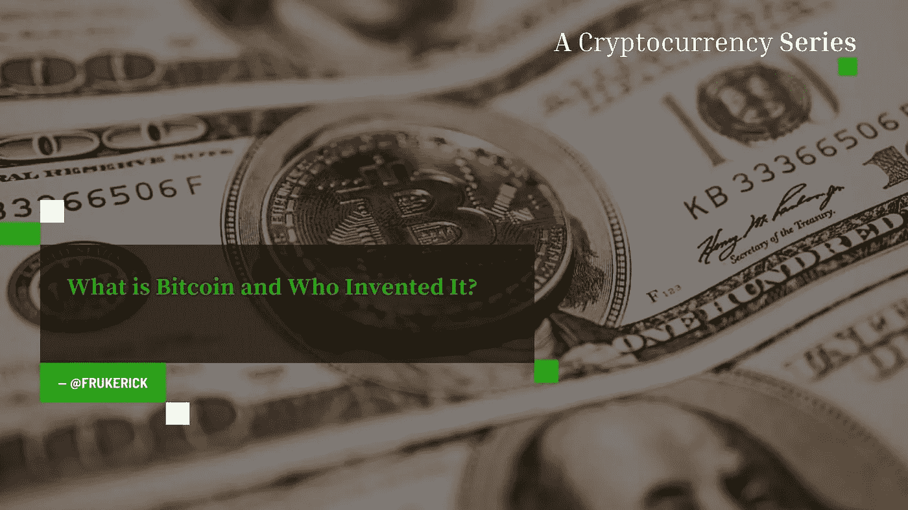

# 比特币是什么，是谁发明的？🤔

> 原文：<https://medium.com/geekculture/what-is-bitcoin-and-who-invented-it-d3995b83a736?source=collection_archive---------25----------------------->

## 第四集

## 第一种也是最早的加密货币比特币于 2009 年问世，此前中本聪发布了一份白皮书，详细介绍了该系统的运作方式

那些不从历史中吸取教训的人注定会重蹈覆辙——这里是加密货币的简史。

在当今主流加密货币出现之前，[早期尝试创造依赖于加密分类账的数字货币](https://www.forbes.com/sites/bernardmarr/2017/12/06/a-short-history-of-bitcoin-and-crypto-currency-everyone-should-read/)包括 Digicash 和 B-Money。

Digicash 是一种早期的加密电子支付形式，由美国密码学家 David Chaum 于 1985 年实现。它依靠软件从银行提取纸币，并在转移到收款人之前指定特定的加密密钥。因此，允许发行银行、政府或中介无法追踪数字货币。

1998 年晚些时候，戴伟发表了一篇关于 B-Money 的描述，其特征是一个匿名的分布式电子系统。2008 年，[当中本聪发表了一份](https://www.thebalance.com/history-of-cryptocurrency-5119511)[白皮书](https://bitcoin.org/bitcoin.pdf)详述比特币系统如何运作时，这个概念完全浮现出来。该软件于 2009 年上市，比特币成为有史以来第一种加密货币。

[Photo](https://www.pexels.com/photo/woman-holding-two-coins-2228570) by Thought Catalog from Pexels

想知道中本聪是谁吗？你并不孤单😅

既然你这么在乎，知道没人知道会很满足。大多数理论认为，Satoshi 可能是一个人、一群程序员、一个时间旅行的外星人或一个秘密政府团队的假名。

除了比特币，还有其他加密货币吗？

是的，目前有超过 7000 种加密货币存在。

比特币的诞生为许多其他加密货币提供了基础。有些是同一软件的衍生产品，而另一些则采用了不同的方法。

> ***您知道您的年度中级会员资格可以节省 10 美元*** ***吗？点击*** [***此处***](https://frukerick.medium.com/membership) ***即可享受*** [***优惠***](https://frukerick.medium.com/membership) ***的同时。***

👉 [**跟我来**](https://frukerick.medium.com/) ，Fru Kerick。
👉 [**订阅**](https://frukerick.medium.com/subscribe) 让你永不错过一个故事。
👉 [**中级会员可节省 10 美元**](https://frukerick.medium.com/membership) 。**阅读** [无限故事](https://frukerick.medium.com/membership)。以后再谢我吧…

[Fru Kerick](https://frukerick.medium.com/?source=post_page-----d3995b83a736--------------------------------)

## 周日运动

[View list](https://frukerick.medium.com/list/the-sunday-movement-4ca3751173a0?source=post_page-----d3995b83a736--------------------------------)25 stories