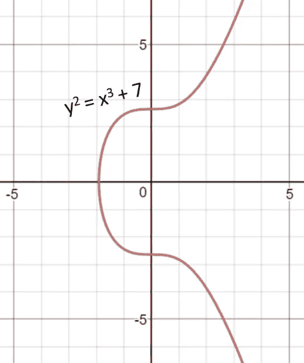
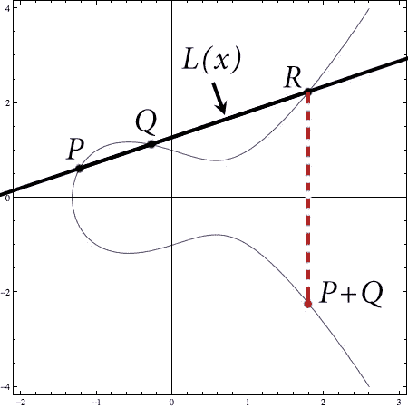
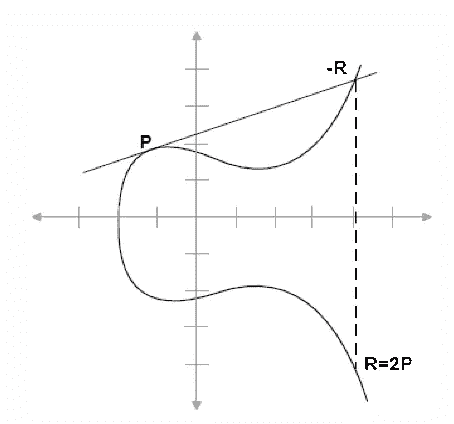
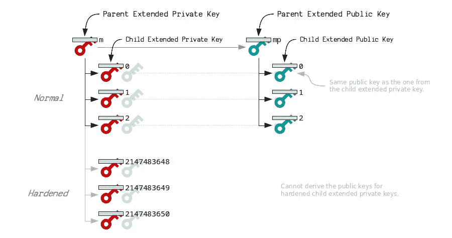
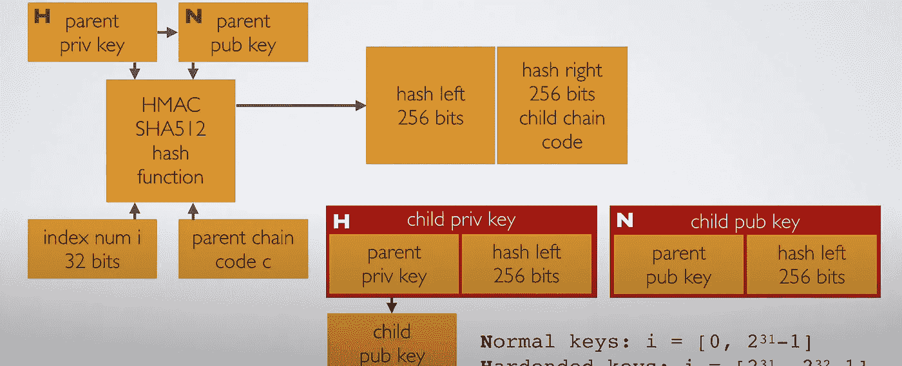
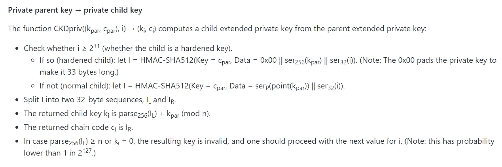
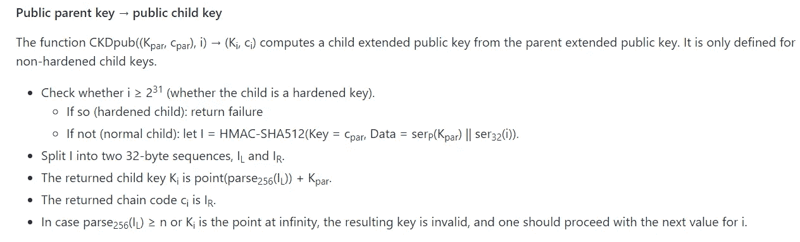
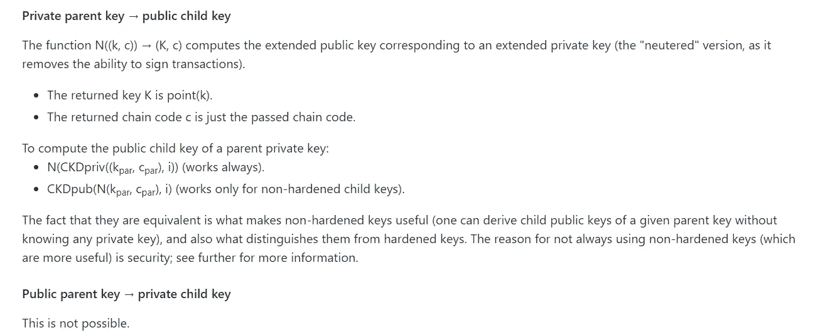
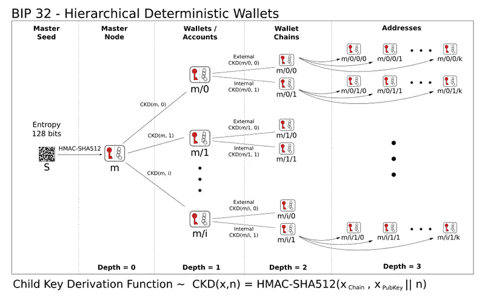

# 什么是比特币改进提案 32 (BIP-32)？

> 原文：<https://medium.com/geekculture/what-is-bitcoin-improvement-proposal-32-bip-32-586a3f36a95c?source=collection_archive---------1----------------------->

比特币改进提案-32 或 **BIP-32** 是一种信息 BIP，描述了**等级确定性钱包**或**高清钱包**。高清钱包可以与不同的系统部分或完全共享，每个系统都可以使用或不使用硬币

《BIP 32 号协议》在几个方面都是比特币钱包的重大改进。高清钱包极大地提高了钱包的互操作性，因为一组密钥可以通过一个扩展的私钥在钱包软件之间传输。

## 确定性钱包与分层确定性钱包

**确定性钱包**是一个从称为种子的单个起始点导出密钥的系统。它使用椭圆曲线数学，这使它能够在不泄露私钥的情况下计算公钥。确定性钱包通常由单个**【链】**密钥对组成。这种做法的局限性在于，钱包的共享是在全有或全无的基础上进行的。

高清钱包相对于简单的确定性钱包的优势在于，它提供了**多个密钥对链**，从而使钱包能够选择性地共享钱包。

# BIP-32 密钥派生

比特币使用的公钥密码是使用 *secp256k1* 定义的字段和曲线参数的**椭圆曲线密码**。使用 ECC 的优点是它减少了密钥大小并提高了速度。

ECC

基于 ECC 的高效且可互操作的加密技术的商业标准由**高效加密技术标准组织(SECG)** 开发，并且它已经发布了一个具有一组推荐的椭圆曲线域参数的文档。

> 由字母{ p，a，b，G，n. h }指代。

这个数据集统称为**椭圆曲线域参数**。

**secp256k1** 使用以下椭圆曲线方程，

> *y = x + ax + b*
> 
> *参数 a = 0*
> 
> *参数 b = 7*
> 
> 因此，这个等式看起来像:y = x + 7

有限域 **Fp** 是由参数 p 定义的有限个元素的域，参数 p 是一个素数。因此，字段 **Fp = {0，…，p-1}** 因此在椭圆曲线方程中应该使用**模 p** 运算。

> *因此等式将是:y = x + ax +b(mod p)*

参数 G 被称为**生成器**或**原始元素**，它是椭圆曲线上的一个预定点(Xg，Yg)，用于计算曲线上的其他点。发生器 G1 以两种形式显示，

**压缩格式**(前缀:02)

> *02 79 be 667 e f 9 dcbbac 55a 06295 ce 870 b 07 029 BF CDB 2d ce 28d 9 59 f 2815 b 16f 81798*

**未压缩格式**(前缀:04)

> *04 79 be 667 e f 9 dcbbac 55a 06295 ce 870 b 07 029 BF CDB 2d ce 28d 9 59 f 2815 b 16 f 81798 483 ada 77 26 a3 c 465 5 5 da 4 fbfc 0 e 1108 a 8 FD 17 b 448 a 6855419 9 c 47d 08 f FB 10 D4 b 8*

当在生成点 G 上应用一定数量的操作时，循环以相同的顺序再次开始。下一个循环的开始由参数 n 表示，该参数称为发电机点 G 的**顺序。**

参数 **n** 决定了最大值，直到该值它才可以变成私钥。范围**【1，n-1】**内的任何 256 位数字都是有效的私钥。参数 h 被称为**系数**，其**常量值为 1** 。

## 椭圆曲线的性质

1.  如果一条直线与两点 **P** 和 **Q** 相交，则它与曲线上的第三点 **-R** 相交。
2.  如果一条线与曲线相切，它与曲线上的另一点相交，
3.  所有垂直线与曲线在**无穷远处**相交。

如需椭圆曲线的视觉演示，请访问本页，

 [## 椭圆曲线点

### 椭圆曲线点

椭圆曲线 Pointswww.desmos.com](https://www.desmos.com/calculator/ialhd71we3) 

有两个操作(**点操作**)可以对椭圆曲线上的生成器 G 执行。

1.  点加法
2.  点加倍

## 点加法

点加法是将一条椭圆曲线上的两个点 **P** 和 **Q** 相加的运算( **P！=Q** )。在 P 和 q 之间画一条直线。这条直线将与曲线相交于另一点 **-R** 。点-R 相对于 x 轴的反射给出了点 **R** ，这是点相加的结果。

Point Addition

## 点加倍

点的加倍 **P** 就是将点 **Q** 移动到点 P 的坐标上的过程，( **P=Q** )。在点 p 处画椭圆曲线的切线，该线与椭圆曲线相交于点 **-R** 。点-R w.r.t x 轴的反射给出了点 R，这是点 p 加倍的结果。

Point Doubling

## 标准转换函数

当我们谈论这个 BIP 中的算法时，我们假设标准的转换函数。

> ***点(p)*** *:返回 secp256k1 基点与整数 p 的 EC 点相乘(重复应用 EC 组运算)得到的坐标对*
> 
> ***ser32(i)*** *:将 32 位无符号整数 I 序列化为 4 字节序列，最高有效字节在前。*
> 
> ***ser 256(p)****:将整数 p 序列化为 32 字节序列，最高有效字节优先。*
> 
> ***【serP(P)****:使用 SEC1 的压缩形式将坐标对 P = (x，y)序列化为字节序列:(0x02 或 0x03) || ser256(x)，其中头字节取决于省略的 y 坐标的奇偶性。*
> 
> ***【parse 256(p)****:将一个 32 字节序列解释为一个 256 位数，最高有效字节优先。*

**BIP-39，**是一个改进建议，描述了生成 512 位种子的助记词的实现。这个种子然后被用来创建一个高清钱包。点击这里查看更多关于 BIP-39 的信息，

 [## 什么是比特币改进提案 39 (BIP-39)？

### 比特币改进提案或 BIP 是一个设计文件，为比特币社区提供信息或描述一个…

medium.com](/geekculture/what-is-bitcoin-improvement-proposal-39-bip-39-9a95ed07cb03) 

# 扩展键

Bip39 种子**(128–256 位)**使用 **HMAC SHA512** 哈希函数生成主私钥 **(256 位)**。附加了具有额外 256 比特熵的主链码，使得从主密钥导出的密钥不仅仅依赖于主密钥本身。

扩展私钥表示为 **(k，c)** 其中 k 是普通私钥，c 是链码。从父密钥派生的每个扩展密钥具有 **2 个**普通子密钥和 2 个加固子密钥。每个键都有一个索引。**正常子键**使用索引 **0** 到 **2 -1** 。**硬化子键**使用索引 **2** 到 **2 -1** 。

## 子派生(CKD)函数

给定一个父扩展密钥和一个索引“I”，就有可能计算出相应的子扩展密钥，但是要这样做，算法取决于子扩展密钥是否是一个加固密钥，以及我们所讨论的是私钥还是公钥。

HMAC-SHA512 散列函数接受三个输入，母私钥或公钥、索引号 I 和母链码。该函数的输出给出了 256 位的左哈希和 256 位的右哈希。

Child Key Derivation Function

如果密钥是一个**加固的密钥**，那么我们得到子私钥，其中左边的散列位被附加到父私钥。

> **扩展私钥(xprv)** =母私钥+母链码

**Xprv keys** 可以用私钥和子公钥创建一个完整的分支。

如果密钥是一个**普通密钥**，那么我们得到子公钥，其中左边的散列比特被附加到父公钥。

> 扩展公钥(xpub) =父公钥+父链代码

**Xpub keys** 只创建子公钥的一个分支。它不能创建强化密钥。

## 私有父密钥到私有子密钥的派生

## 公共父密钥到公共子密钥的派生

## 私有父密钥到公共子密钥的派生

使用不同的索引号(I)将从相同的父项创建不同的**不可链接子键**。使用子链代码对子键重复该过程将创建不可链接的孙键。通过改变链代码，创建了一个**新节点(又名钱包)**。

# 钱包结构

BIP39 在密钥树及其节点上强加了钱包结构。

**HDW** 组织为若干个**账户**。帐户是有编号的，默认帐户(" ")是数字 0。每个账户由两个密钥对链组成:一个**内部**和一个**外部**的。外部链用于生成新的公共地址，而内部密钥链用于所有其他不需要任何通信的操作。

查看 python 中 BIP-32 的实现，

 [## BIP _ 实现/bip 32 . py at master tion x3na/BIP _ 实现

### 此文件包含双向 Unicode 文本，其解释或编译可能与下面显示的不同…

github.com](https://github.com/tionx3na/BIP_implementations/blob/master/bip32.py) 

# 参考

 [## bips/bip-0032 . mediawiki at master bit coin/bips

### 最近的更改:(2013 年 4 月 16 日)添加了 i ≥ 0x80000000 的私有派生(父私钥泄露的风险更低)(30…

github.com](https://github.com/bitcoin/bips/blob/master/bip-0032.mediawiki)