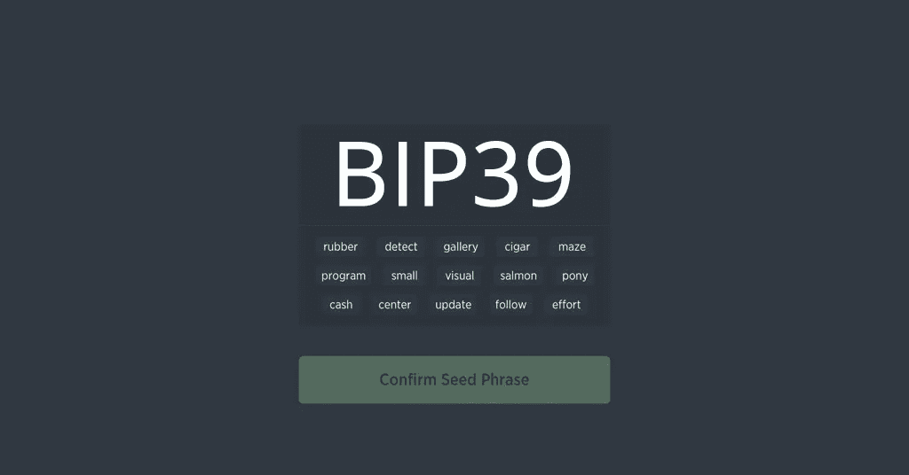
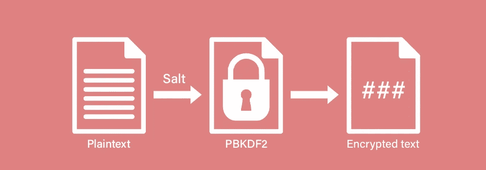
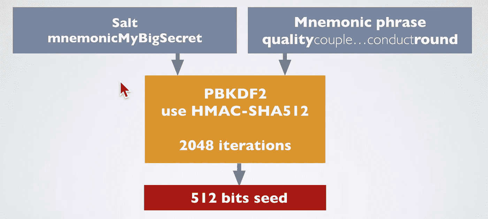

# 什么是比特币改进提案 39 (BIP-39)？

> 原文：<https://medium.com/geekculture/what-is-bitcoin-improvement-proposal-39-bip-39-9a95ed07cb03?source=collection_archive---------8----------------------->

**比特币改进提案**或 BIP 是一份设计文件，为比特币社区提供信息，或描述比特币或其流程或环境的新功能。

**BIP-39** 描述了用于生成确定性钱包的助记码或助记句的实现。

它由两部分组成，**生成助记符**和**将其转换成二进制种子**。该种子随后可用于使用 BIP-32 或类似方法生成确定性钱包。

# 生成助记符

**BIP-39** 用作传输计算机生成的随机性的指南，具有人类可读的转录，与处理**钱包种子**的原始二进制或十六进制表示相比，非常用户友好。

将要生成的助记符必须以 32 位的倍数对熵进行编码，并且应该在 128-256 位之间。我们称初始熵长度为 **ENT** 。

> **注意**位的长度越长，安全级别越高，但助记符的长度也会增加。

生成 ENT 后，通过取其 SHA256 哈希的第一个**“ENT/32”**位生成校验和。

> HASH = SHA256(ENT)，
> 
> CS =哈希的第一个 ENT/32 位
> 
> 然后校验和被附加到初始熵上。

然后，连接的比特被分成 11 个比特的组，每个比特编码一个从 0 到 2047 的数字，作为单词表的索引。我们将这些数字转换成单词，并将连接起来的单词用作助记句。

## 单词表的特征

对应于从 0 到 2047 的索引的单词被标准化用于互操作性。单词表的特征是，

> 1)单词列表是以这样一种方式创建的，即只需键入前四个字母就可以明确地识别单词。
> 
> 2)避免使用看起来相似的词对，以便更容易记住句子。
> 
> 3)对单词列表进行排序，以便更有效地查找码字。

用单词替换索引号的用途是帮助用户更容易记住这些键。

检查 BIP-39 中描述的标准单词表，

 [## 比特币大师 bips/bip-0039-wordlists.md

### 实现短语生成或校验和验证的开发人员必须使用表意空格/…分隔单词

github.com](https://github.com/bitcoin/bips/blob/master/bip-0039/bip-0039-wordlists.md) 

# seed 助记符

对于助记符到种子的转换，使用 **PBKDF2** 函数。

PBKDF 2 或**基于密码的密钥派生函数 2** 是一个简单的密码密钥派生函数，抗**字典攻击**和**彩虹表攻击**。它基于用一些填充多次迭代导出 HMAC。

**助记符语句**用作密码，字符串**“助记符”+密码短语**用作 PBKDF2 函数的 salt。

> 用户可以输入密码短语，如果不输入，则使用空字符串。

**迭代计数**被设置为 20148，并且 HMACSHA512 被用作伪随机函数来导出长度为 512 比特的密钥。这个种子随后被用于生成高清钱包，这将在 BIP 32 中描述，我将在另一篇文章中介绍。

# 参考

 [## bips/bip-0039 . mediawiki at master bit coin/bips

### BIP: 39 层:应用程序标题:生成确定性密钥的助记码作者:马雷克·帕拉蒂努斯·帕沃尔·鲁斯纳克…

github.com](https://github.com/bitcoin/bips/blob/master/bip-0039.mediawiki)