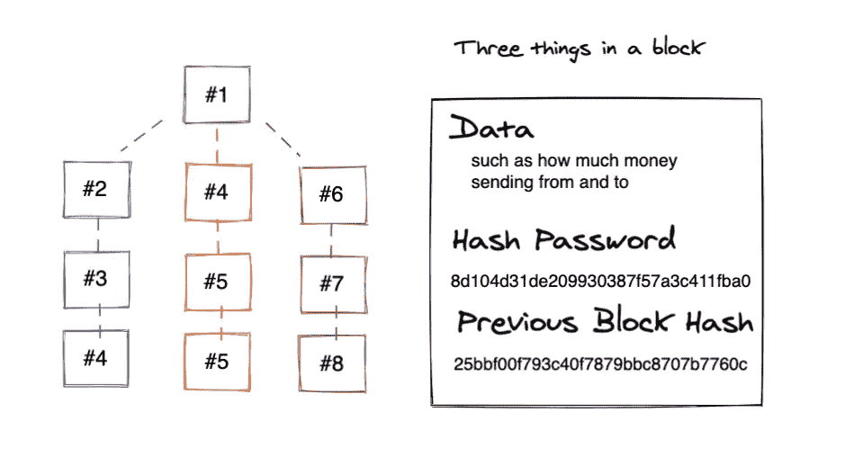

# 什么是区块链技术:简单解释。

> 原文：<https://medium.com/geekculture/what-is-blockchain-technology-simply-explained-3e71d56ae415?source=collection_archive---------17----------------------->

[-André François McKenzie](https://unsplash.com/@silverhousehd)

比特币，以太坊，Dogecoin？！这些是市场上最受欢迎的加密货币，你可能听说过，但你知道它背后的技术吗？这将是一个关于区块链的简单解释。

# 介绍

1991 年，*斯图尔特·哈伯*和*w·斯科特·斯托纳塔*想出了一种给数字文档加时间戳的安全方法，这种方法不能被篡改，这种技术今天被称为区块链。这种技术很少被使用，直到一群化名为*中本聪*的开发者在 2007 年采用这种技术，并在 2009 年晚些时候创造了一种名叫比特币的数字分散货币。

# 区块链

区块链基本上是一个分布在 P2P 网络中的数字账本。它使用哈希来存储数据块上的一些信息，一旦数据发生变化，哈希也会发生变化。让我们看看上面的图表，假设数据块#2 已被篡改，从而使哈希值发生变化，系统可以检查数据块#3 以前的哈希值，如果数据块#2 的当前哈希值不匹配，则系统将知道数据块#2 中的变化是不正确的，并使其无效。

# 工作证明

知道现代计算机每秒可以处理成千上万个等式，*中本聪*想出了这种算法，大约每 10 分钟检查一次分类账的变化，看看所有的数据是否有效，从而防止用户发送/接收不正确的金额。这些检查是由账本所有者进行的，你可能知道他们是加密矿工，他们会因为检查整个区块链的处理能力而获得一定数量的硬币，只有在一切都有效的情况下才会添加新的区块。

# 分散货币

由于区块链是一个开放的 P2P 网络，这使其成为一个伟大的去中心化货币平台。分散的货币只是意味着货币价值不是由一个单一的实体控制，如美元围绕着美国政府。我相信比特币是在 2008 年金融危机时发明的，当时美国政府救助了所有发放了根本不存在的数十亿美元贷款的房地产公司。这给中本聪的理论嘴巴留下了一个酸味，因为他知道通货膨胀只是由政府中的少数当权者控制的。

# 新技术

随着加密货币的兴起，区块链已被用于许多其他业务，如医疗行业，以安全地跟踪患者的医疗数据，沃尔玛等企业使用区块链技术来保存进出产品的安全记录，甚至大银行也将区块链用于加密货币的相同目的。

# 结论

区块链是一种安全的解决方案，用于保存 P2P 网络中每个人维护的数字分散账本。我希望这对于日常消费者来说足够简单易懂。我写这篇博客是因为我的另一半问我 Dogecoin 是什么，为什么她总是听到它。这只是一个简单的初学者解释，我将在未来写另一篇博客来深入研究区块链，并解释更新的概念，如智能合同。

