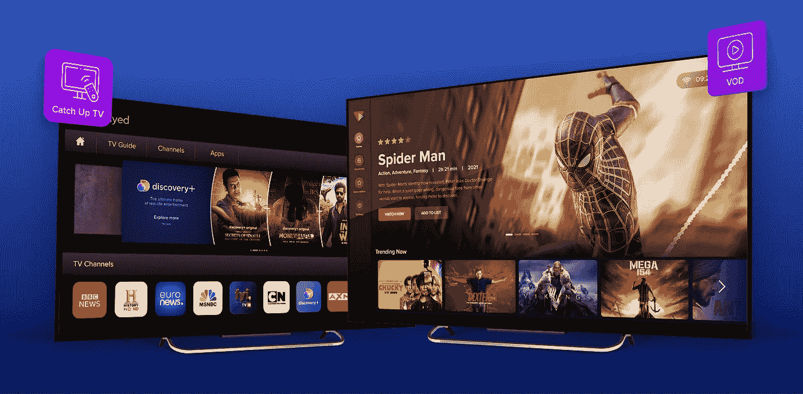
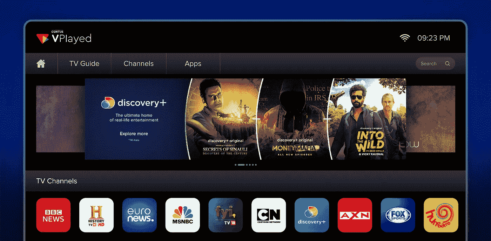
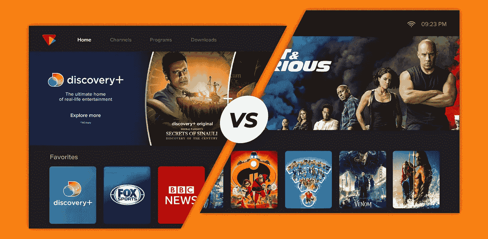

# 什么是电视节目？追看电视和视频点播的区别？

> 原文：<https://medium.com/geekculture/what-is-catchup-tv-difference-between-catchup-tv-vs-vod-1dd0ea486247?source=collection_archive---------4----------------------->

探索 tvcatchup 与 VOD 流服务之间的完全区别以及它是什么。还要更多地了解这两种服务如何让最终用户受益。

电视消费在我们几乎所有的生活中扮演着不可或缺的角色。对每个人都有好处。这也是生活的完美喘息。尤其是在辛苦工作了一整天之后。以前，我们必须观看我们面前正在播放的节目。在这个通过互联网进行视频流传输的时代，情况并非如此。

通俗地说，网飞、亚马逊 Prime 和迪士尼+在想看电视节目的人群中掀起了一场革命浪潮。因为当以前的广播技术变得无能为力时,《谈话》中的片段遇到了危机。电视迷们被电视时间表的时间表束缚住了。

但是，该领域最近的参与者承认，他们已经为 vod 电视(视频点播电视)铺平了道路。随着“什么是视频点播”这一突破性进展的出现，在一种模式下，出现了一系列可配置的电视流媒体方法。这种美德在制作甚至被称为“追赶电视”的节目时成倍增长。

数据显示，在 2021 年至 2022 年期间，1.224 亿美国家庭拥有电视。这显示了普通美国公民有多倾向于电视消费。

在 Statista 上公布的一项调查统计中，估计大多数美国成年人更喜欢上网观看他们选择的内容，而不是订阅有线电视，因为前者更容易获得。另一个同类的主要份额认为与在线媒体流相比，有线电视是昂贵的。

**什么是叙旧电视**

是一种特殊的流媒体服务，可以在指定的在线空间播放已经播出的电视节目。这有助于赶上观众因时机不佳而错过的电视节目。

赶上电视还需要一件事——只有以前在电视频道播出的内容才能成为赶上的素材。从逻辑上来说，让一个电视频道的忠实追随者跳过电视直播，在他们方便的时候追上来，这是一个深思熟虑的提议。

## 哪里都可以看到**追电视**

根据您希望观看的特定频道的内容，您可以在两个地方观看电视节目。

a)如果广播公司与 OTT 平台合作，那么您可以在其中观看节目。b)但是，如果电视网有自己的在线视频流平台，那么节目就会备份到这个平台上。它们可以被清楚地识别为，

1) **在服务提供商 STB** 上收看电视节目:在连接到 STB(机顶盒)的智能电视上观看您错过的预定节目，无需更改直播电视和 OTT 流媒体服务之间的电缆端口。

2) **在线追看电视**:在广播公司自己的[视频点播流媒体平台](https://habr.com/en/post/562216/)上追看过去的节目，该平台可在任何时间与任何设备连接。该平台还可以提供其他形式的服务，以最好地娱乐广播公司的忠实观众群。

这两种流式传输最初在地面电视上广播的电视节目的方式的一个共同因素是-在这两种设置背后的使能技术平台可在浏览器以及平台持有者的应用上访问。

# **如何使用 Catch up tv**

首先，重要的是要知道该功能仅通过 OTT 媒体服务提供。它通常作为 OTT 平台与电视频道合作提供的 vod 服务包的一部分。有时它们可以直接在电视频道的网站或视频平台上获得。

**使用电视追踪器的内幕**

1.  上视频流媒体平台首页。
2.  找到并选择您希望观看的电视节目
3.  浏览过去的时间表，找到感兴趣的剧集
4.  最后，把它从你的清单上划掉。

## **什么是 VOD** ？

[VOD 平台](https://www.vplayed.com/video-on-demand-platform.php)是对任何视频频道的最广泛分类，可通过互联网在任何设备上访问，不受访问地点和时间的限制。为什么《追电视》也归入这一类？

它基本上是建立在任何空间在线呈现视频流的可能性。这就是为什么它被许多行业所采用，不管它们的背景如何。

**视频点播的优势核心特征:**

1.  完全不受任何观看视频内容对应的时间轴的约束。
2.  它赋予用户在选择观看材料时的选择自由，也可以针对这些用户的喜好进行优化。
3.  它的观众控制设置非常灵活，超出了有线电视甚至卫星电视的基本控制设置。

此外，当你有一个比单一模式更高的货币化模式时，你对你的业务有更多的自主权。

这种自主性还源于日益增长的媒体消费者基础，他们更倾向于视频内容，而不是其他格式的视频内容。

## **追赶**与 **VOD 电视**的区别

**赶上电视**

1.  它只有一个目的，那就是让它的用户补上错过的电视节目。
2.  在这种视频流服务下观看的节目受制于它们已经首先在直播电视上播出的条件。
3.  对内容可观看的时间长度也有时间限制。

**视频点播电视**

1.  它向用户开放其平台，拥有各种形式的视频材料(电影、剪辑、电视节目……)的完整资料库。

2.这些视频平台已经变得如此突出，以至于它们在平台不拥有的旧内容中托管自己的内容。

3.只要订阅持续到其用户，就可以享受这里的内容。

## **到底是什么？**

总之，两者都是当下的媒介。不过，如果我们从起源的角度来说，电视是在视频点播之前出现的。相反，我们可以说，追赶电视的需求可能需要视频流的视频点播线路。

当电视网络一直在寻找一种方法来将他们的频道观众与他们错过的节目结合起来时，他们想到了在广播公司的网络上提供点播服务的想法。

随着这个想法的出现，它多样化并扩大了自己，从而渗透到在线领域。此外，它的外延变得如此巨大，以至于它成长为一个全新的商业领域。我相信，现在，我们可以亲眼看到[顶级视频点播平台](https://blog.contus.com/vod-video-on-demand-platforms/)是多么巨大，当它们形成了像网飞这样的独角兽和同样高端的竞争对手如亚马逊 Prime、迪士尼+…

目前,“追赶电视”可以被看作是可以被视频点播所包含的东西。可以预见的是，我们未来的创新取决于视频点播的发展。

如果您是一家正在为您的平台寻找追赶电视货币化模式的广播公司，请查看 CONTUS VPlayed [视频货币化解决方案](https://www.vplayed.com/video-monetization-platform.php)，并联系我们的团队以获得最佳建议！