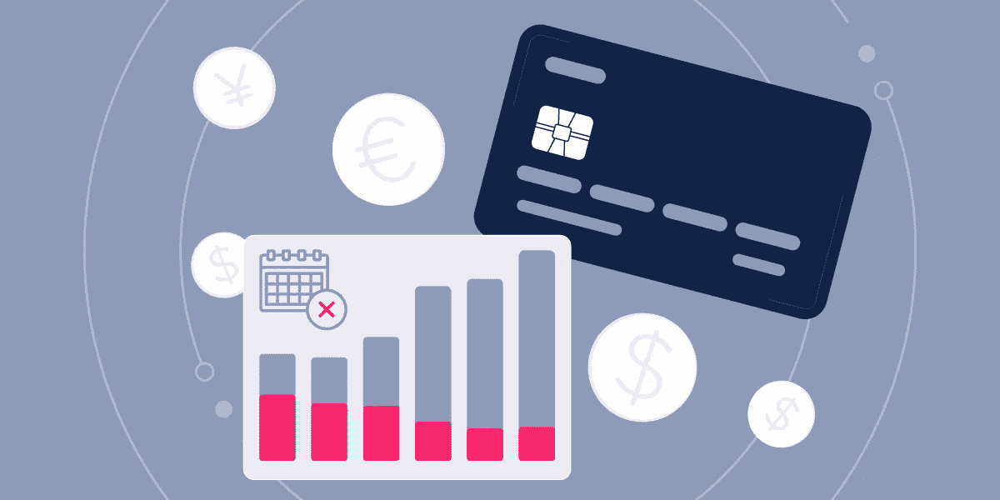
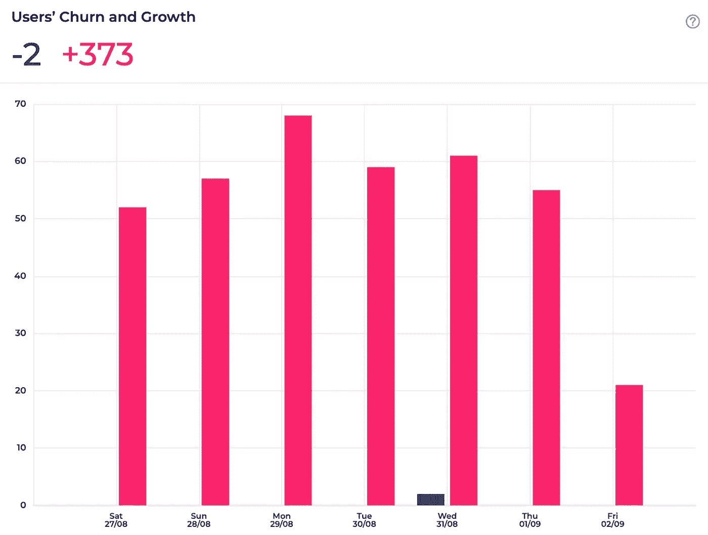
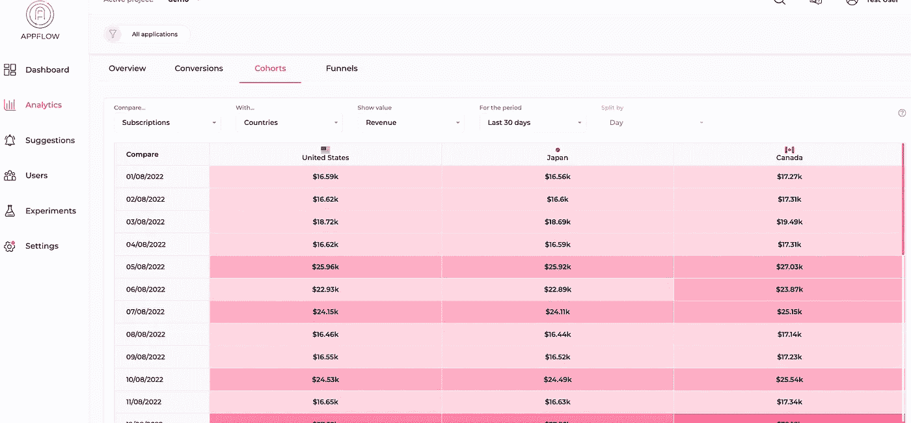

# 基于订阅的应用程序的流失是什么？

> 原文：<https://medium.com/geekculture/what-is-churn-for-subscription-based-apps-6ece1c6482bc?source=collection_archive---------15----------------------->

Churn 在字典中的意思是“停止购买特定公司的产品和服务，尤其是为了从竞争对手那里购买”。现在，它是所有企业的一个关键指标，因为它与企业生存和发展的关键——留住人才截然相反。理解用户离开的原因和他们留下来的原因同样重要。

高流失率意味着低留存率，会阻碍每月经常性收入的增长，并最终摧毁产品。这就是为什么 RARRA 的[业务增长模式](https://clevertap.com/blog/aarrr-metrics-vs-rarra-framework/)在今天的应用程序世界里变得比 AARRR 更受欢迎。“增长的真正关键是留住用户”。也就是说，增长的真正关键是低流失率，尤其是对基于订阅的应用而言。

[Churn for Subscription-based Apps](https://www.appflow.ai/blog/churn-for-subscription-apps)

# 基于订阅的应用程序的流失是什么？

对于基于订阅的应用来说，用户流失有两个方面。从 app 用户的角度来看，流失是指特定时间段内停止使用 app 的用户数量。而从订阅的角度来看，流失指的是取消或选择不续订订阅的订阅用户数量。通常人们更多的是从订阅的角度来关注流失。然而，应用使用中的流失也应该被考虑，因为免费用户是最有可能订阅的。

# 为什么 App 用户会流失？

这里有几个订户流失的原因供你参考:

*   **App 功能不能解决用户的问题:** App 用户订阅是因为他们想修复自己的问题。因此，当他们订阅并体验该应用程序，但最终发现它不能满足他们的需求时，他们会取消订阅，并找到一个可以真正解决他们问题的应用程序。
*   **不需要这项服务:**一些应用程序用户使用该产品来解决他们的短期问题。当他们不再需要该服务时，他们肯定会取消订阅。
*   **定价太贵:**当用户发现他们在应用上的花费无法平衡他们的收入，甚至是负的投资回报率时，在这种情况下，他们为什么还要继续使用这个应用呢？
*   **切换到替代解决方案:**当用户找到另一个可以解决相同问题的低成本解决方案，甚至是免费的解决方案时，他们自然会切换到另一个替代方案，这个替代方案很有可能是该应用的竞争对手之一。
*   **用户对应用程序的用户体验感到沮丧:**当应用程序的可用性让用户感到沮丧，因为他们的努力对于持续的错误和性能问题来说是徒劳的。这肯定会赶走订户。

# 如何计算订阅流失率？

计算流失率的方法因业务和产品不同而不同。衡量客户流失率最简单的方法是用特定时间段内流失的订户总数除以该时间段内您拥有的订户总数。每个基于订阅的应用程序都可以提出更合适的等式来计算流失率。

例如，像 [appflow.ai](https://www.appflow.ai/) 这样的移动订阅工具可以帮助他们的用户直接计算他们的应用程序的流失率，并提供“是否增加取消流失率”的选项。为什么不在客户流失中添加取消功能？这是因为当人们取消时，并不意味着他们不使用该应用程序，特别是对于免费增值的订阅应用程序。这些用户可能处于订阅期，并且更喜欢在订阅到期后手动订阅服务。无论您使用何种计算方法，核心都是在比较不同时期的流失率时保持相同的等式。

[Appflow.ai — Mobile subscription analytics](https://www.appflow.ai/analytics)

# 为什么客户流失很重要？

## 对于产品团队:

用户流失的最常见原因是他们使用的应用程序不能解决他们的问题和解决他们的痛点，这与产品功能和特性密切相关，因此流失是产品经理的一个重要的[指标](https://www.appflow.ai/blog/mobile-app-metrics-comprehensive-guide)。分析人们流失的原因可以看出 app 的质量和可用性。有了这种洞察力，产品经理可以改进产品缺点，优化用户体验，并推广所需的新功能。

## 对于营销团队:

流失对营销团队的主要 KPI 收入有灾难性的影响。所以流失对于营销团队的重要性是显而易见的。营销团队负责引入新用户和留住老用户。一项关于什么样的用户最有可能流失的研究可以帮助他们防止应用程序用户流失。例如，如果应用营销人员通过 appflow.ai 使用[群组分析](https://demo.appflow.ai/#/analytics/cohorts?project=61dfef44440a4a5550d07ffd)和[其他归因工具](https://www.appflow.ai/integrations)的集成，如 Adjust、Appsflyer、苹果搜索广告等，并发现某个国家的人在一段时间后会流失，因为他们无法承受昂贵的定价，那么就为这些人提供折扣，尽可能延长他们的终身价值。

[Appflow.ai — Mobile Subscription Cohort Analysis](https://www.appflow.ai/cohort)

# 如何降低订阅应用的流失率？

*   **瞄准合适的用户:**不是所有的应用都适合所有人。了解 app，了解 app 能解决什么样的问题。然后分析用户画像，瞄准最有可能订阅的潜在线索。
*   **谨慎使用用户:**当应用程序用户订阅或发布新功能时，通过提供完美的使用体验、详细的手册和有用的教程，强调应用程序的实际功能和优势，确保订阅者能够充分利用产品。
*   **了解用户需求:**要让用户坚持使用应用，满足他们的需求是第一要务。应用程序用户订阅是因为他们看到了对他们的价值。但随着时间的推移，用户的需求可能会增长，如果应用程序不能满足他们的需求，他们会转向另一个更强大的工具。为了防止这种情况，请始终了解用户的需求，然后改进应用程序的现有功能，并添加新的所需功能。
*   **与用户保持密切关系:**向用户展示你的产品是否能帮助他们实现价值，可以让他们感到自己很重要。因此，当应用程序不能满足他们的新需求时，他们会问是否有可能开发一个新功能，而不是静静地搅拌。
*   **调查用户流失的原因:**通过调查问卷或直接与流失的应用程序用户交谈，了解用户流失的真正原因。通过这种方式，营销人员可以了解原因，并结合数据库中的数据分析或 appflow.ai 等基于订阅的数据分析工具，他们将能够提出一个伟大的想法来防止他们的订户流失。

# 什么是好的流失率？

一个好的流失率应该为零，这意味着没有人取消订阅。但实际上，这是不可能的，因为用户会因为这样或那样的原因而流失。要判断你的流失率是否可以接受，参考行业平均流失率是个不错的选择。有一件事是永远正确的，那就是一直降低流失率，尤其是对于基于订阅的应用程序。

# 最终想法

对于基于订阅的应用来说，客户流失是最痛苦的因素。高流失率意味着所有的努力和投入带来新用户，并说服他们订阅将是徒劳的。更糟糕的是，随着应用的发展，用户流失也会存在。但这并不意味着我们应该什么都不做，相反，我们应该始终专注于减少订阅流失，并从数据库中的流失数据甚至从基于订阅的数据分析工具[中获得反映。通过这种方式，应用程序将更加完美，并为世界提供更多价值。](https://www.appflow.ai/blog/in-app-subscription-tools)

 [## 面向 iOS 和 Android 的移动订阅分析- Appflow

### 在一个仪表板中公布您的移动订阅数据并计算应用收入、留存率和流失率。进入你的…

www.appflow.ai](https://www.appflow.ai/analytics)