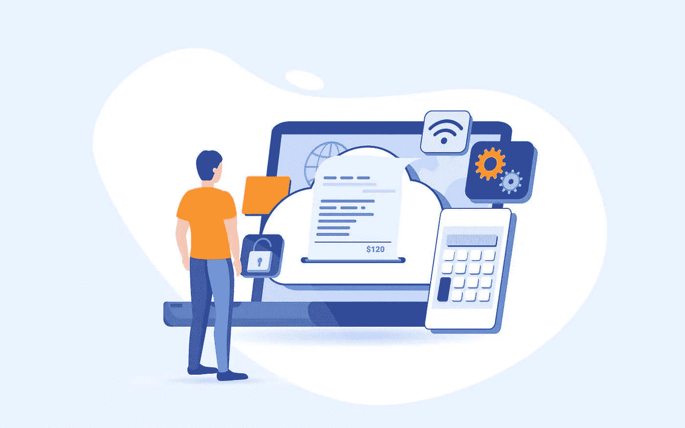

# 什么是云会计？如何选择最好的会计软件？

> 原文：<https://medium.com/geekculture/what-is-cloud-accounting-how-to-choose-the-best-accounting-software-220909892b98?source=collection_archive---------47----------------------->

> *根据* [*Flexi*](https://www.flexi.com/cloud-accounting-statistics/) *预测，到 2023 年底，全球基于云的会计市场将增长至 42.5 亿美元。*

云会计是会计和金融领域的一个新兴趋势，正在给会计流程带来重大转变。公司可以通过注册云会计软件来节省资金、精力和时间。这消除了在每个员工的系统上安装昂贵软件的需要。

近年来，云已经成为 IT 领域越来越重要的一部分。本文将探讨什么是云会计，它是如何工作的，以及它为您的企业提供了哪些优势。

# 什么是云会计？

几个世纪以来，人们在纸上记录他们的收入和支出。自 18 世纪以来，复式记账法就一直存在，这种记账法使用会计报表的两面来记录企业的财务状况。如今，会计软件允许公司实时跟踪他们的收入和支出。

那么，云会计在这方面如何改进呢？以下是主要区别:

**传统会计:**

这是最老套的了！在云会计出现之前，大多数会计软件都安装在本地计算机上。这意味着会计软件使用的所有财务数据都存储在您的办公电脑上。只要你保持在互联网服务提供商的带宽限制内，这是没问题的，但这意味着你不能从其他电脑或在线服务访问你的数据。

**云会计:**

云会计**(也称为在线会计)**是小企业管理日常财务的一种安全高效的方式。云会计意味着你可以从任何地方访问你的账簿，随时处理你的财务。您永远也不需要担心在火灾或洪水中丢失重要的文档或其他数据。

云会计是小企业在不破产的情况下进入会计软件游戏的一种方式。对于会计师来说，这也是将他们的客户保持在一个地方的好方法，可以方便地访问他们所有的数据。云会计软件最大的好处就是性价比高。云负责服务器和存储，因此您不必担心硬件升级。

云平台最重要的方面是它能够为您提供额外的价值，这一点我们将在下一节中讨论。云平台可以通过多种方式为您的企业提供价值。其中包括 API、多租户和混合策略。API 允许第三方开发者连接到你的系统，使你的公司作为一个企业更有价值。

> *根据* [*资本顾问*](https://capitalcounselor.com/accounting-statistics/) *的一份资源，使用云会计的公司将比不使用这些工具的公司多增加五倍的客户。*

# 云会计的优势

1.  **从任何地方访问:**基于云的会计的最大优势是您的数据始终可以从任何设备获得。它提高了你的生产力，节省了你的时间。它还允许其他部门访问相同的数据并更有效地合作。
2.  **实时:**有了在线会计系统，更容易跟踪实时数据。基于云的会计消除了花费时间核对过去的交易以查看您企业当前财务状况的需要。在制定重大战略和财务决策时，将观察到这种实时概览的本质。它将帮助你确定这个项目是否值得，是否太浪费，或者钱没有花在一个好主意上。
3.  **自动化:**在自动化时代，用手工会计任务弄脏自己的手就像在流沙中游泳。更好的选择是投资有助于任务自动化和简化会计流程的软件。自动化是当今商业环境中不可或缺的工具。企业比以往任何时候都更有必要专注于核心任务，而不是一直处理数字。自动化将释放你的大量时间，让你专注于更重要的任务，并学习如何执行新的任务。自动化是企业成功的关键。它使企业能够专注于他们最擅长的，他们的核心业务任务。自动化日常会计工作的一个简单方法是使用会计软件。
4.  **集成:**云会计软件极其灵活，可以根据您的业务需求进行定制。它们可以与您现有的会计系统无缝集成，还可以通过自动导入银行对账单来节省您的时间和金钱。
5.  **接入 app 生态系统:**开放 API 的本质是让你能够与许多不同的第三方工具共享、交换和集成数据。有许多实际的商业应用程序具有为特定行业需求定制的各种特性和功能。
6.  **数据安全:**云计算最大的问题是没有安全性。云提供商可能会也可能不会保证数据安全，但事实是，您的数据在云中比在本地系统上更安全。除非获得授权，否则任何人都不能访问它。
7.  **无维护成本:**有了云，你就不用安装管理软件了。另外，你不必更新它。随着新特性和功能的引入，基于云的软件会自动升级。它为您节省金钱和时间！

**在你选择一个会计软件之前，问这些问题:**

1.  您的软件适合我的业务吗？
2.  你能定制它来适应我的需要吗？
3.  你的软件能处理多少客户和员工？
4.  包括什么级别的支持，费用是多少？
5.  你的数据有备份吗？停机后可以立即恢复访问吗？
6.  您有什么安全措施来保护我的业务和客户的数据？
7.  你们服务的总费用是多少？有任何安装费或费用吗？
8.  你提供什么样的技术支持？您提供电话或实时聊天支持吗？

# 云会计软件

云会计可能会势不可挡，但也不尽然。合适的云会计提供商将帮助你了解你在云中的财务状况，这远比其他任何因素都重要。

**可供选择的几家云提供商:**

[**Xero**](https://quickwork.co/apps/xero/integrations)

[Quickbooks](https://quickwork.co/apps/quickbooks/integrations)

[**圣人会计**](https://quickwork.co/apps/sage_acc/integrations)

[**佐贺图书**](https://quickwork.co/apps/zoho_books/integrations)

# 结论

本质上，云会计是需要管理其账户的企业的完美解决方案。企业可以使用基于云的系统，如 Intuit QuickBooks Online 或 Xero，来检查和更新他们的书籍和记录。人们开始相信这些系统是安全的。

一个很好的例子是网上银行——人们最初抵制它，但现在每个人都接受它。同样，云会计将成为小型和大型企业的巨大资产。随着公司开始使用基于云的会计软件，拥有最好的解决方案对他们来说很重要。不要错过这个机会。

云会计的应用集成是您成功的关键因素。Quickworks 的“一对多”方法意味着您可以在很少的时间和成本内集成所有领先云会计服务的会计。[在我们的平台上免费开始使用](https://quickwork.co/?utm_source=Blog_Post&utm_medium=Organic_Interlink&utm_campaign=Contact_Us),立即集成您的系统和应用。

**快乐会计！**