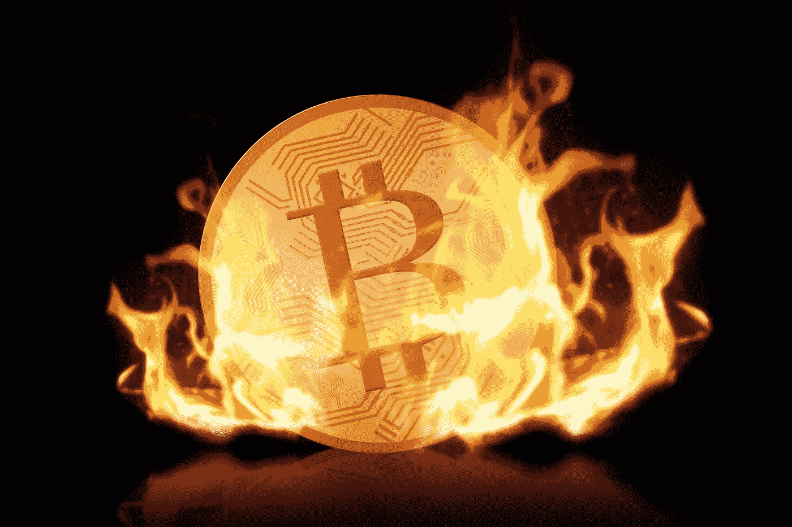

# 什么是硬币燃烧，为什么它让加密投资者高兴？

> 原文：<https://medium.com/geekculture/what-is-coin-burn-and-why-does-it-make-crypto-investors-happy-a71c3fac7417?source=collection_archive---------9----------------------->

## 几十年来，各种组织一直使用各种方法来稳定货币。投资者喜欢稳定，所以 crypto 需要把他们的眉头拧下来。

Image courtesy of [Canva](https://canva.com)

我昨天买了一袋油炸圈饼。当我开始吃它们时，我非常高兴。当然，我很饿，这让我很开心，但我也知道袋子里还有更多甜甜圈。我有充足的货源。然而，随着我吃得越来越多，我的供应量逐渐减少，到最后，当我把手伸进袋子时，我觉得只剩下几个了。尽管如此，我还是想尝更多，我的大脑计算出我想尝比袋子上剩下的更多的甜甜圈。突然，我的甜甜圈成了我担心的来源，因为我快吃完了。那袋甜甜圈花了我 3 美元。然而，如果有人能再给我一袋甜甜圈，我可能会付 5 美元，因为不值得再去一次。当我的供应量减少时，我的甜甜圈的价值增加了。所以，我体会到了供需效应。

但我不想花 5 美元买甜甜圈。那就是通货膨胀。我想再次支付 3 美元，并要求有人为我送货。我需要更便宜的甜甜圈。如果商店将价格降低到 1.5 美元，我可以付给别人 3 美元来买我的甜甜圈。那就是通货紧缩。商店的供应必须增加，所以他们想以较低的价格出售他们的甜甜圈。

这些原则驱动着我们经济体系的核心，从法定货币到股票，再到现在的加密货币。有时在金融不稳定时期，如果流通中的货币过多或过少，政府、企业和组织必须使用积极的方法来稳定货币。今天，我们将重点讨论硬币燃烧，但我们也必须看看法定货币去货币化和股票回购来理解它。当你读完之后，你会明白烧钱，为什么组织要这么做，以及它如何能让你受益。

让我们得到它。

# 什么是硬币燃烧？

去货币化、股票回购和烧钱有相似之处，但也有不少不同之处。例如，停止货币流通消除了法定货币的地位和价值。相比之下，股票回购允许公司从公开市场收回股票。而且，你猜对了，烧币让开发者或社区可以销毁加密货币代币。然而，在思考什么是硬币燃烧时，值得依次讨论每一个问题，以便在头脑中进行比较。

## 什么是去货币化？

停止一种货币的流通就是剥夺它的法定货币地位。当一个政府改变货币时，他们就停止旧货币的流通。例如，尤利西斯·s·格兰特总统签署了 1873 年的货币法案。虽然意在重组铸造程序，但这也是让美国远离双金属主义的一个举措。1873 年以前，矿工和农民可以将他们的白银交给政府铸造成银元，并作为法定货币使用。“1873 年的犯罪”通过后，他们被铸币厂拒之门外，或提供微不足道的硬币等值，不超过 5 美元。经过持续的辩论，政府在 12 年后废除了该法案。然而，去货币化并不总是有负面影响。比如 2015 年[津巴布韦](https://www.theguardian.com/world/2008/oct/09/zimbabwe)的案子。这拯救了他们的经济。在 2015 年期间，该国的恶性通货膨胀上升到**2 . 31 亿%**(为了清楚起见，我想把它写出来)。作为回应，政府在三个月内清空了他们所有的货币，代之以其他国家的三种不同货币，包括美元。因此，去货币化不是一件轻而易举的事情。然而，这样做是为了一个积极的目的——稳定。一个多世纪后，证券交易委员会将一种类似的稳定公司经济的非破坏性方法合法化:股票回购。

## 什么是股票回购？

股票回购或股份回购是指公司使用其可用现金从市场上回购股票。例如，如果苹果股票下跌，保持或增加价值的一个方法是从公开市场回购股票。随着苹果减少其公开市场份额，只要需求保持或增加，它们就变得更有价值。然而，股票回购并不总是合法的。在 20 世纪的大部分时间里，SEC 认为股票回购是非法的，是一种市场操纵。然而，在罗纳德·里根总统任期内以及随后推动解除管制的过程中，SEC 通过了规则 [10b-18](https://www.investopedia.com/terms/r/rule10b18.asp) 。该法令允许公司通过法律程序回购股票，这打开了闸门。不过，股票回购并非完全不受监管。2003 年，美国证券交易委员会修改了规定，要求公司披露每季度每笔股票回购的详细信息。此外，公司在购买之前必须满足特定的标准。因此，政府和企业拥有在特定情况下稳定经济的方法，但这种方法把密码放在哪里呢？

## 硬币燃烧

烧钱包含了去货币化和股票回购的特征。当有人烧掉加密硬币时，它就永远丢失了。然而，启动硬币燃烧的人用新硬币或不同类型和可比价值补偿燃烧者。加密货币硬币的开发者或加密社区内的多数共识可以发起硬币燃烧。例如，以太坊的" [London](https://www.cnbc.com/2021/08/05/ethereum-just-activated-its-london-hard-fork-and-its-a-big-deal.html) "硬叉子要求他们燃烧大量被称为以太的以太坊硬币。这些硬币的燃烧是增加网络能力的一部分，随着代码的变化，改变交易费用的工作方式。不稳定的交易费用和处理更多交易的缓慢扩展一直是以太坊面临的问题。因此，为了调节以太的流量，他们从投资者那里买回硬币，然后烧掉。人们很容易想到烧掉或撕碎一美元钞票，让它退出流通，但如何用加密技术做到这一点呢？开发者和社区将硬币发送到一个没有人持有私钥的唯一地址(钱包)。它被称为不可消费的地址。因此，如果没有人有私人钥匙，硬币是无用的，并有效地销毁。其他成员在网络上验证参与燃烧的社区成员(矿工)，燃烧者因其“工作”而获得奖励开发者称这种算法为防烧算法。所以，社区在服务中烧钱是为了进一步发展和改善网络的现有功能，但还有其他烧钱的理由吗，比如经济稳定？

# 为什么有人会烧硬币？

开发商或社区成员同意烧币的主要原因是通货膨胀。

## 通货膨胀

再次以以太坊为例，以太矿工可以开采的数量没有限制。然而，与比特币不同的是，比特币有 2100 万个令牌的限制，以太坊必须应对更多导致通胀的因素。合乎逻辑的是，当一种资源接近无穷大时，它基本上会变得免费，尽管块创建速度有所帮助，但以太坊的区块链比比特币更快。因此，随着供应增加和价格下降，你可以看到对乙醚的需求下降。你好，通货膨胀。然而，以太坊并不是没有控制力，比如挖掘难度，但这还不够。毕竟，以太坊的卖点之一是其更快的交易时间。例如，当美国通货膨胀率达到 1991 年以来的最高水平时，以太坊股价暴跌至 2000 美元以下。然而，以太坊转向股权证明稳定了硬币的过山车，这一举动的一部分是硬币燃烧。投资者通常喜欢加密市场从通胀冲击中稳定下来。

# 对投资者有什么影响？

## 焚烧硬币通常会让投资者感到高兴

没有人喜欢通胀，包括秘密投资者。与股票相比，crypto 具有极大的波动性，因此所有者已经在乘坐一辆混乱的过山车。法定通货膨胀和传统的市场力量会影响 crypto 在其自然涨落之上的表现，因此当开发商向市场引入稳定力量时，投资者可以对他们的赌注保持信心。例如，2018 年 4 月，比特大陆的 Antpool(一个采矿池)宣布燃烧其 BCH 的 12%。他们的使命声称要实现中本聪最初的目的，而比特币已经成为一个出卖梦想的巢穴。因此，他们创造了比特币现金硬叉。焚烧他们的硬币当然产生了预期的效果，因为 [BCH 每枚代币上涨了](https://bravenewcoin.com/insights/bitcoin-cash-and-coin-burning-what-does-it-mean)200 美元。然而，这是紧随一个已经令人印象深刻的攀升之后，可能是由于对矿池移动的预期。因此，供求规则开始生效，投资者看到了收益的快速增长和稳定。然而，硬币燃烧并不能保证价格会上涨。如果开发人员不了解正确的硬币燃烧时间，它可能会导致没有任何变化。不过，通常情况下，烧钱会达到抑制通胀的目的，随着投资组合的进展，投资者会感到一种压倒性的信心和幸福感。

# 结论

焚烧硬币的结果是政府、企业和组织在需要的时候努力争取的东西:稳定。通过去货币化，股票回购策略，密码组织可以达到同样的结果与硬币燃烧。通常情况下，硬币燃烧通过供求逻辑提高剩余硬币供应的价格。然而，有时并非如此。然后，硬币的价格根本没有变化，这可能会动摇投资者的信心。然而，加密投资者是一个不同的品种，霍德勒明白，有时你必须经受住非常严重的风暴才能最终获胜。

你参加过硬币燃烧吗？

哦，还有一件事，如果你想**直接支持我的写作**，你可以通过我的链接**报名参加** [**。当你注册时，你的订阅费的一部分直接给我。或者，**](https://tcgunterwriter.medium.com/membership) **[**免费订阅**](https://tcgunterwriter.medium.com/subscribe) 每当我发帖就能收到邮件。**