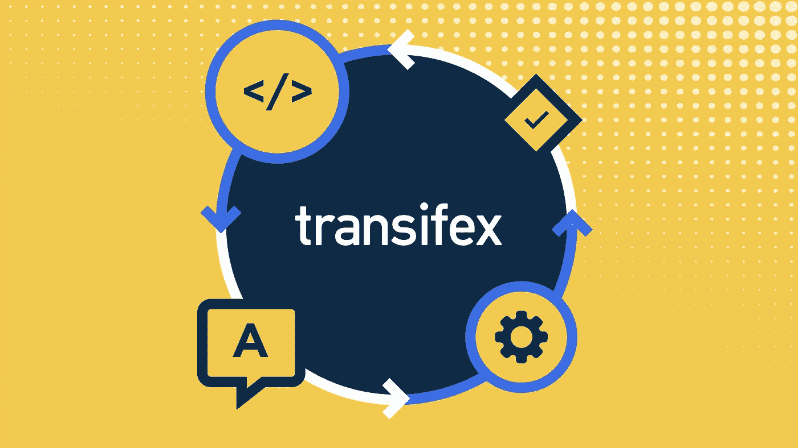
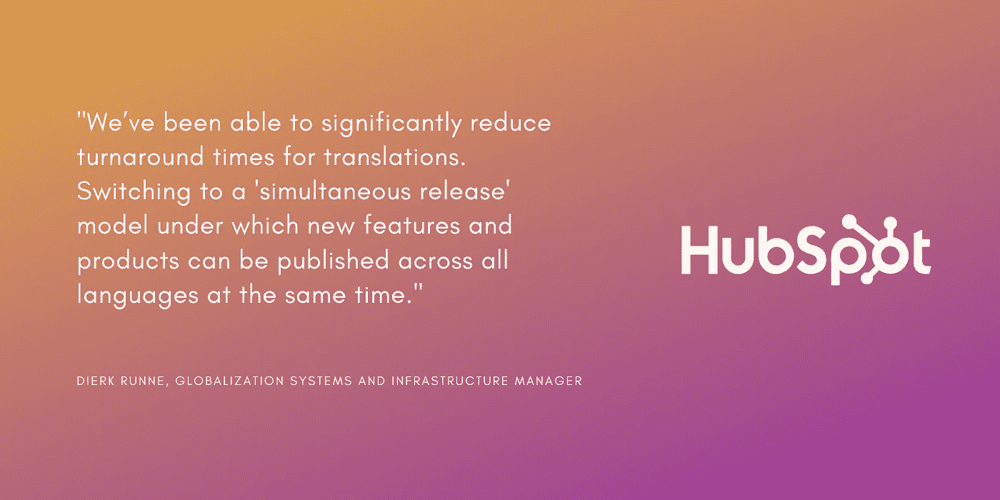
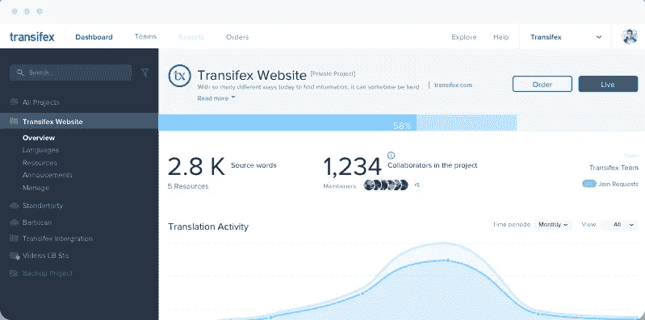

# 什么是持续本地化？

> 原文：<https://medium.com/geekculture/what-is-continuous-localization-2a3a4dd29df6?source=collection_archive---------50----------------------->

持续更新您的数字产品和服务可能是一个非常耗时的过程。现代软件、网站和文档可能要求特别高。但是现代问题需要现代解决方案——这就是持续本地化的用武之地。

一个制作精良的持续本地化工具可以帮助您无缝、轻松、持续地进行本地化。这里是你需要知道的一切！

# 什么是本地化？

本地化(l10n)是使内容适应特定国家、城市或在某些情况下甚至是城镇的过程。这可能需要您考虑多种因素，例如:

1.  翻译和语调。
2.  媒体内容(图片、视频等)。
3.  计量单位(重量、高度等)。
4.  货币。

更多，取决于你的行业和目标受众。

这是很大的努力，但是[研究表明，每投资 1 美元，本地化的 ROI(投资回报)为 25 美元](https://cdn-txweb.transifex.com/wp-content/uploads/2020/09/Localization_ROI_by_the_Numbers_Transifex_EN.pdf)。所以，最后，毫无疑问是值得的。

这就是它的要点。如果你想了解更多关于本地化的知识，它是如何工作的，以及关于它的一切，[查看这个页面](https://www.transifex.com/blog/2021/what-is-localization/)。

# 什么是持续本地化？

先说它的核心，持续本地化还是本地化。您仍然需要根据最适合的语言环境来调整数字内容。目标隐约相同。

但是本地化和持续本地化有一个核心区别。持续本地化就是处理不断变化的内容。而且，不管是好是坏，不断变化的内容正在成为新的规范。

不断变化的内容的一些流行的例子是:

*   SaaS 平台
*   应用程序
*   法律文件
*   网站
*   比赛
*   营销内容

更多，取决于你所在的行业。

我们通常谈论的是你必须不断更新和/或改进的内容。

现在的问题是，如果没有合适的工具，处理这样的任务是非常麻烦的。

您需要一个解决方案，能够将本地化和工程团队带到一个具有相互工作流的地方。这就是翻译管理系统(TMS)和软件本地化工具支持持续本地化工作的方便之处。

# 持续本地化是未来的 3 个原因

当传统的解决方案大部分都运行良好时，为什么还要为持续的本地化而烦恼呢？

首先，我们现在生活在一个不同的时代。总的来说，我们现在有应用程序、网站和许多不断变化的数字内容。

许多曾经静态的内容现在也需要您保持更新。例如，想想老派的电子游戏。

就在几十年前，我们从来不需要更新大多数视频游戏。现在，即使是离线游戏也能在首次发行后继续获得内容。

这就是为什么适当的持续本地化工具可以帮助:

1.  轻松更新您的内容。
2.  减少产品经理的总体工作量。
3.  以及提高本地化和工程团队之间的沟通速度。

不要相信我们的话。了解我们客户的观点:

“我们的翻译知道他们必须在每周四和周日进行翻译。这是一个持续的过程，如果我愿意，我完全可以自动驾驶。”— *帕特里克·麦克洛林，Eventbrite 的高级本地化项目经理。*

“我们不封杀开发者，但我们从一开始就教育他们要牢记本地化。当他们在 en 中推出新内容时，我们已经准备好尽快将其翻译成 23 种语言，如果我们还没有这样做的话。”— *伊莎多拉·费尔南德斯，Quora 的 i18n 和 l10n 项目经理*

# 持续本地化的有用工具

# 基础翻译管理系统

翻译管理系统也称为 TMS。使用 TMS 可以让您将整个本地化团队集中到一个地方。基本上，我们谈论的是在一个集中的平台上带来团队和内容的软件。

总的来说，我们不得不在开发人员、翻译人员、质量检查员和整个本地化团队之间来回传递电子表格的日子已经一去不复返了。免费试用 Transifex，或者如果您想要更深入的了解，可以要求演示。

长话短说，一个合适的 TMS 会让你离持续本地化更近一步。

问题是一个 TMS 作为基础编辑器对它来说是不够的。毕竟，在成功编辑后，您仍然需要上传翻译后的文件。虽然这比四处传递电子表格要好得多，但对于持续本地化来说并不理想。

这就是我们开发 [Transifex Native](https://www.transifex.com/native/) 的原因，这是最接近理想的持续本地化工作流程。

# TX 本地

你可以把 Transifex Native 看作是一种可以安装在网站或应用程序上的插件。这是进入持续本地化的相对容易的方法。

简而言之，它所做的是在编辑器和您正在本地化的平台之间自动拉和推内容。

这意味着你再也不用担心文件管理的问题了。这包括下载文件、上传、手动编辑和部署！这就是 TX Native 是理想的持续本地化工作流程的原因！

也要考虑添加一个[图形编辑器集成，比如 Figma](https://www.transifex.com/blog/2021/transifex-native-figma-%e2%9d%a4-l-f-e-part-2/) 到组合中。这是为工程师、设计师和本地化团队准备的完整包。

# Transifex API

如果一个基本的 TMS 和 TX Native 对你来说还不够，可以考虑看看 [T](https://docs.transifex.com/api-3-0/introduction-to-api-3-0) [ransifex 的健壮灵活的 API](https://docs.transifex.com/api-3-0/introduction-to-api-3-0) 。

API 3.0 允许您远程访问 Transifex 的各个部分，例如:

*   用户
*   组织
*   语言
*   项目
*   资源
*   资源字符串和注释
*   L18 格式
*   上下文截图
*   活动报告
*   统计数字
*   资源翻译
*   团队成员
*   组
*   和翻译记忆库

通过使用 API 并将其与 [Transifex webhooks](https://docs.transifex.com/transifex-native-integrations/webhooks) 结合，您可以开发定制脚本和代码。这将自动为您工作，同时持续同步翻译。

# 包扎

简而言之，持续本地化就是让你的内容保持更新。Transifex 就是给你正确的工具去做！

这篇文章最初发表在这个页面上。