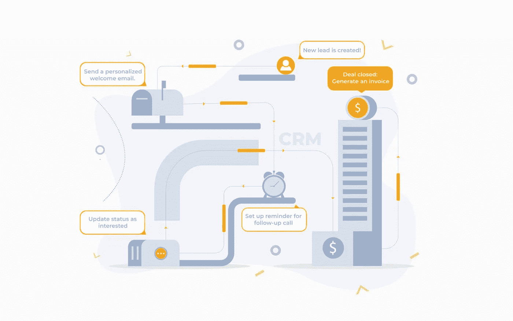
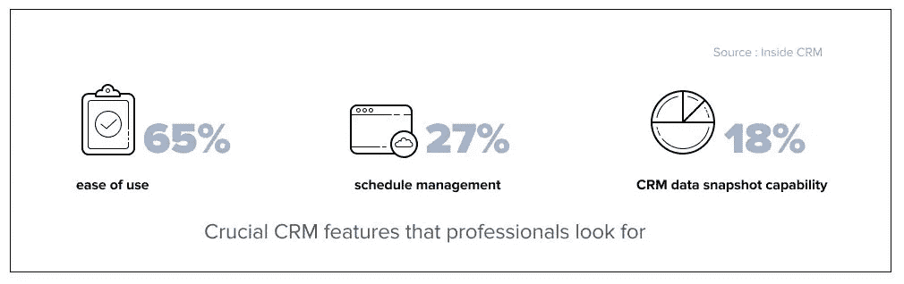
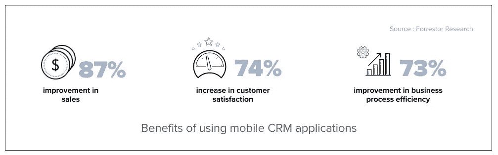
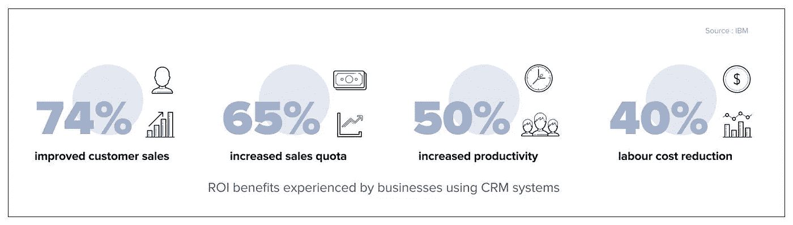

# 什么是 CRM？CRM 集成如何帮助您的组织成长？

> 原文：<https://medium.com/geekculture/what-is-crm-how-crm-integration-can-help-your-organization-to-grow-33a52724fee6?source=collection_archive---------62----------------------->

新技术来来去去。然而，对有效的客户关系管理软件的持续需求将永远不会停止。为了提高效率、生产力和效果，企业将需要 CRM 系统来帮助他们更好地保留和管理现有客户，同时吸引新客户。

# 什么是客户关系管理？

客户关系管理(CRM)是管理客户关系的过程。它允许企业跟踪联系人，并跟踪潜在客户和客户，从而提高销售额和客户满意度。客户关系管理流程包括存储和管理联系信息，如电子邮件、电话号码以及未来或过去的业务关系。

# 什么是客户关系管理？

客户关系管理系统存储所有与潜在客户的互动。它记录了从某人第一次访问你的网站到他们看了你的销售方案多长时间的所有事情。

但它不仅仅是一个名字和电子邮件地址的列表——它远不止这些。

CRM 工具的一个很好的例子是 Salesforce，这是一个受欢迎的 CRM 系统，被全球超过 150，000 家企业使用。

# 客户关系管理系统能给你的企业带来的好处

1.  **为所有销售人员维护一个集中的数据库:**客户关系管理系统是销售团队的必备工具。在一个位置管理所有潜在客户信息的能力使您的代表能够接触到他们需要跟进的所有潜在客户，并更快地达成交易。
2.  **在一个地方管理所有互动:**您所有的客户互动都可以通过 CRM 系统进行跟踪。这可以让你的销售团队组织有序，并对他们与买家的每一次互动负责，无论是电话、电子邮件还是面对面的交谈。例如，您的 CRM 可以确定何时联系潜在客户，并帮助销售代表记住他们是否已经联系过。
3.  **自动化数据输入流程以提高效率并节省资金:**有了 CRM，您可以确保与客户的每一次沟通都能立即得到跟踪。这一切都在系统中自动完成，节省了团队中每个人的时间和精力。此外，CRM 还提供交易状态和更新，这些都是自动执行的。这也不需要任何手动输入就可以完成！
4.  **简化客户数据:**客户关系管理系统让您的团队能够在销售周期的每一步轻松跟踪销售线索并与每位客户沟通。销售代表将能够实时看到联系人是否访问过您的网站。他们还可以看到他们是否从网站上下载了内容。
5.  **报告:** CRM 软件帮助销售代表组织有关潜在客户和交易的数据。使用报告功能，销售代表可以更好地管理他们的渠道、交易和联系人。他们还可以评估自己的表现，并跟踪自己的目标和完成定额所需的工作。
6.  **销售业绩预测:**任何成功的销售组织的关键是能够制定包含战略的战略计划。借助详细的 CRM 报告，销售主管可以确定收入和利润等关键指标。这些数字提供了一幅清晰的画面，展示了你的业务做得有多好，以及在下一个季度或下一年要实现你的目标需要做些什么。

**如果你的销售组织需要更多的说服力来采用 CRM，这里有一些统计数据可以进一步证明它们的价值:**

# CRM 有哪些不同的类型？

CRM 软件主要有三种类型:运营型、分析型和协作型。以下是更多内容:

1.  **运营 CRM:** 让您详细了解每个客户的销售和营销自动化历程。
2.  **分析型 CRM:** 分析和识别客户数据的趋势，帮助你做出更好的商业决策。
3.  **协作式 CRM:** 组织客户信息，并与多个利益相关方共享。

# 如何决定最适合你的企业？

免费的 CRM 可能是开始学习 CRM 的最好地方。他们毕竟是**免费的**！

你可以按照自己的进度学习 CRM，而不用承担财务承诺的负担。您将能够确定对您来说最重要的功能，并在决定供应商之前“尝试一下”(免费)。

这一点很重要，因为 CRM 框架在被插入到工作流中时并不简单地“做它的事情”。人们必须使用 CRM，并认识到它可以获得真正的、积极的商业利益。

免费提供的 CRM 通常是付费完整版的功能受限或时间受限版本。决定一个 CRM 可能是困难的，所以供应商有免费的版本来帮助消除这个过程中的猜测——这是用户在完全承诺之前测试 CRM 以查看它是否是一个好的匹配的完美方式。

了解客户关系管理的工作原理，最终可以为你的企业带来许多新的机会。

作为一个小企业主，你能做的最重要的投资之一就是对人的投资——员工和客户。客户关系管理(CRM)软件是一种帮助人们的简单方法。客户关系管理系统使员工能够更轻松地处理日常客户和业务体验，从而带来更强大的客户体验。快乐的内部顾客等于满意的外部顾客。至少，这是目标。

免费的 CRM 系统可以让你和你的团队一起测试一个平台，看看你是否可以在不预先花任何钱的情况下从中获得价值——如果你是一家预算紧张的小公司或初创公司，这尤其有用。

你没有理由不去看看，因为它是免费的！这里有几个最好的免费客户关系管理软件，它们都提供诱人的免费计划:

*   [**Zoho CRM**](https://quickwork.co/apps/zoho_crm/integrations) 拓展业务
*   [**HubSpot CRM**](https://quickwork.co/apps/hubspot/integrations) 适用于需要大量集成选项的企业
*   [**洞察**](https://quickwork.co/apps/insightly/integrations) 项目管理
*   [**胶囊 CRM**](https://quickwork.co/apps/capsule/integrations) 一款简单易用的免费 CRM
*   [**敏捷 CRM**](https://quickwork.co/apps/agilecrm/integrations) 免费营销功能
*   [**条纹**](https://quickwork.co/apps/streak/integrations) 用于管理 Gmail 收件箱中的联系人
*   [**Apptivo**](https://quickwork.co/apps/apptivo/integrations) 适用于各类企业和那些重视良好客户服务的人

# 结论

使用 CRM 软件系统将提高销售代表的工作效率，将有关潜在客户的所有信息保存在一个中心位置，帮助您的团队达成更多交易，并培养重要的业务关系。CRM 软件的好处对销售代表来说是无价的。它允许公司改善他们的工作流程，提高生产力和加强销售渠道，以提高客户服务。

要了解如何有效使用您的 CRM 系统并将其与您现有的系统集成，您可以[在我们的平台上免费开始](https://quickwork.co/?utm_source=Blog_Post&utm_medium=Organic_Interlink&utm_campaign=Contact_Us)并立即集成您的系统和应用程序，或者您可以安排与我们的自动化专家进行演示通话，了解具体的使用案例。

[**日程演示**](https://calendly.com/quickwork/demo)