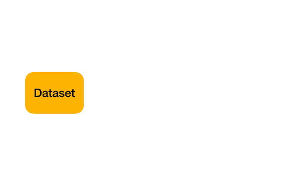

# 什么是交叉验证？以及它在数据科学中的重要性！

> 原文：<https://medium.com/geekculture/what-is-cross-validations-and-its-importance-fae918cd7ccf?source=collection_archive---------47----------------------->

**“交叉验证是一种评估和比较学习算法的统计方法，将数据分为两部分，一部分用于学习或训练我们的模型，另一部分用于验证我们的模型。”**

以上台词你看懂了吗？

让我们用简单的话来看，

当使用一些数据集时，我们正在创建一个机器学习模型，我们经常将数据集分成训练集和测试集。训练数据集通常用于学习/训练我们的模型，测试数据集用于验证我们的模型。假设我们使用某种算法在给定的数据集上训练我们的模型，并且我们试图找出我们的模型的准确性。我们模型的准确性可能是 90%或 95%或 100%。这是什么意思…

我们的模式好吗？

我们的模型准备好预测未来数据了吗？

答案是**没有**。

为什么我们的模型不好，为什么我们的模型在给了我们 100%的准确率之后，还没有做好预测未来数据的准备。因为我们的模型已经在给定的数据集上训练了自己，它已经知道了数据，并且已经很好地概括了数据。当我们试图预测新数据时，它给我们的准确性很差，因为它以前没有见过新数据。它不能给我们良好的精度和一个通用的模型。

当训练数据集为我们提供良好的准确性时，每当新数据出现时，它就不能为我们提供良好的准确性，在这种情况下，我们的模型将会过度拟合。

为了处理这类问题，需要交叉验证。它将数据集分为两部分(训练和测试)。在一个部分，即训练部分，它将尝试训练模型，在第二部分，即测试部分，它将对我们的模型进行预测，这是看不到的数据。之后，我们将检查我们的模型工作得如何。如果模型在测试数据上给我们很好的准确性，这意味着我们的模型是好的，我们可以信任它。

[https://www.google.com/url?sa=i&url=https%3A%2F%2Ftowardsdatascience.com%2Fwhat-is-cross-validation-60c01f9d9e75&psig=AOvVaw1CiVe0FwLwJgTh-MeG0TFD&ust=1624598260566000&source=images&cd=vfe&ved=0CAoQjRxqFwoTCIiRt6fCr_ECFQAAAAAdAAAAABAD](https://www.google.com/url?sa=i&url=https%3A%2F%2Ftowardsdatascience.com%2Fwhat-is-cross-validation-60c01f9d9e75&psig=AOvVaw1CiVe0FwLwJgTh-MeG0TFD&ust=1624598260566000&source=images&cd=vfe&ved=0CAoQjRxqFwoTCIiRt6fCr_ECFQAAAAAdAAAAABAD)

交叉验证是一个非常强大的工具，因为它帮助我们更好地使用我们的数据。

此外，使用交叉验证的一个最常见的原因是参数调整。

**交叉验证的类型:**

1.  坚持方法
2.  遗漏一项交叉验证(LOOCV)
3.  k 倍交叉验证
4.  分层交叉验证
5.  时间序列交叉验证

在我们的下一篇文章中，我们将看到 [**类型的交叉验证。**](https://medium.datadriveninvestor.com/types-of-cross-validation-d9d3343b650a)

**结论:**

在本文中，我们了解了交叉验证在数据科学中的重要性，以及不同类型的交叉验证技术。

请随时留下您的评论、建议或任何错误。😊

**帮我接通:**[**LinkedIn**](https://www.linkedin.com/in/sagar-dhandare-a401271a3/)**|**[**GitHub**](https://github.com/SagarDhandare)**|**[**邮箱**](mailto:%20sagardhandare3@gmail.com)

**快乐学习！！！** ❤🥀