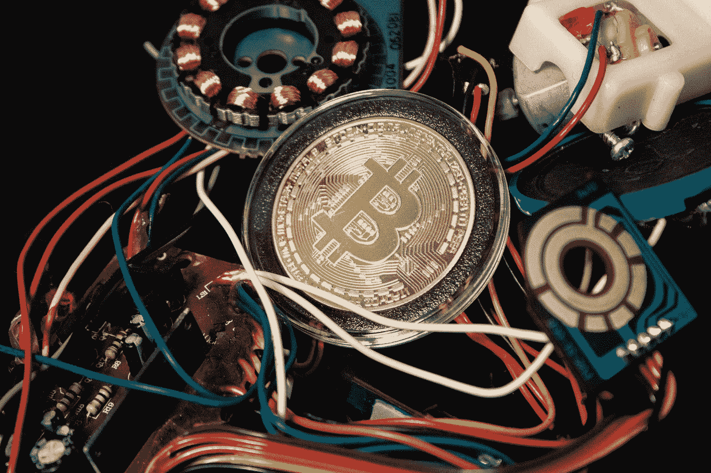

# 加密货币对环境有害吗？

> 原文：<https://medium.com/geekculture/what-is-cryptocurrency-and-its-affect-on-the-environment-dd99a30cecb1?source=collection_archive---------41----------------------->

试图解释什么是加密采矿及其对环境的影响。

Photo by [Brian Wangenheim](https://unsplash.com/@brianwangenheim?utm_source=medium&utm_medium=referral) on [Unsplash](https://unsplash.com?utm_source=medium&utm_medium=referral)

自从加密货币出现以来，我从未费心去了解更多关于这项神秘技术的知识。考虑到我决定专攻环境科学，每当有人试图与我分享秘密新闻时，整个概念就在我脑海中闪过。