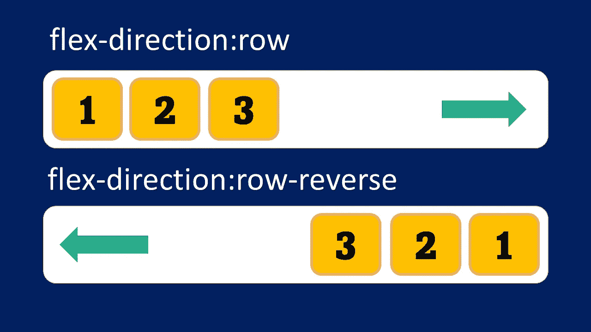

# 什么是 CSS flex-flow 和 justify-content？

> 原文：<https://medium.com/geekculture/what-is-css-flex-flow-2dcb7522cb0e?source=collection_archive---------42----------------------->

## 柔性方向和柔性缠绕的简写

柔性流是柔性方向和柔性缠绕的简称。我们之前已经讨论过柔性包装。

对于伸缩方向，如果方向是行，则项目被放置在一行中。如果是 row-reverse，项目也会以相反的顺序放在一行中。

row and row-reverse