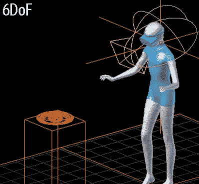
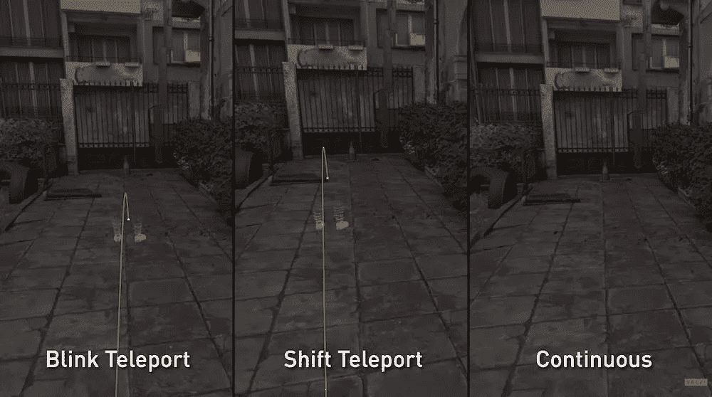

# VR 中的网瘾是什么，如何对抗

> 原文：<https://medium.com/geekculture/what-is-cybersickness-in-vr-and-how-to-fight-it-25b1d44c7d6b?source=collection_archive---------36----------------------->

## 晕动病和你需要知道的

Original Photo by [Naomi Tamar](https://unsplash.com/@naomitamar?utm_source=unsplash&utm_medium=referral&utm_content=creditCopyText) on [Unsplash](https://unsplash.com/s/photos/pop-art?utm_source=unsplash&utm_medium=referral&utm_content=creditCopyText) edited by author

特别是当你第一次使用虚拟现实耳机时，你一定不能晕机。如果你生病了，你的大脑可能会在你每次使用 VR 耳机时欺骗你生病。

即使你经常使用虚拟现实体验，你也可能会在玩密集型游戏时患上网瘾。

**但是什么是网瘾，你为什么会得网瘾，你能做些什么来对抗网瘾？**

# 什么，为什么，谁会得网瘾？

网瘾不仅仅是虚拟现实中的事情。你可能从乘船或乘车中了解到晕动病，也称为旅行病。你在 VR 中经历的网瘾也是一样的。**这只是晕动病。**

运动病是通过被动运动出现的。你所看到的和你的平衡感告诉你的是有冲突的。

举个例子:你带着 VR 头戴设备站在客厅里。你的平衡感是在你的内耳中产生的，它告诉你的大脑你站着不动。在虚拟世界中，你坐在过山车上，同时移动你的头和身体向某物射击。

你的大脑无法计算这种冲突，你会晕车。

不是每个人都有相同的晕车症状。**每个人对人工运动的耐受程度不同。**以下[是你可能出现的症状](https://www.healthline.com/health/vr-motion-sickness)，但不要担心你不会同时出现所有症状:

*   **头晕**
*   **头痛**
*   乏力
*   恶心和呕吐
*   恶心
*   冷汗

> 别担心。你不必习惯于网络病。

# 你能做什么来反对它？你能习惯吗？

## 1.检查体验的舒适度

在选择 VR 体验的时候，想想你对自己和晕车的了解。你容易晕车吗？用 VR 的时候是不是已经生病了？如果是，体验是怎样的？

使用 Oculus 产品，你可以在多种舒适度之间进行选择:舒适、适度、强烈。

*   [*【舒适】*](https://developer.oculus.com/policy/store-policies/) *体验一般会避免相机移动、玩家动作或令人迷失方向的内容和效果。一般有固定摄像头位置的 app 都会这样分类。*
*   [*【适中】*](https://developer.oculus.com/policy/store-policies/) *另一方面，体验可能会有更多的相机和玩家动作。*
*   [*【激烈】*](https://developer.oculus.com/policy/store-policies/) *体验通常会融入第一人称的相机运动、加速度或显著的相机运动以及玩家运动* n

用 Steam 玩 PC-VR 时，你有四个舒适度评级:舒适、中等、强烈、极端。

*   “舒适”的体验适合大多数人。
*   “适度”的体验适合许多人，但肯定不是每个人。
*   *“激烈”的体验不适合大多数人，尤其是刚接触虚拟现实的人。*
*   *“极端”体验可能包含激烈的内容，可能不适合大多数人，尤其是刚接触 VR 的人。*

当你是虚拟现实的新手时，坚持舒适的体验，并努力向上。

> **如果感到不适，请立即停止体验！**

## 2.您的耳机——3 自由度对 6 自由度

当你在虚拟世界中时，你会被你的耳机和控制器的位置所追踪。你在坐标系中移动的方式被转换成了虚拟世界。

耳机支持 3 个自由度(3 自由度)或 6 个自由度(6 自由度)，指的是可以被跟踪的方式的数量。3DoF 追踪你头部的旋转运动。6DoF 还可以追踪你在房间里的位置(平移运动)。

Gifs explaining visually what 3DoF and 6DoF means. [Originally from](https://cognitive3d.com/blog/room-scale-vr)

**虚拟现实的妙处在于与世界互动。成为世界的一部分 6DoF 更好，也不会生病。如果你还有一个旧的纸板 3DoF 耳机，以前没用过，现在最好不要用。**

尝试获得像 Oculus Quest 这样的入门级耳机，或者去当地的 VR 街机体验并享受虚拟现实。如果你感兴趣，我[写了一篇关于在 VR 中开始的最佳体验的文章。](https://konstantinschraps.medium.com/the-best-virtual-reality-experiences-for-introducing-anyone-to-vr-ccd5792ccd3)

## 3.人工运动

网络病的一个主要因素是人工移动。不同的运动方式已经被开发出来，它们对你来说有不同的舒适度。

许多人喜欢连续的人工移动，但是，例如，有更舒适的不同种类的心灵运输。虚拟现实中有超过 100 种不同的移动方式。

一些游戏也有隧道视野，限制视野，有助于很好地对抗晕动病。

[销量最大的 VR 游戏](https://www.spglobal.com/marketintelligence/en/news-insights/blog/top-10-vr-games-by-revenue)，Beat Saber，甚至不需要人工移动。你的动作被翻译到虚拟世界，你只向左或向右移动两三步。

**大多数游戏允许改变它们的移动方式**，所以如果你生病了，不要放弃游戏。也许下次可以尝试不同的运动方式。

Different [types of locomotion](https://mixed.de/motion-sickness-guide/) in Half-Life Alyx

## 4.你习惯虚拟现实吗？

别担心。你不必习惯于网络病。从我自己的经历来看，我可以告诉你，你可以习惯虚拟现实。

在玩了一些舒适的体验，习惯了在虚拟空间里走动，了解了自己之后，你将能够参与到以前会让你网瘾的体验中去。

**如果你感到不适，立即停止体验！**摘下耳机，等到感觉恢复正常。如果你晕车，可能需要几个小时才能感觉好起来。

## 5.我买了体验，但我会网瘾。现在怎么办？

如果你因为网瘾买了一个你不能享受的体验，即使有上面的建议，也没问题。

**无论是在**[**Oculus Store**](https://www.oculus.com/legal/quest-rift-content-refund-policy/)**还是在**[**Steam Store**](https://support.steampowered.com/kb_article.php?ref=6695-QIKM-7966)**，**如果你没有玩超过 2 个小时。

如果你生病了，不要沮丧。停止体验，稍后再试。遵循以上几点，你就没事了。