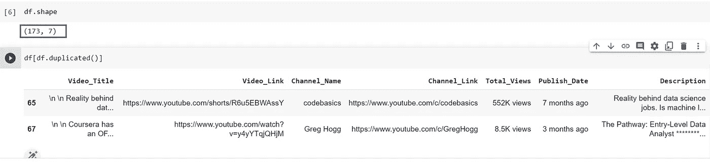
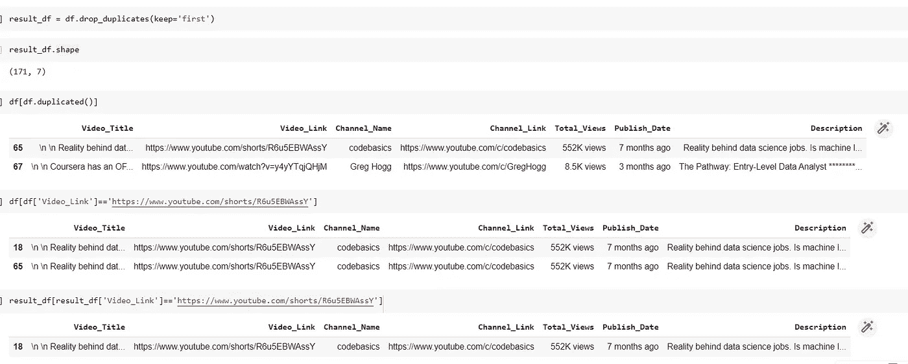
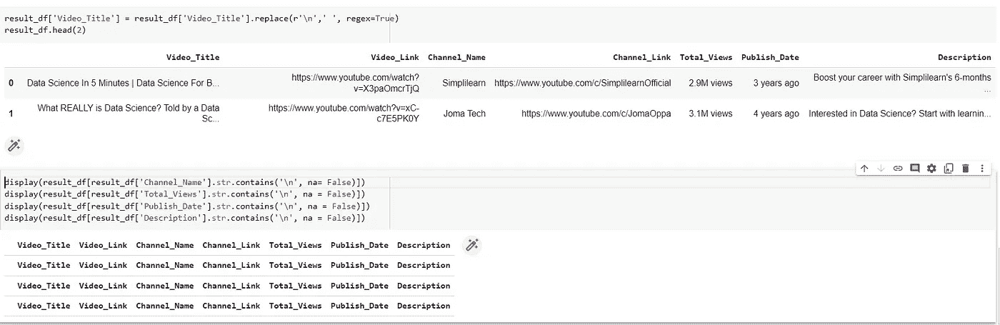

# 什么是数据清洗？如何进行数据清理？

> 原文：<https://medium.com/geekculture/what-is-data-cleaning-how-data-cleaning-can-be-done-20722af9dc67?source=collection_archive---------8----------------------->

当我们从一个来源收集数据时，它被称为原始数据或原始数据。每一个原始数据都有可能变成信息。可以看我的[文章](/geekculture/data-information-and-knowledge-4e8b9fdeaa04)了解更多的信息和知识。

当我们从 data exhaust 收集数据时，我们会得到大量的原始数据。数据枯竭是指互联网或计算机用户在网上活动和交易过程中留下的非常规数据或数据痕迹。这包括地理空间、网络、时间序列、网站访问、点击链接，甚至鼠标悬停，这些都是以 cookies、临时文件、日志文件、可存储选项等形式出现的。处理后的一些数据可用于预测分析、改进用户界面和布局设计等。

这些原始数据可能有很多干扰、重复、未格式化或有多种格式，通常没有模式，并且缺乏一致性和完整性。为了从这些数据中提取信息或见解以做出业务决策，我们必须确保数据是干净的，并执行数据质量检查。如果没有清理数据和执行质量检查，那么它可能会导致不正确或错误的见解，并最终导致不正确的业务决策。数据只有在经过清理和质量检查后才有价值。

# 数据清理

数据清理也称为数据清理或数据擦洗，是将脏的或杂乱的数据转换为干净数据的过程，这些数据可以提供给机器学习模型或用于数据分析。所有数据集可能不需要所有的数据清理过程。基本的数据清理过程是:

## 删除重复项:

当数据被废弃或通过不同方式收集时，或者当客户提交冗余表单或来自不同数据源的混合数据时，或者当数据在系统之间传输时，就会出现重复数据。这些重复的记录增加了存储成本。但是，当将数据标记为重复时，它应该是一个完整的副本，因为部分重复可能具有商业价值。例如，如果是根据每月的交易次数来检查客户，则客户详细信息将是相同的，只有交易、交易金额和其他与交易相关的详细信息将是不同的。因此，应该根据业务目标来分析部分重复数据。

为了用 python 解释这一点，我用 youtube 的废弃数据制作数据科学视频，数据集可以从[这里](https://github.com/SandKrish/Data-Cleaning/blob/main/DataScience_Youtube_Videos.csv)访问。在 python 中，使用 duplicate()函数返回一系列真值和假值，用于描述数据框中的哪些行被复制。

在这里，duplicate()函数为 173 行中的两个不同的行返回了 True，这表明这两行中的每一行都有一个副本。

部分重复可以通过使用带有 duplicate()函数的子集来识别。如果我们必须找到 channel_name 的部分副本，我们可以使用 df[df . duplicated(subset = " Channel _ Name ")]来找到它们。

在这个数据集中，我们有 67 个 Channel_Name 的部分副本。

要删除重复项，我们可以将 drop_duplicates()与 keep as first、last 或 False 一起使用，这将保留第一个重复项并删除 rest，保留最后一个重复项并删除 rest，或者同时删除所有重复项。“保持值”的默认值为“第一”。

这里 result_df 只有 171，这意味着删除了两个重复的记录。代码片段解释了相同的内容。

## 删除不相关的观察/数据:

如果业务目标是在一个时间范围内分析数据，不属于这个类别的数据可以被删除。同样，如果我们的数据有许多列，如全名、名字、姓氏、中间名和用户 id，除了全名之外，我们可以删除其余的 3 列，因为这对目标没有任何意义。通过移除不相关的观察和/或数据，得到的数据将更有效，并且对业务目标的干扰最小。

## 修复结构错误:

有不同形式的结构错误，如废弃的数据可能有' \n '，或者包含要输入的城市的类型表单可能有城市缩写或完整形式或城市的旧名称，则不适用可以写成 NA、N/A 或 No。因此这些类型的结构错误应在数据清理流程中解决。

在数据集中，我们可以看到“\n”代表 Video_Title。我们使用 replace()来清理 Video_Title。我们还可以检查任何其他列是否有' \n '，如果有，也可以清理该列。

在清理完“\n”之后使用 strip()总是一个更好的做法，这样可以修剪掉多余的空格。这里我们可以看到只有 Video_Title 有' \n's。

完整的 Python 代码可以从[这里](https://github.com/SandKrish/Data-Cleaning/blob/main/DataCleaning.ipynb)访问。

## **格式:**

如果数据是从不同的来源收集的，如 2021 年 9 月 12 日、2021 年 12 月 9 日、2021 年 12 月 9 日、2021 年 9 月 12 日或 21 年 9 月 12 日，则日期可以有不同的格式。因此，在分析数据或将其提供给 ML 模型之前，将数据格式化为单一格式是必须遵循的步骤。

## **过滤不想要的离群值:**

当一个观察值的平均值是标准偏差的正负 2 倍时，它被认为是异常值。但是，如果我们有一个离群值，我们不应该在没有适当分析的情况下丢弃它。如果一些文件的文件大小是异常值，那么这些文件很可能包含重复值或不相关的观察值，而这些值或观察值没有被处理。因此，第一步是检查和分析文件内容，而不是在没有任何适当验证的情况下就丢弃它。有时离群值是有效的，它们可以证明我们的业务目标。

## 处理缺失值

在处理缺失值之前，应执行其余所有数据清理过程，尤其是删除重复项和处理不相关观察值或数据和异常值。否则，在使用平均值/中值进行数据插补时，您将采用整个数据的平均值或中值，这将给出错误的结果。处理缺失值的几种方法如下:

如果一列有 85%的值丢失，那么我们没有足够的数据来填充这些丢失的值。所以我们可以放弃这个专栏。

当一个列缺少分类值时，我们可以用默认值或“未知”来替换它。但是当数值缺失时，我们可以用均值或中值或 KNN 插补来估算。或者根据业务目标，我们可以使用预测算法来预测缺失值，这将提供更好的准确性，除非缺失值预计具有非常高的方差。

数据清理完成后，在获取数据进行分析或将其提供给 ML 模型之前，应该进行数据质量检查。在我的下一篇文章中，我将介绍数据质量检查以及如何进行检查。

如果你觉得这篇文章有用，请鼓掌:)