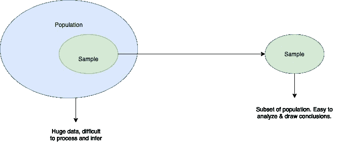

# 什么是机器学习中有效采样的数据采样和统计技术

> 原文：<https://medium.com/geekculture/what-is-data-sampling-and-8-techniques-for-effective-sampling-in-machine-learning-31ba9fbf4e1f?source=collection_archive---------20----------------------->

数据是应用人工智能领域的货币。因此，最重要的是，我们要充分利用现有的数据，并利用这些数据得出切实有效的结论，以解决现实世界中的问题。

我们在应用机器学习中面临的最大问题之一是在计算能力有限的机器上处理大量数据。我们的机器都太兴奋了，以至于在处理“稍微”大的数据集时，也不会抛出可怕的“内存不足”异常。

那么，我们如何克服这个顽固的问题呢？有没有一种方法可以选择和分析能够很好代表的数据子集，然后将我们的结论推广到整个数据集？

在进入主题之前，让我先介绍一些基本术语:

**群体**:包括所有可能的结果或测量或感兴趣的数据点。

**样本:**从总体中抽取的观察值子集

**抽样:**选择这样一个样本的过程叫做抽样。

> “抽样是一种统计方法，它允许我们从总体中选择数据点子集来分析和表征整个总体。”

Image by Author

# 不同类型的取样技术:

机器学习中最常用的采样技术有两种。选择正确有效的采样技术对于决定一项研究的成败至关重要。

1.  *概率抽样* —这种抽样方法基于概率。人口中的每一部分都有平等的机会被选中。因此，概率抽样给了我们最好的机会来创建一个真正代表整个人口的样本。
2.  *非概率抽样* —在非概率抽样中，所有元素被选中的机会并不相等。因此，有一个很大的风险是，最终得到的样本不具有代表性，不能产生概括的结果。

现在，我们只看概率抽样，因为它在两者中具有最小的选择偏差，并且是应用机器学习中最常用的抽样技术。

# 概率抽样的类型:

有四种类型的概率抽样。

Image by Author

1.  **简单随机抽样**

在这种简单的随机抽样中。每个个体都是随机选择的，完全是随机的，因此在抽样过程的任何阶段，每个个体都有相同的被选中的概率或机会。 ***简单随机抽样减少选择偏差***

**2。系统采样**

这项技术也是随机的，但通过维护一个系统或公式来完成。受试者可以定期从整个群体中选出。

系统抽样比简单的随机抽样更方便。然而，如果我们从总体中选择项目时存在潜在的模式，这也可能导致偏差。

**3。分层抽样**

在分层随机抽样中，整个人口被分成多个非重叠的同质群体(阶层),并从各个阶层中随机选择最终成员进行研究。每个组中的成员应该是不同的，这样所有组中的每个成员都有平等的机会通过简单的概率被选中。**当我们想从人口的所有子群体中得到代表时，我们使用这种类型的抽样。**

**4。整群抽样**

在整群抽样中，我们使用总体的子群而不是个体作为抽样单位。人群被分成称为集群的子群，随机选择整个集群进行研究。**当我们关注特定区域或领域时，会使用这种类型的抽样。**

# 选择偏差

有效取样技术的一个明显抑制因素是选择偏差。选择偏倚通常是由于取样和选择分析时没有适当随机化而引起的误差。

它被定义为由于群体的非[随机样本](https://en.wikipedia.org/wiki/Random_sample)导致的系统误差，导致群体中的一些成员比其他成员更不可能被包括在内，从而导致[有偏样本](https://en.wikipedia.org/wiki/Biased_sample)，

*那么如何减轻选择偏差呢？*

1.  确保所选择的子群在关键特征方面等同于一般人群(这种方法不如第一种方法有保护作用，因为通常关键特征是未知的)。
2.  从人群中选择子群体时使用随机方法。
3.  确保在采样数据时使用概率采样技术。

**参考文献:**

 [## 8 种抽样技术的数据科学家指南

### 概述抽样是一个流行的统计概念-了解它是如何工作的在这篇文章中，我们还将讨论八…

www.analyticsvidhya.com](https://www.analyticsvidhya.com/blog/2019/09/data-scientists-guide-8-types-of-sampling-techniques/)  [## 取样技术介绍|取样方法类型和技术

### 让我们举一个新冠肺炎疫苗临床试验的例子。很难对整个…进行审判

www.mygreatlearning.com](https://www.mygreatlearning.com/blog/introduction-to-sampling-techniques/) 

在 [Linkedin](https://www.linkedin.com/in/sindhuseelam/) 和 [Medium](/@sindhuseelam) 上与我联系，获取更多关于统计学、机器学习的文章。