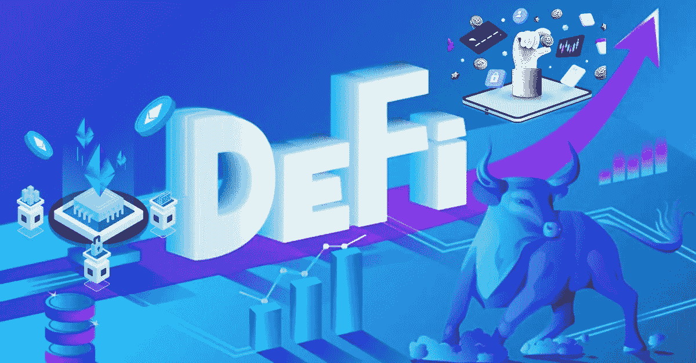
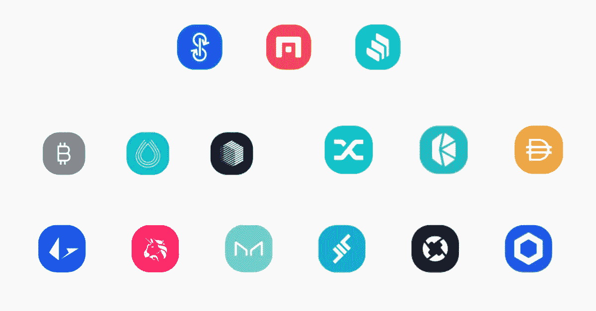
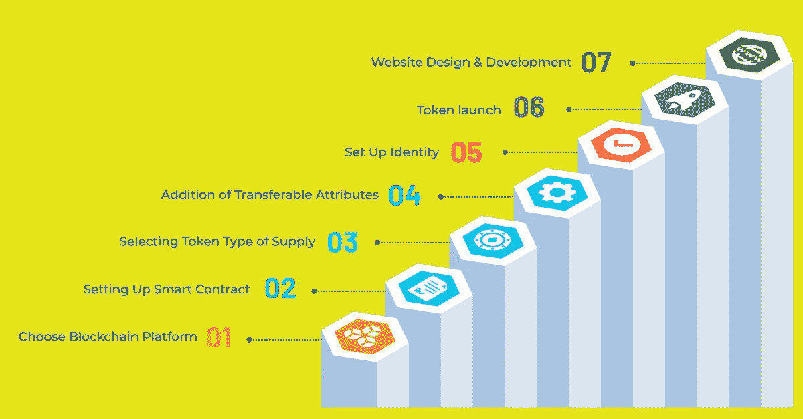

# 什么是 DeFi Token？|每个投资者都应该知道的事？

> 原文：<https://medium.com/geekculture/what-is-defi-token-what-every-investor-should-know-a2a2d45b4a1c?source=collection_archive---------15----------------------->

DeFi token

金融业近年来发生了很大的变化。分散的金融服务正在慢慢取代集中的金融服务。CeFi(集中式金融)提供了一个中央实体的传统金融，就像银行一样。CeFi 可以访问和控制您的资金流动；它在那些对用户资金有重大控制权的人之间充当中介。尽管 CeFi 已经使用了这么多年，但随着区块链技术的引入，DeFi 已经开始在金融行业获得巨大的知名度。因此， [DeFi token development](https://bit.ly/3SKjqYU) 在金融领域获得了巨大的人气和牵引力。让我们更深入地研究一下 DeFi 令牌开发和 DeFi 令牌开发的成本。

# **DeFi 令牌及其类型**

DeFi tokens

DeFi token 可以定义为基于区块链技术的数字版法币。它们被用作本地货币，可以在构建它们的平台上使用。

➡ **治理令牌:**有了治理令牌，用户可以通过投票参与平台的决策。获得治理令牌的用户可以对平台的未来变更进行投票。

➡ **安全令牌:**安全令牌用于将物理令牌的所有权表示为存储在区块链上的数字安全。

➡ **股权代币:**股权代币代表股份在代币中所占的百分比，或者换句话说，持有股权代币的人拥有某种形式的投资所有权。股票可以是公司的实物资产或股份。

➡ **效用代币:**效用代币在现实世界中持有价值，同时也持有作为 DeFi 代币所携带的价值。

# **DeFi 令牌的特征**

➤ **开源:**使用开源工具让你的项目更加可信，你可以决定它们是如何工作的。

➤ **自动化:**你可以自动快速的执行交易。您可以自动化一般流程，如利息支付、贷款发放等。

➤ **包容性:** DeFi 服务是无国界的，任何人都可以不受任何地理限制地使用。

# **DeFi 代币的好处**

➼ DeFi 代币可以用于众筹项目。

➼代币可以在其他 DeFi 平台上下注。用户可以根据下注的代币数量和时间赢得奖励。

➼使用 DeFi 代币完成的所有交易都可以在区块链上访问和验证，从而确保可靠性和合法性。

➼令牌的所有权通过智能合约来保护。

➼代币持有者可以参与 DeFi 交易，如借贷、贷款、保险等。

➼用户可以在没有任何第三方的情况下进行点对点交易。

➼令牌可以安全地存储在数字钱包中，并由私钥保护。

# **DeFi 令牌开发流程**

DeFi Token development process

✔ **区块链:**为您的 DeFi 开发选择正确的区块链网络，并确定您的 DeFi 令牌的运营框架。

✔ **智能合约:**开发智能合约，根据用户的要求提供特定的功能，

✔ **识别你的域名:** Defi 代币可用于各种用途，如借贷、交易、资产管理等。确定您的需求，并相应地开发您的令牌。

✔ **帐户和地址创建:**在 crypto wallet 上创建一个帐户，用于资产管理和使用 DeFi 令牌作为交易单位。此地址是交易加密令牌所必需的。

✔ **令牌身份:**为您的令牌创建一个唯一的身份。对您的令牌的徽标、名称和需求设置进行修改。它提高了令牌的信誉和可扩展性。

✔ **列表:**令牌身份更新后，您可以在交易平台上列出您的 DeFi 令牌。在公认的平台上列出您的代币可以提高代币的销售和交易。

**点击更多详情:**

 [## 启动您自己的 DeFi 项目的完整指南

### 由于加密货币的繁荣，现在对 DeFi 代币或硬币的需求很高。这是推出 DeFi 的正确时机…

www.blockchainappfactory.com](https://www.blockchainappfactory.com/blog/how-to-launch-a-defi-token/?utm_source=gk&utm_medium=10-06-2022&utm_campaign=Pavun) 

## **DeFi 令牌开发的成本**

开发您自己的 DeFi 令牌的成本取决于功能、区块链和特性。因此，根据令牌标准的不同，开发成本可能会有所不同。

## **总结一下**

DeFi 很快被主流市场采用，因为它解决了集中融资的缺点。随着世界朝着为用户提供高端安全和隐私的去中心化金融系统发展，调整 DeFi 可能是您企业的最佳选择。DeFi 令牌已成为 DeFi 系统的燃料，因此世界各地正在开发许多 DeFi 令牌。你可以通过雇佣一个专家 [DeFi token 开发公司](https://bit.ly/3SKjqYU)来建立你自己的 DeFi token，并把它放在流行的 DeFi 平台上，从而在 DeFi 领域获得巨大的发展。