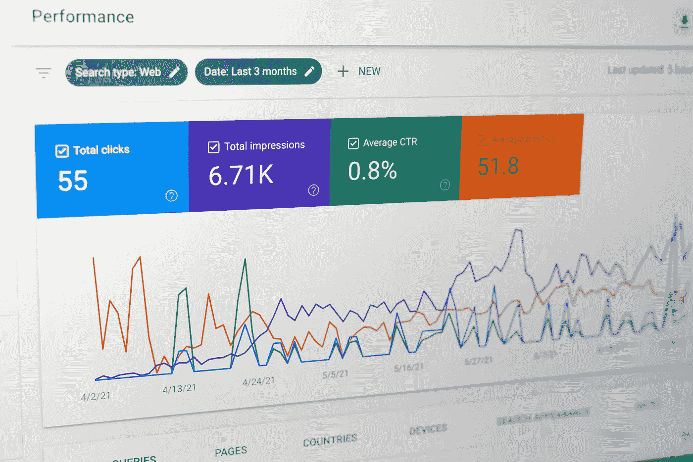

# 什么是描述性统计？

> 原文：<https://medium.com/geekculture/what-is-descriptive-statistics-a9f0b6e66c75?source=collection_archive---------14----------------------->

**第二部分:统计系列**

您好，欢迎回到[统计系列第二部分](https://agupta97.medium.com/list/statistics-series-for-data-science-71974047d2e2)。在上一篇文章中，我们看到了应用统计的不同类型的数据。在本文中，我们将介绍描述性统计。它用于描述、呈现和总结给定的数据。它用于呈现数据集的摘要，以便更好地理解。

描述性统计通常有三种方法。

1.集中趋势测量

2.分散性或可变性

3.数据的分发或可视化

Photo by [Justin Morgan](https://unsplash.com/@justin_morgan?utm_source=unsplash&utm_medium=referral&utm_content=creditCopyText) on [Unsplash](https://unsplash.com/s/photos/statistics?utm_source=unsplash&utm_medium=referral&utm_content=creditCopyText)

**1。集中趋势的度量:**

当您必须给出最期望或最频繁出现的值或数据的中心值时，可以使用集中趋势的度量。

让我问你一个问题:从你家到学校/办公室需要多长时间？

我从学校到办公室需要 15 分钟。

让我问另一个问题:它总是保持不变还是有时少于或多于 15 分钟？

你可能会给出的答案是:不，有时会超过 15 分钟或不到 15 分钟，这取决于交通、下雨或其他各种因素。

但是当我问你第一个问题的时候，你会得出一些持续时间，虽然时间每天都在变化。为什么会这样呢？答案是因为集中趋势措施。你得出的答案是从你家到学校/办公室的平均时间。

集中趋势的度量告诉您大部分数据或数据的中心位于何处。均值、中值和众数是被称为集中趋势度量的 3M。

**的意思是:**

平均值是数据的算术平均值。例如，我们可以计算几个月的平均预算、班级的平均身高、平均体重或班级的平均年龄。平均值是通过将所有数据点相加并除以数据点的数量来计算的。

**平均值=(数据点总和)/(数据点数量)**

**平均值的缺点**:由于平均值考虑了所有数据点，因此它会受到称为异常值的极端值的严重影响，即如果您收集的数据中的一个点比其他数据点小两个或太大，平均值也会受到影响，无法给出大多数数据的真实平均估计值。

**均值的优势:**它是一种非常流行且被广泛使用的度量，用来表示数值数据的中心。它也广泛用于机器学习算法。

**中位数:**

中位数是数据的中点。要计算中位数，数据点应该按升序排列。如果数据点的数量是奇数，那么出现在中间的数据点就是众所周知的中位数。如果数据点的数量是偶数，则两个中点的平均值称为中值。

**中位数的优势:**它不考虑整个数据，因此不受极值或异常值的影响。这是表示数据中心点的非常稳健的方法。它仅用于定量数据。

**中值的缺点:**为了计算中值，数据点应该按升序排列，由于较大数据集的计算开销，这使得它不太有吸引力。所以在机器学习算法中用的不多。

**模式:**

众数是数据中重复次数最多的值或出现频率最高的值。平均值和中值是为定量数据计算的，而众数是为定性和定量数据计算的。例如，通过计算每个产品的订购频率，然后选择具有最高频率的产品，可以回答哪个产品比其他产品卖得多。注意，可能有多个产品(模式)具有相同的频率。

**该模式的优势:**这是定性数据的唯一中心度量。

**模式的缺点:**在你的数据集中可以出现不止一个模式。它不用于机器学习值。

注:由于平均值受异常值的影响最大，因此我们可以计算修整平均值。它被称为修剪平均值，因为您从两端修剪数据点以移除异常值。虽然中值不受异常值 l 的影响，但它被认为是位置估计的稳健度量。

**2。扩散措施:**

分布度量用于告诉您数据如何围绕集中趋势的度量分布。最常用的传播度量如下:

**Range:** Range 告诉您数据集的最大和最小数据点。数据集的每个定量特征可以有不同的范围。

**标准差:**标准差告诉您数据如何分布在平均值周围。这将计算数据相对于平均值的离差。标准差越大，数据集的可变性就越大。

**方差:**方差是标准差的平方。一般标准差用的比较多。

**四分位范围(IQR):**IQR 描述了从最低到最高排序的中间 50%的值。

**3。分布:**

为了描述一个变量的每个潜在值出现的频率，用百分比或数字表示，统计学家使用图表。例如，如果您正在进行一项民意调查，以找出哪些披头士成员更喜欢，您将设置两列:一列列出所有可以想到的选项(John、Paul、George 和 Ringo)，另一列列出投票总数。

统计专家将频率分布显示为表格或图形。

感谢您花时间阅读这篇文章。我希望你会喜欢这篇文章。如果你喜欢这篇文章，别忘了点击“鼓掌”和“关注”按钮。继续查看新帖子。