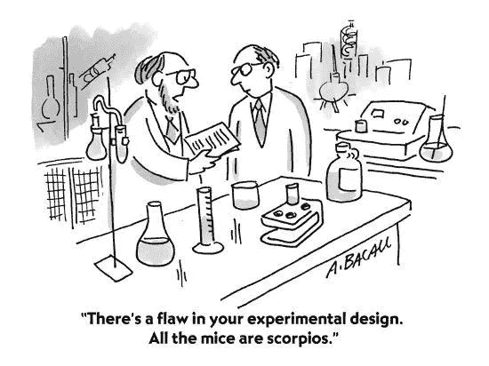
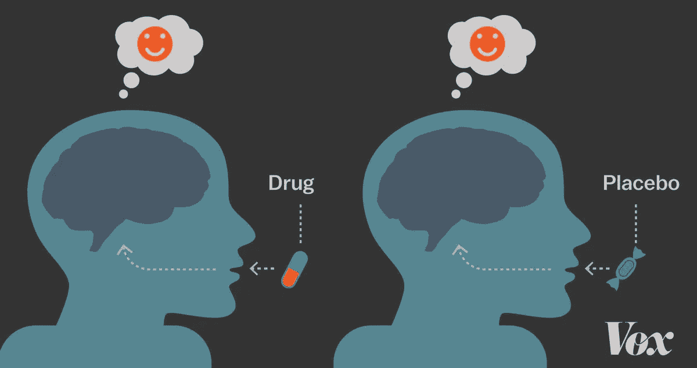

# 什么是实验设计？

> 原文：<https://medium.com/geekculture/what-is-design-of-experiments-48555d1587db?source=collection_archive---------10----------------------->

## 统计/数据科学专题

## 在多元分析中

[https://images.app.goo.gl/WRmBfzGHAsBTN223A](https://images.app.goo.gl/WRmBfzGHAsBTN223A)

D 试验设计(DoE)是在有多个自变量影响因变量时，用来分析特定自变量与因变量之间关系的一种方法。我会试着通过多个例子来解释这个定义和概念。

S 假设你拥有一块土地，你在这块土地上种植了一种蔬菜。让我们称之为蔬菜，维加。你对这批货的 VegA 总量不满意，想增加产量。你会怎么做？

你决定接受我的帮助。我听了你的问题，决定用 DoE 来解决问题。首先，我会记下所有影响织女星输出水平的因素。我发现土壤肥力、天气、水的可利用性和害虫影响总产量(可能还有更多因素。为了便于理解，我们只选取了四个因素)。这里，这四个因素是自变量，总产量是因变量(因为总产量取决于这些因素)。

现在，我想研究一下总产量和水资源利用率之间的关系，也就是说，作物的用水量是如何影响总产量的。为了了解这一点，我将在我的土地上创造三个盒子，并在每个盒子里种植相同的蔬菜种子。我只是改变这些盒子里的水量，而保持每个盒子里的其他东西(肥料量、杀虫剂量)不变。在第一个盒子里，我将提供与前一批相同数量的水。在第二个盒子里，我将供应更多的水，在第三个盒子里使用更少的水。

接下来，我将比较这些盒子中的产量，我将能够判断水的可用性和总产量是否具有正相关性(产量随着供水量的增加而增加/产量随着供水量的减少而减少)、负相关性(产量随着供水量的减少而增加/产量随着供水量的增加而减少)或无相关性(总产量不取决于用水量)。这样，我将知道这些变量之间的确切关系，并利用这些信息为我服务。

现在，我将创建另外三个框，并重复相同的过程来确定土壤肥力和总产量之间的相关性(关系类型)。这次我将改变肥料而不是水的用量，并收集所需的信息。同样，我将检查杀虫剂对总产量的影响。

为了检查天气对总产量的影响，我将在不同的季节种植蔬菜，以确定天气是否影响总产量。如果是的话，我就知道哪个季节最适合种植织女星了。

所有这些都完成后，我将把所有的信息放在一起，取每个自变量的最优值，得到因变量的最大值，即总产量。

这里我只是设计了适当的实验来研究多个自变量对一个因变量的影响。这整个过程被称为“实验设计”。

没有必要通过 DoE 只研究一对一的关系。我们也可以设计实验来研究两个或多个自变量的组合对因变量的影响。在这个例子中，我们可以研究土壤肥力和水的有效性对总产量的综合影响。

为了做到这一点，我将保持其他两个因素不变，但使用每个盒子中肥料和水的数量的独特组合。比如第一个盒子，我会多放些水，少放些肥料。在第二个盒子里，我会少放些水，多放些肥料。像这样，我将创建九个盒子，每个都有一个独特的公式。现在，我将能够确定哪种组合最适合增加织女星的总产量。

因此，DoE 可以用来研究因变量和自变量之间存在的每一种可能的关系。上面给出的例子只是对这种方法有了一个非常基本的理解。通常，我们会设计更详细的实验，这样我们从这些实验中收集的数据对于进一步的统计分析来说就足够且合适了。让我给你另一个例子，我们设计了一个更详细的实验。

S 假设你发明了一种自制药丸，你声称这种药丸对治疗焦虑有效。你怎么坚定的证明？再说一次，你来找我帮忙。我再次决定使用 DoE 来解决这个问题。首先，我会收集一群有焦虑问题的人。假设我收集了 60 个人。现在我将他们分成三组，每组 20 人。这些组是 a 组、b 组和 c 组。

我会把你做的药丸给 GroupA。我会给 b 组另一套药丸。但是这些药丸只是看起来像药用药丸的糖果。它们对人类没有任何影响。我不会给 GroupC 任何药片。在一段时间内(你认为药片开始显现效果所需的时间)，a 组和 b 组会继续服用给他们的药片(按照你推荐的剂量)。在此期间，GroupC 不会服用任何药物。

时间周期结束后，我会收集每个人的焦虑是否治愈的数据。最终，我会有足够的数据来进行进一步的统计分析。通过这种分析，我将能够确定你制造的药丸是否真的有帮助，或者是安慰剂效应正在治愈焦虑。也可能是焦虑在一段时间后自行消失，不需要任何外在的东西来解决问题。

[https://images.app.goo.gl/v4Kh8ejLGS79MH1x8](https://images.app.goo.gl/v4Kh8ejLGS79MH1x8)

因此，我设计了一个合适的实验来帮助我收集足够的数据来检验我的假设。这就是 DoE 意义所在。打个比方***“DoE 之于统计学就像实验物理学之于物理学”*** 。

通过这篇文章，我用通俗易懂的语言解释了术语“实验设计”的含义。显然，在设计实验时，有很多我们没有讨论的因素。今后，我将努力揭示这些因素。现在，我将以一句话来结束这篇文章，

> 像我这样的发展科学家通过设计受控实验来探索学习的基础科学。—艾莉森·戈普尼克